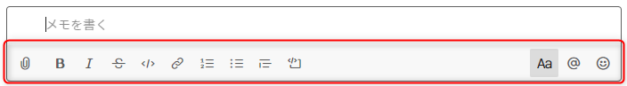
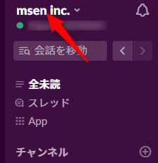
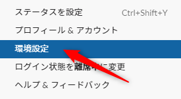
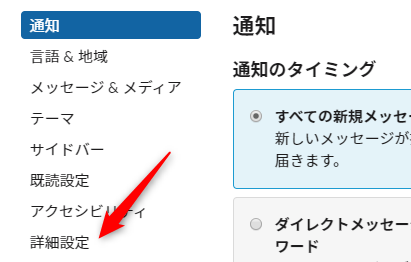
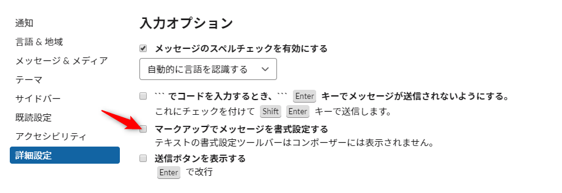
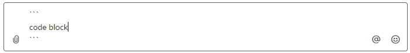

普段、 Slack でメッセージ入力をする際、マークアップ記法を用いているのですが、 **v4.2.0 のアップデートで追加された自動書式設定機能**のおかげで、非常に使いづらくなってしまいました。

[Windows版「Slack」アプリに書式設定ツールバーが追加 - 窓の杜](https://forest.watch.impress.co.jp/docs/news/1221042.html)

しばらくそのままの設定で使い続けていたのですが、検索してみると、公式ページに**自動書式設定機能を無効にする方法**が掲載されてましたので、その手順を紹介します。

## 設定変更前

自動書式設定が有効な場合、書式設定ツールバーが表示されています。

[メッセージの書式設定 | Slack](https://slack.com/intl/ja-jp/help/articles/202288908-%E3%83%A1%E3%83%83%E3%82%BB%E3%83%BC%E3%82%B8%E3%81%AE%E6%9B%B8%E5%BC%8F%E8%A8%AD%E5%AE%9A) に書式設定ツールバーを非表示にする手順が載っておりますが、非表示にするだけで無効にはならないので気を付けてください。

## 設定変更方法

[デスクトップで書式設定を行う | Slack](https://slack.com/intl/ja-jp/help/articles/360039953113-%E3%83%87%E3%82%B9%E3%82%AF%E3%83%88%E3%83%83%E3%83%97%E3%81%A7%E6%9B%B8%E5%BC%8F%E8%A8%AD%E5%AE%9A%E3%82%92%E8%A1%8C%E3%81%86) の記載内容に沿って説明していきます。

### メニューを表示

画面左上にあるワークスペース名をクリックします。

### 環境設定を開く

メニューから環境設定を選択します。

### 詳細設定を開く

詳細設定を選択します。

### 「マークアップでメッセージを書式設定する」を有効にする

「入力オプション」 から、**「マークアップでメッセージを書式設定する」**の横にあるボックスにチェックを入れます。

以上で、設定は完了です。

## 設定変更後

書式設定ツールバーがなくなり、自動書式設定が無効になりました。

おかげで、入力時のイライラからも解放されました！