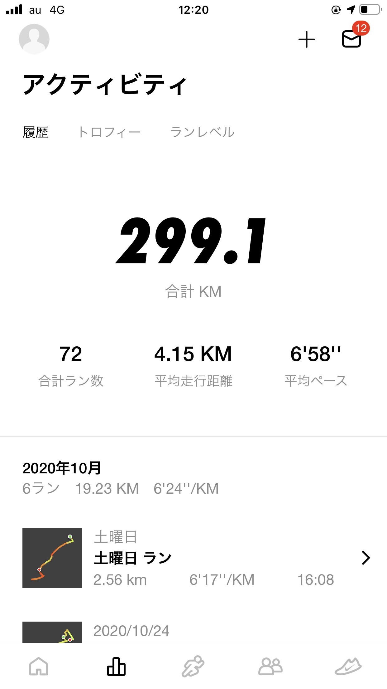

## はじめに

こんにちは、こうへいです。

私は、新卒で病院の事務員として働きはじめてから数回転職してきましたが、すべてデスクワークで、現在はプログラマーの仕事をしています。

私の場合ですが、デスクワークをしていると運動不足になりやすかったり、肩こりになったりと健康面でよくない面があったり、最近ではデスクワーカーでなくても世界的なコロナウイルスの流行で自宅で過ごすことも多くなってきています。

ということで、今回は、運動不足解消のために始めたジョギングについて私の経験から気がついたことを中心に書いていこうとおもいます。

## ジョギングのイメージ

ところで、皆さんはジョギングにどのようなイメージを持っていますか？中には、ジョギングに**辛い**などマイナスなイメージをもっている方もいるとは思います。私もその一人でした。

走ることに対してマイナスなイメージを持つようになるのはなぜでしょうか？私が思うに学校のマラソン大会や部活での厳しい練習で走ることが嫌いになってしまうのではないでしょうか？部活はともかくマラソン大会などは半強制的に走らされるイベントのため、**辛い**イメージがつきやすいのだと思います。

大人になってからはどうでしょう。大人になってからは、誰かに強制的に走らされることは少ないと思います。大人になってからは自分の好きな時に好きな頻度で走ることができます。自分の好きな距離、時間に走ることによって、ジョギングの悪いイメージがなくなってくるのではないのかと思います。

## ジョギングをはじめてよかったこと

私が、ジョギングをはじめるにあたってよかったことがいくつかあります。一つ目は**肩こり**が改善することです。ジョギングをはじめるきっかけはいろいろあるとは思いますが、ジョギングに期待される効果の中で、期待される効果はダイエットではないでしょうか？確かにジョギングで脂肪を燃焼し体を引き締めることは期待できるかもしれません。ジョギングで、１kgの脂肪を燃焼させるには、おおよそ7000kcal消費しなければなりません。ジョギングで7000kcalを消費させるには、相当な距離を走る必要があり効果が出るまでには少し時間がかかります。私がジョギングで最も早く実感できた効果は肩こりの軽減です。重度の肩こり持ちの私ですが、肩が軽くなったことに気が付きました。肩こり持ちの方にはジョギングはお勧めです。

もう一つジョギングをはじめて効果を実感できたことがあります。**頭の中がすっきりする**ことです。日常生活をしていると悩み事などのストレスにさらされることがあると思います。ジョギングしている最中はすこし辛いこともありますが、走り終わったあとは、もやもやが軽減されます。もやもやしていることがあれば、ジョギングしてみてはどうでしょうか？？

## ジョギングを習慣化させるために

ジョギングに限らず、新しいことを継続させることはとても難しいことだと思います。私自身、新しいことをはじめても継続させることが苦手ですが、最低週１回は欠かさず走っています。また、走行距離は、2km～10km程度走っていて5か月継続しています。私が行ったジョギングを継続させる方法を２点記していきます。

まず1つ目は、**短い距離**から始めることです。ジョギングを始めて間もないころは、やる気があるあまり長い距離を走ろうとしがちです。その気持ちは、大事なことですが、長い距離をはじめから走ろうとすると、肉体的にも精神的にも負荷が大きく挫折の要因になってしまうでしょう。長い距離を走りたくなった場合、少しずつ走る距離、走る時間を無理のない範囲で伸ばしていくことをお勧めします。

2つ目は**記録**をとることです。私はジョギングをはじめてから毎回記録をとっています。記録をとることのメリットは、自分の成長が目に見えることです。自分の記録を更新できた時や今まで走ってきた距離を見ると走るモチベーションになります。もしジョギングを始める方がいらっしゃれば、ログをとってみてはどうでしょうか。

最近では、様々なスマホアプリが登場しています。私の使用しているアプリを紹介しておきます。私の使用しているアプリは[Nike Run Club](https://apps.apple.com/jp/app/nike-run-club/id387771637)です。このアプリの良さは、走った距離や時間がリアルタイムで確認できることと走った回数や距離に応じてトロフィーがもらえるので、ゲーム感覚でジョギングに励むことができます。また、マイコーチというジョギングのスケジュールを作成してくれる機能があり重宝しています。その他、ジョギングをサポートしてくれるツールを探してみるのも楽しくジョギングできるかもしれませんね！

## まとめ

今のご時世運動不足やストレスを解消しづらくなっていると思います。ここでは、ジョギングを取り上げましたが、人によって別の方法で運動不足を解消することが良いかもしれません。自分に合った方法を探してみてはどうでしょうか？今日はここで失礼します。

