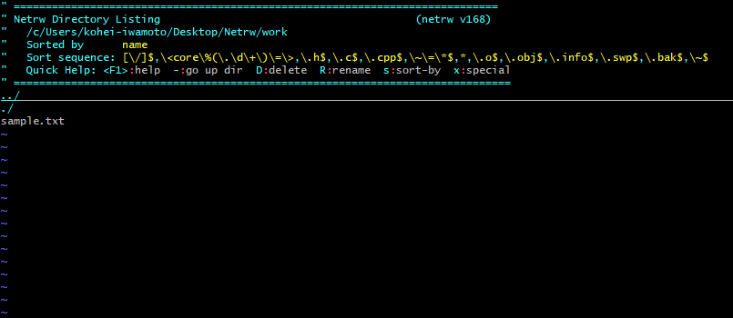
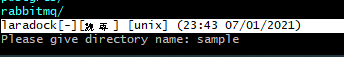

## はじめに

こんにちは、冬が苦手で早く春が来てほしいです。最近、ファイル操作をシェルでコマンド操作して少しずつコマンド操作に慣れてきた気がします。

ある時、***Vim*** をつかってファイルを編集しようとしたとき誤って、***Vim***` でディレクトリを開いてしまいました。すると見慣れない画面が出てきました。



いつもと違う画面が出てきてきたので、詳しく画面を見てみると、**Netrw Directory Listing**と書いていたので調べてみました。**Netrw**ってなに？？？

ちなみに、今回使用しているシェルは、**git bash** を使用しています。

## Netrwってなんだろう？？

**Netrw**を [pi_netrw - Vim日本語ドキュメント](https://vim-jp.org/vimdoc-ja/pi_netrw.html#netrw-start) で調べてみると**Vimの標準プラグイン**のようで以下のように書かれていました。

```
Netrw を使うとファイルの読み込み、書き込み、ネットワークを通したブラウジング、
ローカルファイルのブラウジングが簡単になります。
```
この文面から見てみると、ファイルの読み書きと検索ができるようです。

## Netrw を使ってみる！

**Netrw** の開き方ですが、```Vim ディレクトリ名```と入力すると、**Netrw**の画面が表示されます。

まず手始めにディレクトリをを作成してみます。`d` を入力すると、ディレクトリが作成できます。



`Please give directory name:` と表示されるのでディレクトリ名を入力してみます。


すると、きちんと`sample` ディレクトリができていました。

このように**Netrw**を使えば、ディレクトリ間の移動、削除、作成はもちろんのことそのほかにも様々な機能があります。

| コマンド | 説明 |
|----|----|
| D | ファイル/ディレクトリ(複数可)を削除する |
| d | ディレクトリを作成する |
| r | ソート順を逆にする |
| s | ソート方法を変える(name, time, file size) |
| % | 表示しているディレクトリで新しいファイルを開く |
| j | カーソルを下に移動する |
| k | カーソルを上に移動する |
| Enter | カーソルで指定したディレクトリに移動する。ファイルの場合は、指定したファイルを開く |
| - | 1つ上のディレクトリに移動する |
| o | カーソルで指定したファイルを新しい別ウィンドウで開く |

**Netrw** は多機能で一部の機能だけしか紹介できませんが、簡単なコマンドをまとめてみました。**Netrw コマンド**は、非常にシンプルで**シェルコマンドを使用するよりも短いコマンドで利用することができ、**慣れると早く目的のファイルにたどり着くことが可能だと使用して感じました。


**Netrwコマンド**でディレクトリを移動し、目的のファイルに到達した後、**Enter** を押すと、**Vim** でファイルを編集することができるので、さっとファイルを編集したい時に便利なのではないかと思います。


## さいごに

今回は、**Netrw**の紹介の記事になりましたが、私自身、**Vim**初心者で勉強の途中で知らない機能が多いので、今回のようにプラグインについて継続的に情報を調べていきたいと思っています。

また、**Netrw** に関するその他のコマンドを知りたい方はこのページの**参考ページ**にリンクを載せておきますので、ご参照ください。今日はここで失礼します。

## 参考ページ

[pi_netrw - Vim日本語ドキュメント](https://vim-jp.org/vimdoc-ja/pi_netrw.html#netrw-D)

