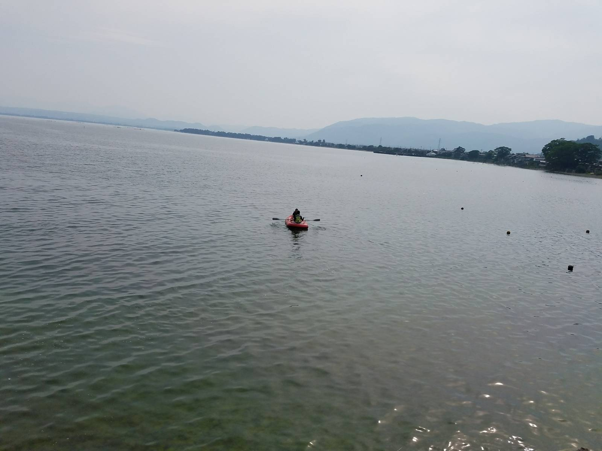
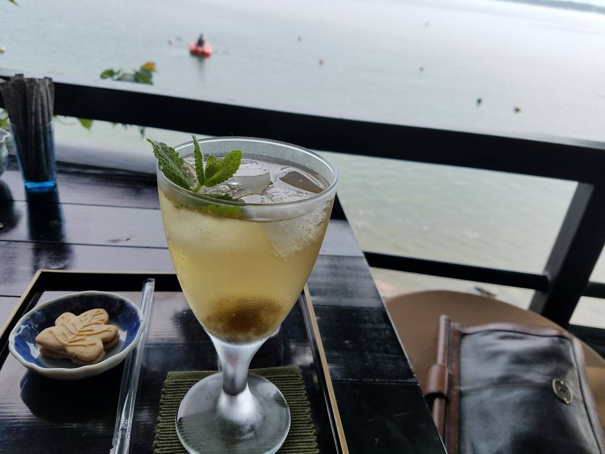

みなさん初めまして。私、今年の4月からMSENで働いている**こっしー**と申します。

6月24日から25日にかけて滋賀県は琵琶湖へ社員旅行に行って参りました。

写真とスケジュールに沿って、美味しかったお店や楽しかった場所など少しでも皆さんにお伝えできれば良いなと思い記事を作成いたしました。

## 1日目

### 食材調達

当日の朝、「[**彩菜みまさか**](http://www.saisai-mimasaka.jp/)」という八百屋で皆と合流し野菜を調達。
調達した野菜は晩御飯で輝くことになります。

### 昼食

宿に向かう途中、「**ひろせ 寿し正**」で昼食。

琵琶湖は海だった？と意味不明な錯覚をするほど海鮮料理が美味しかったです。

海のない滋賀県でここまで新鮮な魚が食べれることに驚きました。値段もお高いわけではなく、お魚が好きなかたにぜひお勧めしたいお店です。

お腹も満たされ宿へ向かいます。

### お宿と琵琶湖

無事宿に到着。宿名「[**四季亭**](http://www.shikitei.info/)」

写真から想像ができるように、雰囲気がよく琵琶湖のとても近くに建造されていて窓から琵琶湖に飛び込めるのではないかと思う程でした。笑

時間を忘れ、湖畔の水鳥や移りゆく景色をながめ、ゆっくりとした時間を過ごしたいかたはぜひ訪れてみてはいかがでしょうか。

二階建てであり、部屋によって間取りが様々で、床を持ち上げると地下へ繋がる階段を発見したときは子供心をくすぐられました。

地下にはボートが2つあり、1つ2000円で借りられるシステム。社長とけんけんさんはビールをポケットに入れボートに乗り込み琵琶湖に旅立っていきました。笑

その間、きよしんさんとじんじんさんと僕とで竹生島の造り酒屋の「[**吉田酒造**](http://chikubu-sakura.com/)」にて地酒を購入。

帰りに琵琶湖を堪能できるカフェで一息。なんですが、けんけんさんが目の前で泳いでいて面白かったです。笑

### バーベキュー

時間が過ぎ、皆が集まったところでバーベキューが始まりました。美味しいお肉にお酒、最高でした。

僕は中でも、「彩菜みまさか」で調達したトマト、しいたけ、きよしんさんがお得意先から調達してくれたお肉は普段一人暮らしをしている僕にはもったいない位おいしかったです。
 
トマトは贅沢にかぶりついて食べました。フルーティでお肉の脂を吸収してくれるような甘さで、デザート感覚でいただきました。

しいたけはしっかりと焼き、食べる前に醤油を垂らしてバターを乗せ、そのままいただきました。バターに醤油って無敵だと思います。笑

メインのお肉はどの部位も美味しかったのですが、口の中で溶けるホルモンが一番お米が進みました。

食べることに必死で、あまり写真を撮っていません。笑

ごちそうさまです。

バーベキューを終え、けんけんさん特製の燻製グッズで調理した明太子とチーズを片手に、皆で晩酌しました。

僕はあまりお酒は強くないのですが、先輩方はお酒を好まれる方が多く、とても美味しそうに飲んでいて少し羨ましかったです。

### 社長への誕生日プレゼント

いい感じに酔いが回ってきたところで、旅行の近日6月21日は社長のお誕生日ということで社員一同で社長にドローンをプレゼントしました！

早速その場でドローンを飛ばすことに。僕も操作させてもらったのですが余りにも高いクオリティと操作の安定感に驚きました。

正直すごい欲しくなりました。笑

### 就寝

時間も0時を過ぎ、順番にお風呂に入り就寝に向かいました。

最近お湯に浸かっていなかったので久しぶりの湯船はとても気持ちがよかったです。

窓際だったからかもしれませんが僕個人的には寝床がすごい好きでした。

先輩方は酔っぱらっていて共感してもらえなさそうですが... 笑

まるで千と千尋の神隠しに出てくるワンシーンのような場所でした。

窓一面に広がる琵琶湖の小さな波打つ音が心地よく、普段慣れない環境で寝ることが苦手な僕でもとても快眠できました。

## 2日目

次回につづく...お楽しみに！
