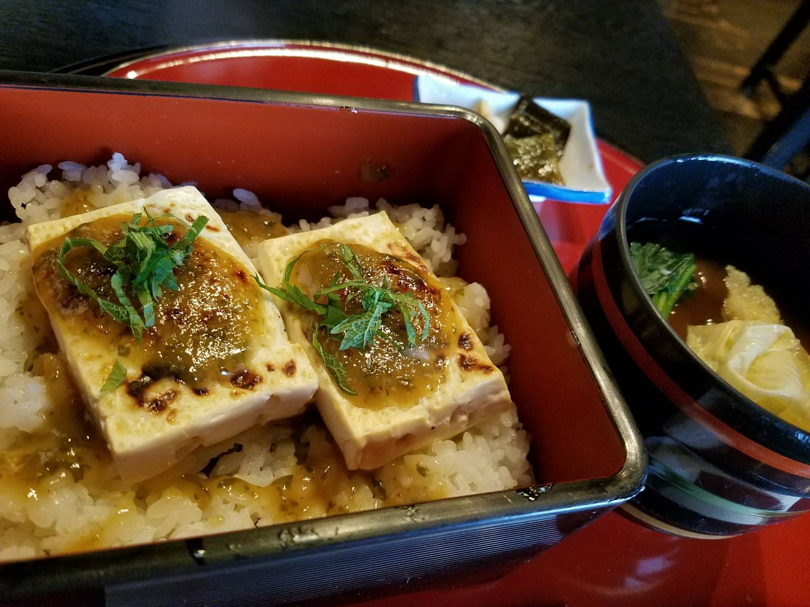
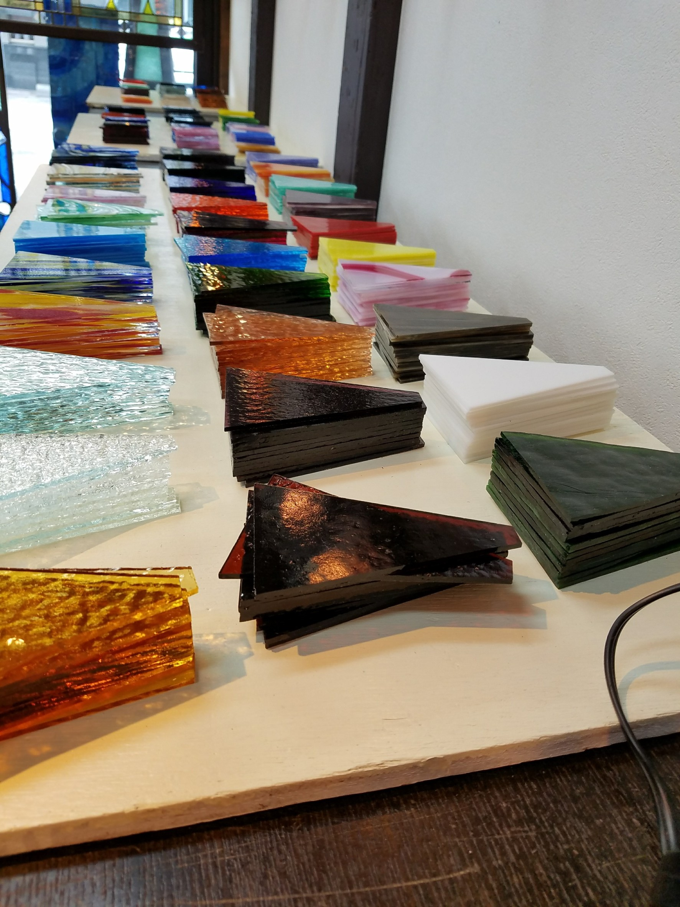
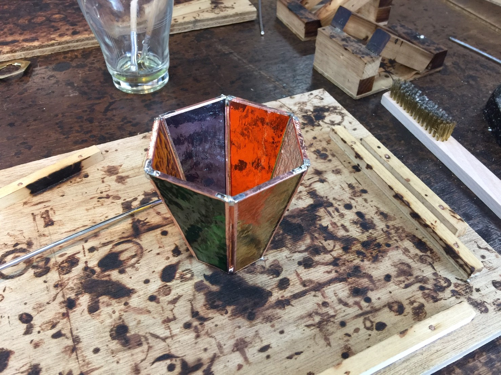
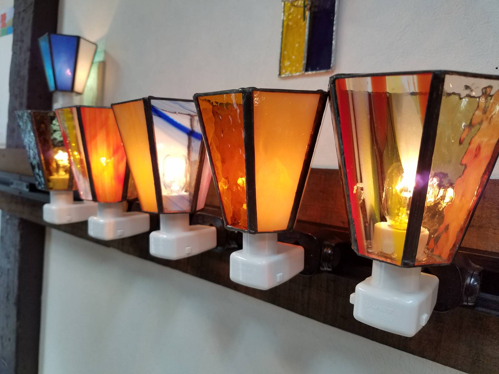
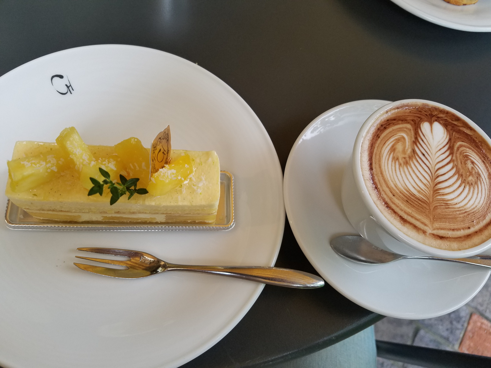

みなさんこんにちは、こっしーです。

6月24日から25日にかけて行ってきた琵琶湖バーベキューの2日目の様子をお届けします！

[1日目の記事はこちら](https://mseeeen.msen.jp/2017-summer-recreation-in-biwako-1/)

## 2日目

### 黒壁スクエア

二日目、朝ごはんはお茶漬けを食べ、四季亭を後にし長浜市の黒壁スクエアに向かいました。

北国街道沿いに続く古い街並の一角にある総称「黒壁スクエア」。

明治時代から黒壁銀行の愛称で親しまれた古い銀行を改装した「黒壁ガラス館」を中心に、ガラスショップや工房、ギャラリー、体験教室、レストランやカフェなど魅力あふれるお店が、古い街並の中に点在しています。

### のっぺいうどん

お昼ご飯は通りかかった「<a href="http://www.momiji-ya.jp/">**のっぺいうどん 茂美志屋（もみじや）**</a>」

僕は、豆腐の味噌田楽とミニのっぺいうどんをいただきました。

のっぺいうどんという言葉を初めて聞き、少し不安でしたが美味しくてよかったです。田楽は味噌が絶妙の甘さ加減でご飯が進みました。

### ステンドグラス作成体験

そして二日目のメインイベント、ステンドグラス体験のため「<a href="http://www.kurokabe.co.jp/trial/#stained_glass">**黒壁体験教室**</a>」にお邪魔しました。

好きな色の板ガラスで便利なおやすみランプやフォトフレーム、ミラー、テーブルランプなどを作成できるのですが僕はおやすみランプにしました。

まず好きなガラスを6枚選ぶのですが、種類が豊富で選ぶ工程が一番頭を使ったかもしれません。笑

ガラスのフチに銅テープをつけ、

はんだこてを使い貼り合わせていくのですが完成まで2時間近く作業するので結構神経を使います。

ただ、好きなガラスで自分の手で自分だけの作品を作る楽しさは図り知れないですね！

みなさんの並べた写真です。

### クラブハリエ

帰りの途中にある「<a href="http://clubharie.jp/">**クラブハリエ**</a>」のカフェで休憩し、それぞれお土産を購入し帰りました。

## まとめ

今回の社員旅行を経て、日々のストレスや疲れがとても解消されました。

何より思ったのはMSENで働けて良かったと思いました。頼もしい先輩方にこれからついていけるように頑張らなくてはならないない、ついていくだけではなく自分だけの武器のような力も身に付けなければならないとより一層思えるようになりました。

そのためにも気持ちを張り詰めた日々だけでなく、時には仕事のことを忘れてゆっくりできる時間を過ごすのも、長い期間で見れば効率的なのかもしれません。

では次回、「MOS試験！試験前日模擬試験5割から合格！」でお会いしましょう。