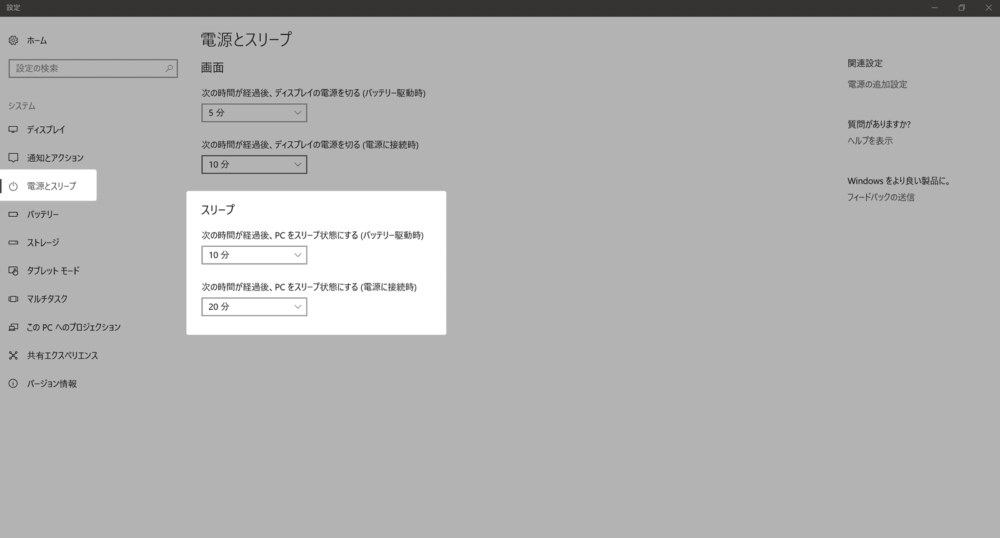

こんにちは、**こっしー**です。

パソコンをいくら放置しても**スリープ状態にならず**、いつの間にかバッテリーが無くなってる...

なんてことが最近ありました。大事な場面でバッテリーがないと焦りますよね。そんな不安を解消するためにも、実際に原因を探して対処してみました。

ちなみに使っているパソコンは、Lenovoの**Thinkpad X1 Yoga**、OSのバージョンは**Windows 10**です。

## 初めに

当然ながら、パソコンの設定により、スリープ状態を無効に設定していれば当然スリープ状態にはなりません。

デスクトップを右クリックして**ディスプレイ設定**をクリック
左にあるメニュー欄の**電源とスリープ**をクリック



スリープ状態にする設定が、**なし**になっていれば、お好きな時間を設定してください。設定した時間を経過するとスリープ状態になると思います。

しかし、僕の場合は、**設定している時間以上放置しているのにスリープ状態にならない！！**

もし、僕と現象が同じで原因が分からないかたがいれば、次の「**原因を探ろう**」をぜひ参考にしてみてください。

## 原因を探ろう

原因を探るためには、初めに**Windowsボタン**を押して「**cmd**」と打ち込みます。

すると**コマンドプロンプト**のアイコンが表示されると思うので、**右クリック**→**管理者として実行**を押して開きます。


次に、下記を実行してみてください。

```
C:\WINDOWS\system32> powercfg /requests
```

このコマンドは、**アプリケーションとドライバーの電源要求を列挙**します。**電源要求があると、ディスプレイの電源を自動的に切ることや、低電力のスリープ状態に移行することができません。**

- **DISPLAY：「ディスプレイの電源を切る」**
- **SYSTEM：「PCをスリープ状態にする」**
- **AWAYMODE：「退席中モード」**

電源要求には3種類あり、各項目の後に何か表示されていたら、それが**その要求を妨害している要因**となります。
僕の場合は、

```
SYSTEM:
[DRIVER] Conexant SmartAudio HD (HDAUDIO\FUNC_01&VEN_14F1&DEV_5111&SUBSYS_17AA2238&REV_1001\4&39c768b7&0&0001)
現在 1 つのオーディオ ストリームが使用中です。
```

これにより、`[DRIVER]`の後に書いている**`Conexant SmartAudio HD`**が**スリープ状態にならない要因**と分かりました。

**Conexant SmartAudio HD**について調べてみると、内蔵されているマイク/スピーカーのドライバーのようです。

## 対処方法

では、`Conexant SmartAudio HD`の電源要求をどうにかして止めなければなりません。

ただ、内蔵マイク/スピーカーのドライバーを削除するわけにもいきませんので、**電源要求を無視する**ように変更します。

```
C:\WINDOWS\system32> powercfg -requestsoverride DRIVER  "Conexant SmartAudio HD" SYSTEM
```

引数は、**<呼び出し元の種類>**、**<名前>**、**<要求>**の順となっているため、僕の場合は

- **<呼び出し元の種類>** → **DRIVER**
- **<名前>** → **"Conexant SmartAudio HD"**
- **<要求>** →　**SYSTEM**

このように書き換えて打ち込んでいます。

実行した時点で、スリープ状態にならない問題は改善されているだろうと思います。ただ、打ち込んでも特に何も表示されないので、正常に実行されたか不安ですよね。

次の「**最終確認**」では、**変更した内容の、確認方法と取り消し方法**について説明しています。

## 最終確認

先ほど打ち込んだコマンドの**引数を記載せず実行**します。

```
C:\WINDOWS\system32> powercfg -requestsoverride
```

すると、下記のような結果が返ってきました。

```
[SERVICE]

[PROCESS]

[DRIVER]
Conexant SmartAudio HD SYSTEM
```

**<呼び出し元の種類>**の下に先ほど電源要求を無視するように変更した**<名前>**が記載されていたら、正常に実行されています。

僕の場合は、**[DRIVER]**の下に**Conexant SmartAudio HD SYSTEM**が記載されているため、正常に実行されてると確認できますね。


実際に、スリープ状態になるまで待ってみました。
......**やっとスリープ状態になりました。**

ちなみに、電源要求を無視するように**変更したものを取り消す**ためには、変更する際に打ち込んだコマンドを少しだけ手直しするだけす。

```
C:\WINDOWS\system32> powercfg -requestsoverride DRIVER  "Conexant SmartAudio HD" SYSTEM
```

これから、**<要求>**の箇所、僕だと**SYSTEM**を記載せずに打ち込むと、変更したものを削除できます。
実際に打ち込んだコマンドが下記になります。

```
C:\WINDOWS\system32> powercfg -requestsoverride DRIVER  "Conexant SmartAudio HD"
```

## あとがき

まさか原因が、内蔵マイク/スピーカーだなんて思いもしませんでした。なんにせよ、直って一安心です。

コマンドプロンプトは普段あまり触っていないため、良い機会になったのかなと思います。

同じ現象で困っている方にとって、少しでも参考になれば幸いです。