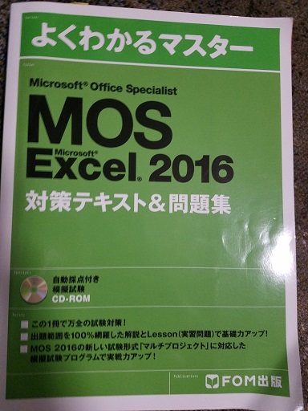
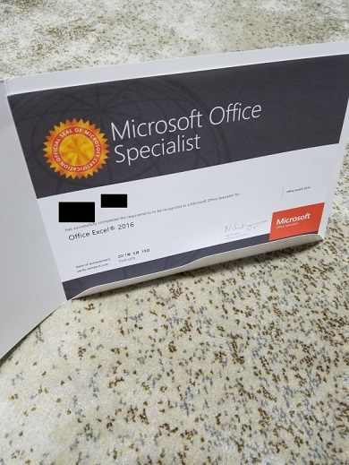

みなさん、こんにちは！こっしーです。

6月18日にMOS試験を受けてきました。

勉強期間は2週間ほどでしたが、結果は1問ミスで合格出来ました。

これから受ける方がいれば、ぜひ参考にしていただけると嬉しいです。

## MOSとは？

[Microsoft Office Specialist](http://mos.odyssey-com.co.jp/index.htm)の略称が**MOS**です。

Microsoft Office（以下、Office）の基本操作ならびに応用的な操作を実践的に行う資格です。

Officeの各バージョン及び各アプリケーションごとに試験科目が分かれています。

* 通常使う上で最低限必要な操作方法を出題するスペシャリストレベル
* スペシャリストレベルの基礎的な内容を十分に踏まえた上でより応用的な操作ができるかどうかを問うエキスパートレベル

上記の2段階に分かれています。（Word・Excel以外はスペシャリストレベルのみ）

Microsoft Office Specialist資格は国籍や年齢を問わずに誰でも挑戦できます！

## お勧めの参考書

僕が受けたのはExcelの一般コース、スペシャリストです。

これからMOS試験受ける方にお勧めしたい参考書がこちら

[よくわかるマスター MOS 対策テキスト＆問題集（FOM出版）](http://www.fom.fujitsu.com/goods/officespecialist/fpt1617.html)

お勧めできる点は模擬試験が行えることです。添付CD-ROMには**本番さながらの模擬試験**を収録しています。これを完璧に解く事が出来れば、本番も難なく合格することができます。

どれだけ学習しても試験形式が分からないと不安要素になり緊張に繋がると思いますが、模擬試験を多く受けることにより、本番の試験に操作ミスがあっても迅速に対応できるのも大切なポイントだと思います。

## 僕が行った勉強法

短期集中で勉強しました。

1. 覚えるのは操作の仕方と少量の暗記なので、一通り参考書の問題を解説を読みながら解いてみる。
2. 解説を読みながらでもよく理解できなかったところだけマーク。
3. 1周目を終え、マークしたところだけ復習し、2周目に入ります。
4. 2周目はなるべく解説を見ずに問題を解き、分からなかったところには再び違う色でマーク。
5. 2周目のマークを復習し、試験の内容が把握できたら模擬試験を受けてみる。

ちなみに僕は模擬試験を始めて受けたのが試験前日でした。笑

試験形式があまり理解できていなかったので時間配分や操作ミスにより最初の点数はひどかったです。

何度も模擬試験を通すと点数も必ず伸びていくので、5回ほど連続で模擬試験を通し試験に向かいました。

## 試験当日

試験場に早めに到着し、と言いたいところですが思いのほか駅から遠く、少し迷ってしまい試験開始5分ほど前に着席しました。

走って向かったので汗だらだら垂らしながらテストを受けました。とても反省しています。

ただ、模擬試験を多くこなしていたせいか本試験がとても簡単に感じたのが素直な感想です。

模擬試験を受けずに本試験を受けていたらと思うと少し怖いです。それほど試験形式を知るという大切さを感じました。

合格発表は終了ボタンを押した瞬間分かるので、3周ほど試験を解きなおし、ボタンを押しました。

結果は合格、1問ミスなのが悔しかったです....

## 感想

合格を報告した時、社長から「**合格はおまけ、それまでのプロセスを大切にしなさい**」と教えていただきました。

その通りだと思います。合格不合格問わず、合格に向かって勉強した時間はとても貴重であり、これからの糧になると感じました。

これからも合格した時の喜びを忘れず精進したいと思います。

次回は10月に基本情報技術者試験を受けてきます！お楽しみに！？