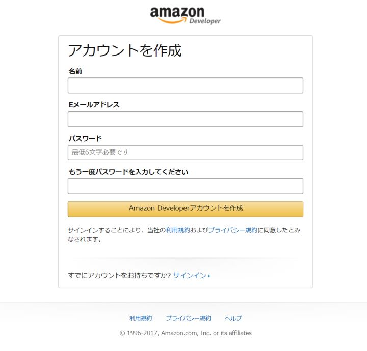

あけましておめでとうございます！こっしーです！

**Amazon Echo** が会社に届いてから、音楽を聴いたり色々楽しんでいます。

Echo (Alexa) に機能追加するには「**スキル**」が必要です。すでにいろんな会社からスキルが提供されていますが、使っているうちに*独自のスキル*を作ってみたくなってきたので、実際にスキルを作ってみることにしました！

本記事ではスキルを作成するために準備することをまとめました！スキルの詳しい作成方法は別記事にて。

## 概要

Amazon Alexa のスキルを作成するためには、 **Alexa Skills Kit** と **Amazon AWS** を連携させる必要があります。

そのため、以下のアカウントが必要になります。既にこれらのアカウントをお持ちの方は、本記事をスキップしてください。

- [Alexa Skills Kit (Amazon 開発者ポータル)](https://developer.amazon.com/ja/alexa-skills-kit)
- [Amazon Web Services (AWS)](https://aws.amazon.com/jp/register-flow/)
- [Amazon Alexa](https://alexa.amazon.com/spa/index.html#cards)（作成したスキルを実機テストする際に使用）

[Amazon 開発者ポータル](https://developer.amazon.com/ja/) と [Amazon Alexa](https://alexa.amazon.com/spa/index.html#cards) は既存の [Amazon](https://www.amazon.co.jp/) アカウントでログインすることができます。

Alexa スキルを開発しようという方で Amazon アカウントをお持ちでない方は少ないと思いますので、 Amazon アカウントの作成については割愛します。

では、それぞれのアカウント作成方法を見ていきましょう！

## Amazon 開発者ポータルアカウント

まずは Alexa Skills Kit を使うため、 [Amazon 開発者ポータル](https://developer.amazon.com/ja/) に飛び、「サインイン」をクリックしてください。

すると、「Amazon Developerアカウント作成」というボタンがありますので、こちらをクリックしてください。

アカウント作成画面が開きますので、画面に従って項目の入力をしてください。

これで、**Amazon 開発者ポータルアカウント**の作成は完了です。

※実機テストをする際は、このアカウントで [Amazon Alexa](https://alexa.amazon.com/spa/index.html#cards) にログインするようにしてください。

## Amazon Web Services (AWS) アカウント

[Amazon Web Services (AWS)](https://aws.amazon.com/jp/register-flow/) にアクセスし、「今すぐ無料アカウント作成」をクリックしてください。

アカウント作成画面が開きますので、あとは画面に従って項目の入力をしてください。

これで、**Amazon Alexa** のスキルを作成する準備は完了です！！

次からは実際にスキルの作成方法をみていきましょう！！
