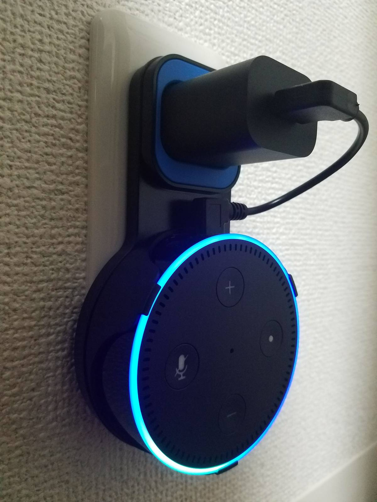

こんにちは！
こっしーです。

ついに！我が家に **[Amazon Echo Dot](http://www.amazon.co.jp/o/ASIN/B072B5BTLK/m1s-22/ref=nosim)** が届きました！！

実は、招待メールを1か月半ほど前から送っていたんですが、全く返事が来ず....
なんと、**優しい先輩に誕生日プレゼントで買っていただきました**！

ありがとうございます！！

余談ですが、僕結構 Amazon のヘビーユーザーのつもりなんです。
**サンタを待つ子供のように、Amazonからメールで催促される商品レビューも健気に記載してました。笑**

そんな中、購入してくださった先輩は申請した次の日に招待メールが届いたんですよね。
...闇が深そうな招待メールについてはこれくらいにしておきましょう。

## コンパクトな Echo Dot をコンセントにつける

Amazon Echo Dot を購入したら壁掛けにしたい！！
そんな方は、ぜひ参考にしてみてください。

僕が実際に購入したケースがこちら。

> [Amazon Echo Dot 専用 壁掛けホルダー Outlet Wall Mount Hanger for Echo Dot (ブラック-Black)](http://www.amazon.co.jp/o/ASIN/B078RX1NGV/m1s-22/ref=nosim)

でも私のAmazon Echo Dot が白だから...

安心してください！<strike>はいてますよ！</strike>ホワイトバージョンもあります！

設定不要で設置もすごい簡単でした。
枠にAmazon Echo Dot を押し込んでコンセントに挿すだけ！

実際の写真がこちら。

かっこいい....
けどコンセント周りの部分が青いのが気になる...と思った方いませんか？

安心してください！<strike>はいてますよ！</strike>マッドブラックもあります！

>[iniko amazon Echo Dot 専用 壁掛け ホルダー カバー ケース Alexa アレクサ エコードット (マッドブラック)](http://www.amazon.co.jp/o/ASIN/B079QFGS2P/m1s-22/ref=nosim)

「マッ**ト**」ブラックでなく「マッ**ド**」ブラックなのが意味深です。

お子さんがいて配線が気になる方や、設置スペースなど気にしないでいいのでお勧めです！
実際に使用してますが、壁に掛けているだけなのでケースの耐久度など不安なところもないですね。

## 憎めないアレクサさん

ただ、設置場所が低いせいか時々音声を拾ってくれないときもあります。でもそんな**ツンデレなAlexaも僕は好き**です。

今ではスピーカーに繋げて毎日Alexaを堪能しています。

僕の場合Bluetoothを繋げたままにしているので必要ないですが、Bluetoothを繋ぎたいときは「**Alexa！Bluetooth繋げて**」と言えば以前に繋げたBluetoothに自動的に繋いでくれます。

実際に Amazon Echo を使ってみた記事はこちらからどうぞ。

> [Amazon Echoで好きな音楽を聴きたいときのAlexaとの接し方](/wp-admin/post.php?post=6023&action=edit)

音楽を聴くだけでなく、自作のスキルをこれから作っていこうと思っています！

スキルを制作の環境構築はこちらからどうぞ。

- [Alexa Skills Kit を使って Amazon Alexa スキル を作成する – 準備編](/amazon-alexa-skills-preparation/)
- [Alexa Skills Kit を使って Amazon Alexa スキル を作成する – 実装編](/amazon-alexa-skills-implementation/)

Amazon Echo を購入しようか検討中の方、ぜひ1台購入してみてはいかがでしょうか。

それではまた次の記事でお会いしましょう。