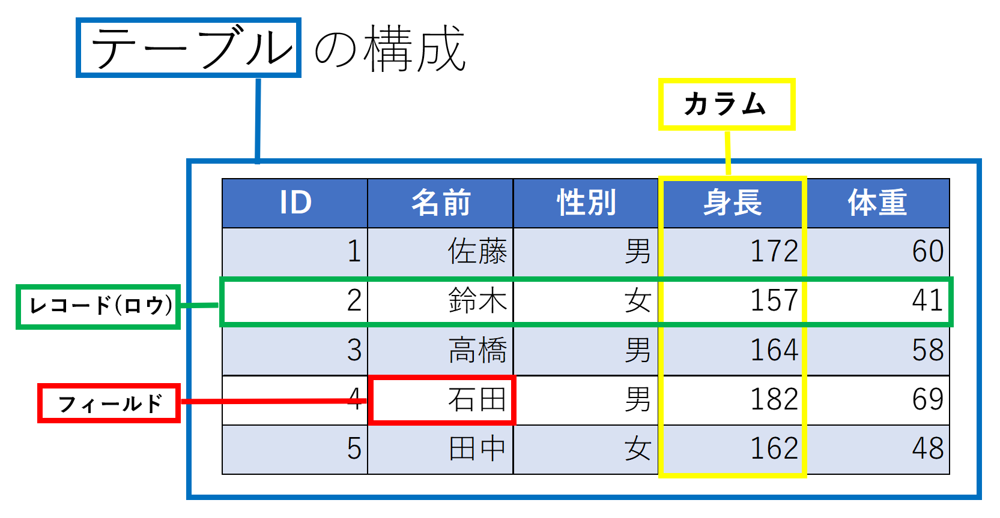

こんにちは！こっしーです。

みなさん **SQL** してますか？

いくら ORM が一般的になったとはいえ、システムエンジニアたるもの SQL を知らずに生きていくことは無理でしょう。

僕は入社半年を過ぎたところですが、最近色々な条件を指定して抽出するSQLを書けるようになりました。しかし、勉強し始めの頃はSQLのイメージが沸かず効率の悪い勉強をしていたなあと思います。

これからSQLの勉強を始める方に少しでも参考になればと思って記事にしました。今日はすごく初歩的なことから始めるので、SQLの知識がなくても気軽に読んでみてください。

ちなみにタイトルの質問の答えは「**SQLは食べられませんが、おいしい**」です。

## SQLってなに？

**SQL**とは、**リレーショナルデータベース管理システム (RDBMS)** と対話するための言語です。

この記事では「**データベース**」といった場合は「リレーショナルデータベース」を指します。データベースに対して「〇〇というデータをください」というの**要求を投げる**際に使われます。

## テーブルの構成

リレーショナルデータベースのデータ構造は「**テーブル**」が基本です。

イメージを掴むために簡単なテーブルを用意しましたのでご覧ください。

このテーブルの名前は**基本情報**とします。



- **列**に相当するのが**カラム**
- **データそのもの**のことを指す**レコード**。
同時に、列であるカラムに対して**行**を意味する**ロウ**
- レコードを構成する**1つ1つの要素**を**フィールド**

**上記3点**はしっかり覚えましょう。

## SELECT 文

SQL といえば **SELECT 文**です。

複数のテーブルから、条件を指定しての行の絞込みや列の値による並べ替えをして、目的に応じたデータの取り出しを行うことができる構文です。

SELECT文の基本的な形は、

```sql
SELECT カラム名
FROM テーブル名
WHERE 条件;**
```

ではそれぞれの意味を解説していきます。

- **SELECT**: **どのカラム（列）のデータを検索するのか**
- **FROM**: **どのテーブル (表) から検索するかを指定する**
- **WHERE**: **どのような場合 (条件) で検索するのか**

### 実際に考えてみましょう

では、上にあるテーブルの画像を参考にして問題を解いてみてください。

> Q.「**IDが1**である人の**名前**を**基本情報**テーブルから抽出してください。」

### 解答

いかがでしょうか。

では、順に考えていきましょう。まず、テーブル名は記載してある通り**基本情報**ですね。**FROM**の後に**基本情報**と書けることが分かります。

次に、名前を知りたいので、**SELECT**の後に**名前**、最後に、条件は**IDが1**の人のため、**WHERE**の後に　**ID=1**　となります。

```
SELECT 名前
FROM 基本情報
WHERE ID = 1;
```

これで完成です。

ちなみにセミコロン (;) は文の終わりという意味と覚えてください。意外に簡単ですね。

先ほどのSQLを書くだけで莫大なデータベースからでも、IDが1の人の名前を抽出できます。SQLの知識が増える分、**色々な条件を指定して自分の知りたい情報を抽出できる**と思うとわくわくしますよね。

SQLの初歩である**SELECT文**の書き方はイメージがついたと思います。次回から実際にサンプルデータを元に色々な条件を指定して抽出する方法を記載していきます。

主に **WHEREとHAVINGの違い** についてご説明します。

**ぜひ一緒にSQLを勉強していきましょう！！**

- 参考文献: [データベースの用語を理解しよう 「テーブル」「レコード」「カラム」「フィールド」とは？](https://academy.gmocloud.com/know/20160425/2259)

