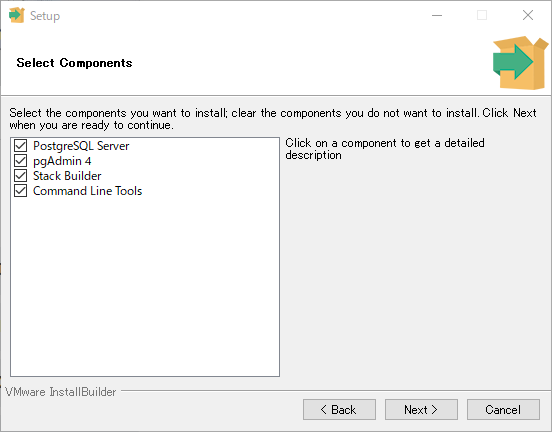
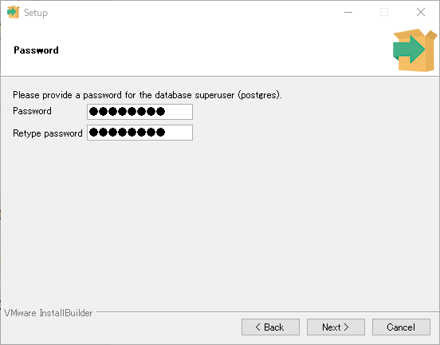
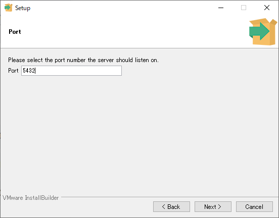
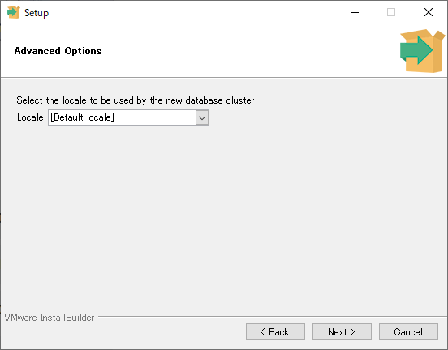
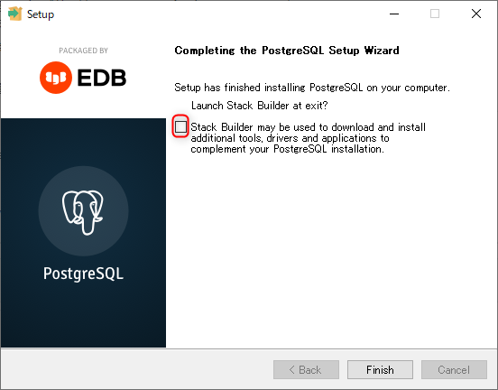
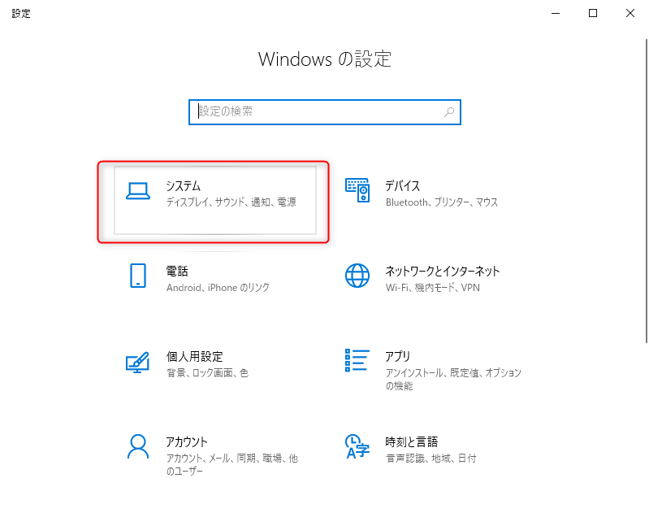
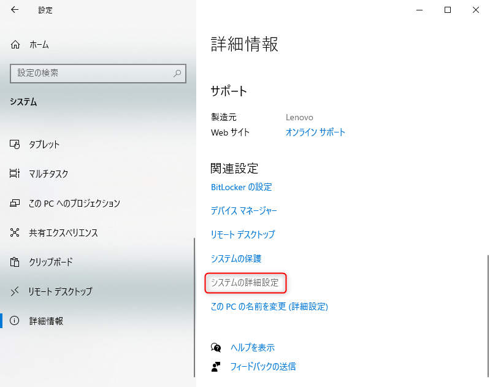
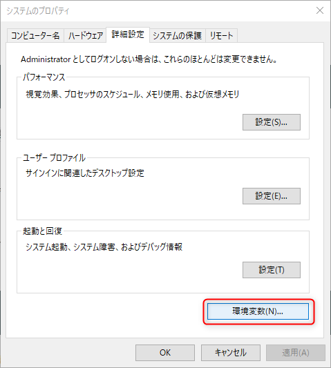
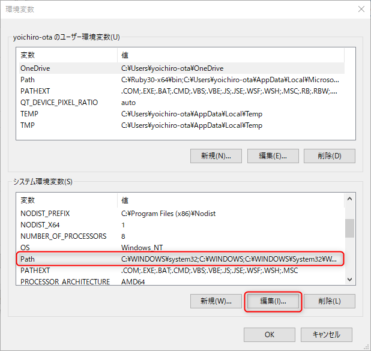
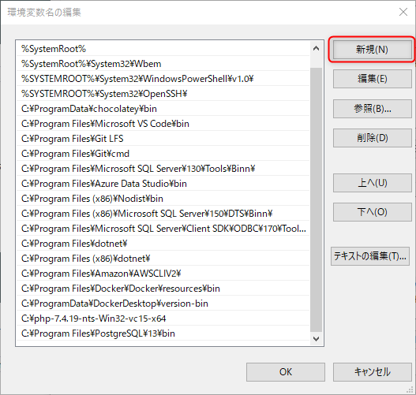

link です。

今回は別記事で紹介した **Heroku** で指定されている **PostgreSQL** をインストールして、 Rails のプロジェクトで使用する手順を紹介します。

## 前提条件

- Windows 10
- Ruby 3.0.*
- Ruby on Rails 6

## 対象読者

Heroku で使われている PostgreSQL を自分の開発環境で使いたいなど、本番環境と開発環境をできるだけ合わせたい初心者向けです。

## PostgreSQL のインストール

PostgreSQL のインストーラーを[こちら](https://www.postgresql.org/)からダウンロードしてください。

インストールするコンポーネントはデフォルトのまま進めます。


パスワードを設定します。


ポートと Locale の設定もデフォルトのままで大丈夫です。




インストールが完了したら、**完了後の画面のチェックを外して終了させてください。 Stack Builder は使いません。**



## PATH の設定

スタートボタンから`設定`を開いて、`システム → 詳細情報 → システムの詳細設定`と辿って行ってください。







`環境変数`で`システム環境変数`の`PATH`を選択して編集します。



`新規`を押して、先ほどインストールした PostgreSQL のフォルダにある bin フォルダのパスを入力しましょう。



恐らく `C:\Program Files\PostgreSQL\13\bin` のようなパスになるはずです。

一度、パソコンを再起動しましょう。  Gem などで利用できるようになったはずです。

## Gemfile の変更

`Gemfile` の `gem 'sqlite3', '~> 1.4'` の先頭に `#` を付けてコメントアウトします。

`gem 'pg'` を適当なところに追加して、コンソールに `gem install pg` と打ちましょう。

**Gemfile**
```rb
# 中略
# gem 'sqlite3', '~> 1.4'  # この行をコメントアウト
# 中略
gem 'pg' # この行を追加
```

## Ruby3.0 に PostgreSQL をインストール
 
Ruby2.3 以降の Gem にはデフォルトで PostgreSQL のドライバーが入っていません。そこで手動でインストールする必要があります。

コンソールに `ridk exec pacman -S mingw-w64-x86_64-postgresql` を打ちます。インストールを行いますか？と出てきたら y を入力しましょう。これで Gem にインストールされます。

以降、新規にプロジェクトを作成するか、既存のプロジェクトの DBMS を変更するかでやることが変わります。

### 新規プロジェクトで PostgreSQL を使用する場合

`rails new プロジェクト名 -d postgresql` で自動的に PostgreSQL を使ったプロジェクトを生成されます。

### 既存のプロジェクトで PostgreSQL を使用する場合

コンソールに `gem install pg` と打ちましょう。 Rails のプロジェクトにインストールされます。

## database.yml の編集

`config/database.yml` を開いて、
```yml
default: &default
  adapter: postgresql
  encoding: unicode
  pool: <%= ENV.fetch("RAILS_MAX_THREADS") { 5 } %>
  username: postgres
  password: PostgreSQL をインストールしたときに設定したパスワード
  host: localhost

development:
  <<: *default

test:
  <<: *default

production:
  <<: *default
```
に書き換えましょう。

---

これで Rails のプロジェクト内で PostgreSQL が使えるようになったはずです。

それではまた、別の記事でお会いしましょう。