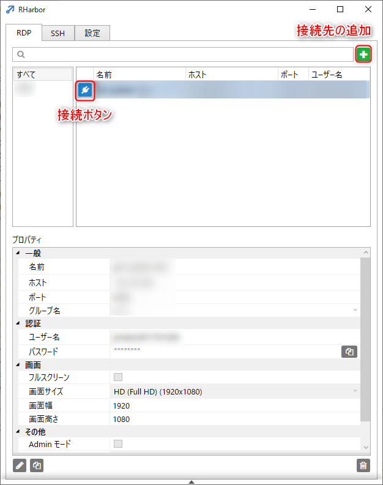
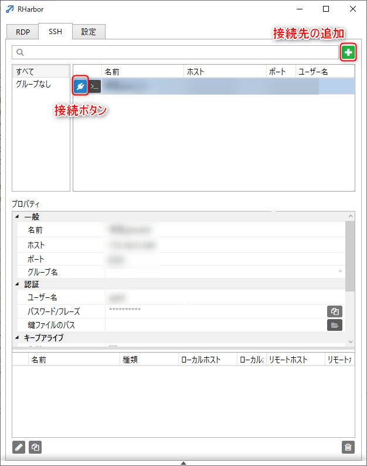
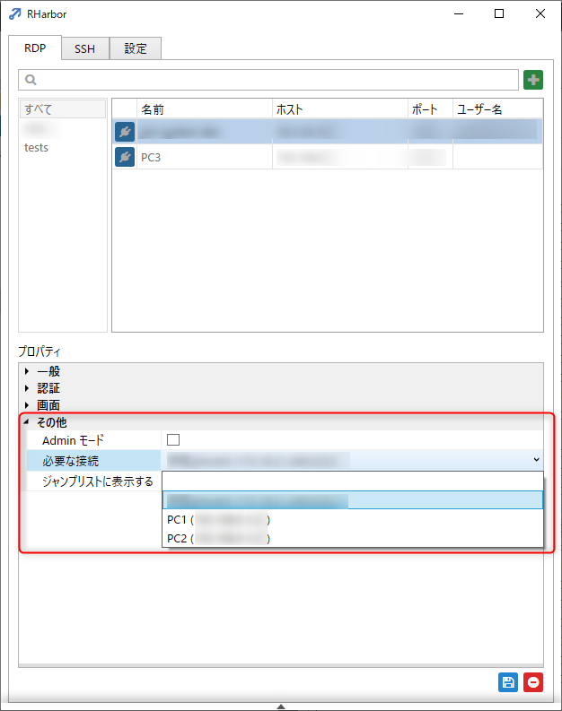
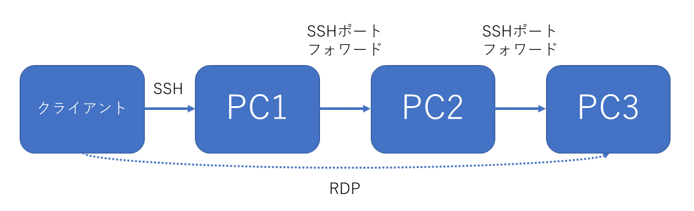
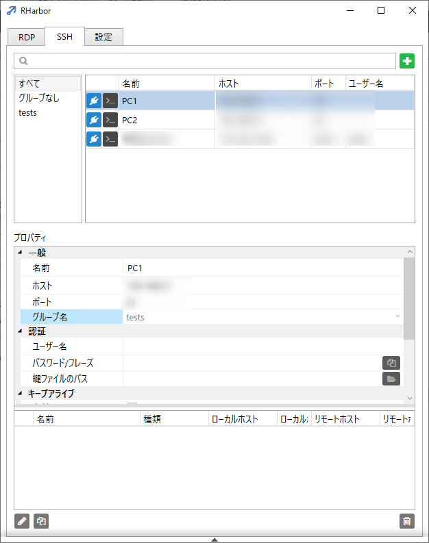
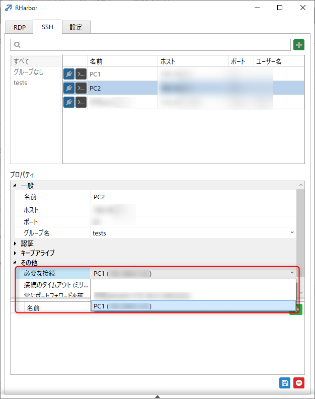
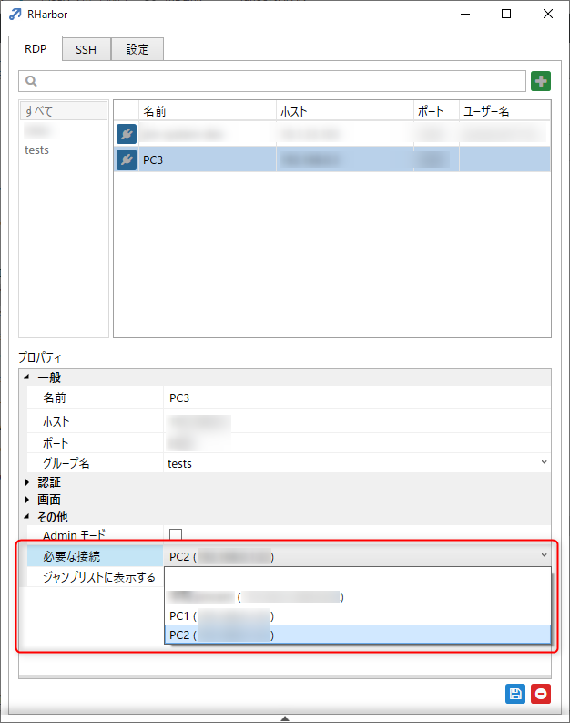

link です。

ネットワークの外部からリモートデスクトップ接続を行う際、セキュリティの関係で接続先の PC から別の PC にリモートデスクトップ接続をすることがあります。

ですが、毎回リモートデスクトップ接続で踏み台に接続して、踏み台からまた別の PC にリモートデスクトップ接続する、など順繰りに多段ログインするのは結構めんどくさいです。

そこで [RHarbor](https://kenzauros.github.io/rharbor/index.ja.html) を使って、一発で多段 SSH 経由のリモートデスクトップ接続をしてみます。

## RHarbor の説明

複数のリモートデスクトップの接続情報を一元管理できて、ワンクリックでリモートデスクトップ接続が開始できるアプリです。

また、リモートデスクトップの機能自体は Windows の標準機能を利用しているため、操作感が変わることなく利用できます。

RHarbor は以下のような方に便利です。

- 仕事で多くのリモートサーバーに RDP で接続する
- リモートデスクトップ先のマシンに接続するために複数の SSH を介さないといけない
- SSH のポートフォワーディングを手軽に行いたい
- 接続情報を一カ所で管理したい

単純に RDP する場合と多段 SSH 経由接続する場合の 2 パターンで紹介します。

## RHarbor の基本的な使い方

**単純に RDP する場合の手順**

1. `RDP` の右上の + ボタンを押す。
2. `プロパティ`の項目に**接続先の PC** のホストやポート、ユーザー名とパスワードなどの必要な情報を入力します。
3. 右下のフロッピーディスクのボタンを押して保存します。

**SSH の設定が必要な場合の手順**

1. `SSH` から右上の + ボタンを押す。
2. `プロパティ`の項目に**踏み台にする PC** の接続に必要なホストやポート、ユーザー名とパスワードなどの必要な情報を入力。
3. 右下のフロッピーディスクのボタンを押して保存します。
4. `RDP` で**接続したい PC の`その他の設定`の`必要な接続`から先ほど設定した SSH を選択。**

後は接続したい PC の項目にあるコンセントプラグのボタンを押すだけで接続することができます。

## 多段 SSH 経由接続のやり方

多段 SSH 経由で RDP 接続をする場合は**踏み台にして接続する順に SSH と RDP を設定します。**

例えば、 PC1(SSH) → PC2(SSH) → PC3(RDP) という構成で接続しなければならない場合の手順は以下のようになります。

1. PC1(SSH) の接続設定を作成
2. PC2(SSH) の接続設定を作成
3. PC3(RDP) の接続設定を作成

まず、 SSH で PC1 の設定を作ります。

次に、 SSH で PC2 の設定を作成します。**その際、`プロパティ`の`必要な接続`に PC1 を指定します。**

最後に RDP で PC3 の設定を作って、**`プロパティ`の`必要な接続`に PC2 に指定します。**

後は PC3 で接続するだけです。 PC1 → PC2 の順に接続が開始され、成功するとリモートデスクトップの認証画面が表示されます。

## まとめ

RHarbor を使ったら通常のリモートデスクトップ接続も多段 SSH 経由の接続も簡単にできました。

皆さんも使ってみてください。