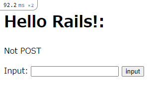
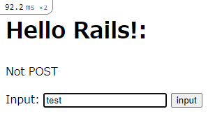
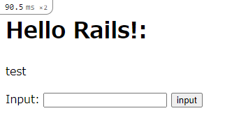

社会人になって睡眠時間が減って、平日はお眠気味な link です。

この記事は前回、[Ruby on Rails 6 入門 Part 1](https://mseeeen.msen.jp/ruby-on-rails1/)の続きです。

前回は Ruby on Rails を使う環境を整え、 Hello World! するところまでをやりました。

今回は**クエリパラメータ**と**フォームパラメータ**を使って、 Web アプリとの情報のやり取りする方法と、 HTML 内に Ruby の情報を埋め込むことができる **ERB テンプレート**について勉強していきます。

### 開発環境

基本的にはコードをかけるものなら何でもいいです。ですが、 [Visual Studio Code](https://azure.microsoft.com/ja-jp/products/visual-studio-code/) を使うことを想定しています。特定の言語のプラグインを入れれば、予約語などに色がつく、 VS Code 上でターミナルを起動できるなど便利な機能が備わっているからです。以降では VS Code を使って編集することを想定して説明します。

### クエリパラメータ

**クエリパラメータ**とは、さまざまな情報を Web サーバーに伝えるために URL に付け加える情報です。

例えば、 Yahoo! で disney のことを検索すると、 `https://search.yahoo.co.jp/search?p=disney` という感じのURLが出てきます。この URL の `?p=disney` という部分がクエリパラメータです。

このクエリパラメータを用いて、ページの内容が付加された情報に応じて変更されるページを作りましょう。

まず、前回の `studyRails` 内の `app\controllers\start_controller.rb` を開きましょう。

`StartController` クラスの中を

```rb
def index()
  @title = "Hello Rails!:"
  @msg = params["msg"]
  render plain: @title + @msg
end
```

と書き換えましょう。

ここで**変数の先頭についてる `@` はこの変数がインスタンス変数であることを表しています。 `@` がないと、この場合は、 `index` 関数のローカル変数と見なされるので注意しましょう。**

インスタンス変数は後で HTML に変数を埋め込む際に使います。

`@msg` に代入している `params["msg"]` の `msg` がクエリパラメータのキーです。

`index` を `route.rb` に登録しておくのも忘れないで下さい。

ここまで出来たら、 `rails s` を実行して、 `localhost:3000/start/index?msg=123` とブラウザの URL 欄に入力してみましょう。

`Hello Rails!:msg の中身`という風に表示されるはずです。

### View と ERB テンプレート

さて、今の画面は直接文字列を表示しているだけです。

このままでは凝った画面は作れません。

そこで、 HTML 文の中に Ruby の変数を直接埋め込める **ERB テンプレート**というものを利用したいと思います。

まず、 `/app/views/start` に index.html.erb という名前のファイルを作成します。

この `index.html.erb` を

```html
<html>
<head>
<title>studyRails</title>
</head>
<h1><%= @title %></h1>
<p><%= @msg %></p>
</html>
```

という風に書き換えます。

`<%= %>` というのは、 Ruby のコードを実行する箇所を示しており、このコードでは変数を HTML 内の指定した箇所に埋め込んでいます。

### フォームパラメータ

先ほどのクエリパラメータは便利なのですが、 **URL から送信する情報が丸見えになってしまうため、セキュリティに問題があります。**

そこで URL にクエリパラメータを記述せずに、情報のやり取りを行える**フォームパラメータ**を紹介します。

まず、`index.html.erb` を

```html
<html>
<head>
<title>studyRails</title>
</head>
<h1><%= @title %></h1>
<p><%= @msg %></p>
<%= form_tag("/index", method: "post") do %>
    <%= label_tag(:input, "Input:") %>
    <%= text_field_tag(:input) %>
    <%= submit_tag("input") %>
<% end %>
</html>
```

という風に書き換えましょう。これは**フォームヘルパー**と呼ばれるフォームパラメータを送信するための Rails の機能の一つです。

```html
<%= form_tag("/index", method: "post") do %>

<% end %>
```

で囲んだ中身に限定してフォームパラメータを受け取ります。

上述の ERB テンプレート内で `:input` と書かれている個所がフォームパラメータのキーに当たります。

`submit_tag` はボタンを生成する箇所です。

次に `start_controller.rb` の中身を

```rb
def index()
  if request.post?
    @title = "Hello Rails!:"
    @msg = params[:input]
  else
    @title = "Hello Rails!:"
    @msg = "Not POST"
  end
end
```

という風に書き換えます。 `if request.post?` は HTTP リクエストが POST であるかそうでないかを判別するためのものです。

`routes.rb` に `post 'index' => 'start#index'` の一文を加えるのも忘れないで下さい。



こんな画面が表示されるはずです。



試しに test と入力して input ボタンを押すと、



このように、 test と画面に表示されているのがわかります。

### まとめ

今回はクエリパラメータとフォームパラメータ、 Ruby のコードを HTML 内に埋め込める ERB テンプレートについて解説しました。

次回は画面の見栄えを良くするために Bootstrap を適用する方法と ERB テンプレートでヘッダーとフッターを設定する方法を学んでいきたいと思います。