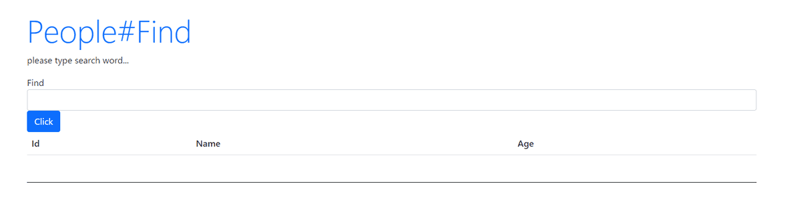
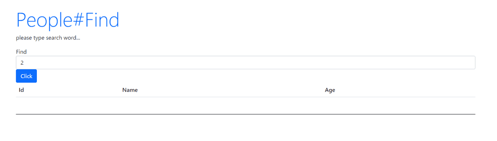
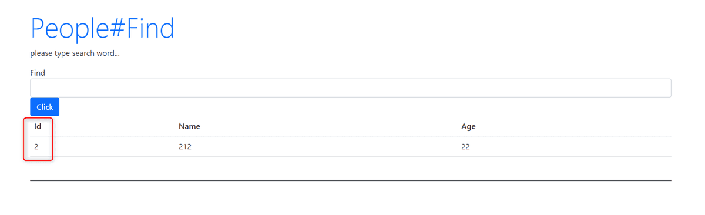
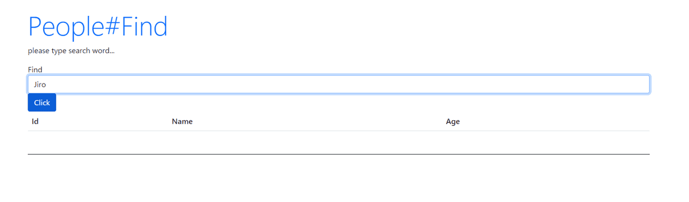
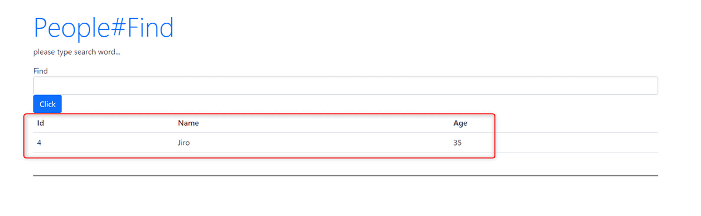
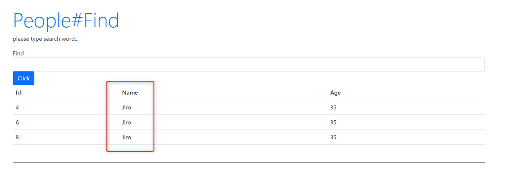

link です。

今回は Rails の Controller 上でデータベースを検索する方法を勉強します。

この記事は [Ruby on Rails 6 入門 Part 5](/ruby-on-rails5/) の続きです。

## 前提条件

- Windows 10
- Ruby 3
- Ruby on Rails 6

## ActiveRecord でデータベース検索

Rails には SQL を使わずにデータベースを検索できる **ActiveRecord** という機能があります。

この機能を使って、データベースを検索する機能を作成してみましょう。

まず、`app/controller/people_controller.rb` に以下の `find` メソッドを追加します。

```rb
def find
  @msg = 'please type search word...'
  @people = Array.new
  if request.post? then
    @people.push(Person.find(params[:find]))
  end
end
```

次に `app/views/people/find.html.erb` を作成して以下のように書きます。

```html
<h1 class="display-4 text-primary">People#Find</h1>
<p><%= @msg %></p>
<%= form_with model: @person do |form| %>
  <div class="form-group">
    <label for="find">Find</label>
    <%= form.text_field("find", {class:"form-control"}) %>
  </div>
<%= form.submit("Click", {class:"btn btn-primary"}) %>
<% end %>

<table class="table">
  <tr>
    <th>Id</th><th>Name</th><th>Age</th>
  </tr>
  <% @people.each do |obj| %>
  <tr>
    <td><%= obj.id %></td>
    <td><%= obj.name %></td>
    <td><%= obj.age %></td>
  </tr>
  <% end %>
</table>
```

`config/route.rb` にルーティングを追加します。追加するときは `get 'people/:id', to: 'people#show'` より上部で宣言されるようにしましょう。

```rb
get 'people/find'
post 'people/find', to: 'people#find'
```

`localhost:3000/people/find` にアクセスして、以下の画像のような画面になっていれば、下準備は完了です。



## ActiveRecord のメソッドの一部

SQL を使ってできることは ActiveRecord でほぼ全てできます。もちろん独自の SQL 文を使用するための `find_by_sql` メソッドも存在します。

今回はデータを取得するメソッドの一部を紹介します。ここで紹介したメソッド以外にも一番最初に取得したレコードを返す `first` や 多数のレコードに対して反復処理を行う `find_each` が存在します。

### find

主キーと一致するレコードを取得します。

`app/controller/people_controller.rb` に追加した `find` メソッド内の `Person.find(params[:find])` が ActiveRecord の `find` メソッドです。

例えば、主キーが `id` だとすると、 2 で検索すれば、



`id` が 2 のレコードのみを返します。



### find_by

`find_by` は与えられた条件にマッチするレコード群のうち、最初のレコードのみを返します。

まず、 `app/controller/people_controller.rb` を `find_by` を使ったコードに書き換えます。

```rb
def find
  @msg = 'please type search word...'
  @people = Array.new
  if request.post? then
    @people.push(Person.find_by(name: params[:find]))
  end
end
```

上述のコードでは `name` を検索条件としています。

例えば、 Jiro で検索します。



すると、 `name` が Jiro である最初のレコードを返します。



### where

`where` は返されるレコードを制限するための条件を指定します。 SQL 文で言う `WHERE` に相当します。

単に `where` メソッドのみで使えば、指定した条件に一致するレコード群を返してくれます。

まず、 `app/controller/people_controller.rb` を `where` を使ったコードに書き換えます。

```rb
def find
  @msg = 'please type search word...'
  @people = Array.new
  if request.post? then
    @people = Person.where(name: params[:find])
  end
end
```

`find_by` と同じく `name` を検索条件として、 Jiro を検索します。


すると、 `name` が Jiro であるレコード全てを返します。



### where で使える条件式

`where` で使える条件式とコード例の一覧を以下の表に示します。

|  検索条件  |  コード例  |
| ---- | ---- |
|  文字列のみ  |  `Person.where("name = Jiro")`,<br>`Person.where("id <= #{params[:id]}")`  |
|  プレースホルダーを使用した条件  |  `Person.where("name = ?", params[:find])`,<br>`Person.where("name = ? AND id = ?", params[:find], params[:id])`,<br>`Person.where("name = :name AND id = :id", {name: params[:find], id: params[:id]})`  |
|  ハッシュを使用した条件  |  `Person.where(name: params[:find])`  |
|  NOT 条件  |  `Person.where.not(name: params[:find])`  |
|  OR 条件  |  `Person.where(name: params[:find]).or(Person.where(id: params[:id]))`  |
|  サブセット条件  |  `Person.where(id: [1,3,5])`  |
|  範囲条件  |  `Person.where(created_at: (Time.now.midnight - 1.day)..Time.now.midnight)`  |

#### 文字列のみ

`where` の条件式は文字列だけで書くことも可能です。

ただし、条件で使用する数値が変動する可能性がある場合、 2 つ目のコード例のように変数をそのまま埋め込んでしまうと SQL インジェクションの脆弱性が発生する可能性があります。

そのため、渡される変数をサニタイズするために、プレースホルダーを使用した条件式か、ハッシュを使用した条件式を使用することが推奨されています。

#### プレースホルダーを使用した条件

最初の引数は文字列で表された条件として受け取ります。その後に続く引数は、文字列内にある `?` と置き換えられます。

`?` をパラメータで置き換える代わりに、 3 つ目のコード例のように条件中でキー / 値のハッシュを渡すことができます。

ここで渡されたハッシュは、条件中の対応するキー / 値の部分に置き換えられます。

Rails ガイドでは[配列で表された条件](https://railsguides.jp/active_record_querying.html#%E9%85%8D%E5%88%97%E3%81%A7%E8%A1%A8%E3%81%95%E3%82%8C%E3%81%9F%E6%9D%A1%E4%BB%B6)と表記されています。

#### ハッシュを使用した条件

上述の `find` メソッドの中ではハッシュを使用した条件で記述していますが、**ハッシュによる条件は、等値、範囲、サブセットのチェックでのみ使用できます。**

## 参考サイト

[Active Record クエリインターフェイス - Railsガイド](https://railsguides.jp/active_record_querying.html)

## まとめ

今回は Rails の ActiveRecord を使ってデータを検索する方法を勉強しました。

次回は Rails でバリデーションチェックを行う方法を勉強します。

それではまた、別の記事でお会いしましょう。
