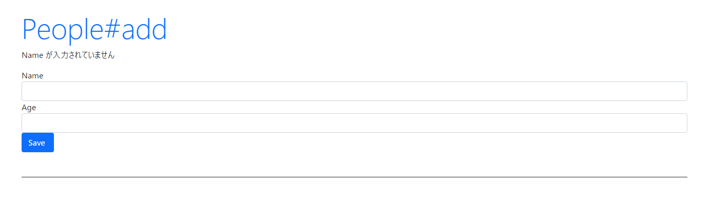
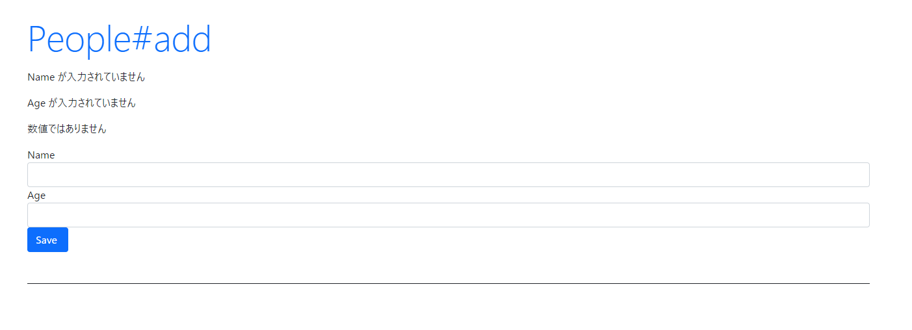

link です。

今回は Rails 上でバリデーションチェックを行う方法について勉強していきます。

この記事は [Ruby on Rails 6 入門 Part 6](/ruby-on-rails6/) の続きです。

## 前提条件

- Windows 10
- Ruby 3
- Ruby on Rails 6

## バリデーションチェック

前回紹介した Active Record にはバリデーション機能が備わっています。

この機能を使って、オブジェクトが保存される前にオブジェクトの状態を検証する方法を勉強していきましょう。

`app/model/Person.rb` を開いて、以下のように書き換えます。
```rb
class Person < ApplicationRecord
  validates :name, presence: true
end
```

これは、モデルのオブジェクトを保存するときにバリデーションを行うプロパティーを指定しています。

上述の例では、 `Person` モデルの `name` プロパティーを指定しています。

続けて、 `app/controller/people_controller.rb` の `create` メソッドを以下のように書き換えます。
```rb
def create
  if request.post? then
    if Person.create(person_params).valid? then
      redirect_to '/people/index'
    else
      @msg = "Name が入力されていません"
      render 'add'
    end
  end
end
```

いつものように `rails s` で Web アプリを起動させたうえで `localhost:3000/people/add` にアクセスして、何も入力せずに Save ボタンを押しましょう。

以下のような画像になっていれば成功です。


ボタンが `Create Person` から `Save` に変わっていますが、動作に問題はありません。

どうしても気になる場合は `app/views/people/add.html.erb` を書き換えましょう。

以下の文を書き換えます。
```rb
<%= form.submit class:"btn btn-primary" %>
```

これで常時、 `作成` ボタンが表示されます。
```rb
<%= form.submit "作成", class:"btn btn-primary" %>
```

上述の例を用いて解説していきます。

`Person.create` を実行すると、モデル内に記述された `validetes` の内容に基づいて、データベースにオブジェクトを保存するかを決定します。

オブジェクトが保存されたか否かは `valid?` プロパティーで取得できます。

`valid?` プロパティーが `true` なら、オブジェクトを保存後、`people/index` に画面を遷移します。

`false` なら、オブジェクトを保存せず、 `@msg` にエラーメッセージを表示させています。

## バリデーションヘルパー

Active Record には、モデル内で直接使える定義済みのバリデーションヘルパーが多数用意されています。

その中からいくつか紹介します。

### acceptance

チェックボックスにチェックが入っているかを確認します。

```rb
class Person < ApplicationRecord
  validates :check, acceptance: true
end
```

View テンプレートで生成されたチェックボックスのオプションがバリデーションチェックの対象になります。

そのため、データベース上に対応するカラムを作る必要はありません。

```html
<%= f.check_box :check %>
```

### confirmation

2 つのテキストフィールドで受け取る内容が完全に一致する必要がある場合に使います。

たとえば、 `name` を確認したい場合はモデルのバリデーションに `confirmation` を設定したうえで、View テンプレートに `_confirmation` がついた項目を用意します。

```rb
class Person < ApplicationRecord
  validates :name, confirmation: true
end
```

```html
<%= text_field :person, :name %>
<%= text_field :person, :name_confirmation %>
```

**このチェックは、 `name_confirmation` が `nil` でない場合のみ行われます。**

確認を必須にするには、後述する `presence` を使って、確認用の項目についての存在チェックも追加してください。

### length

入力値の長さに基づいて、バリデーションチェックを行うヘルパーです。

```rb
class Person < ApplicationRecord
  validates :name, length: { minimum: 2 }
end
```

以下のオプションが存在します。

- `minimum` : 入力された文字列の長さの下限を設定します。
- `maximum` : 入力された文字列の長さの上限を設定します。
- `in` または `within` : 入力された文字列の長さが、与えられた区間以内であるかを確認します。
- `is` : 入力された文字列の長さが設定された値と等しいかを確認します。

### numericality

入力値が数値かどうかをチェックするヘルパーです。

整数のみかどうかをチェックしたい場合は `true` の代わりに `{ only_integer: true }` を記述しましょう。

`only_integer` が `true` でない場合の値の型は `Float` として扱われます。

```rb
class Person < ApplicationRecord
  validates :age, numericality: true
end
```

### presence

指定された属性が「空でない」こと (`nil` でない ) を確認します。

```rb
class Person < ApplicationRecord
  validates :name, presence: true
end
```

### absence

`presence` とは逆に、指定された属性が「空である」こと (`nil` である ) を確認します。

```rb
class Person < ApplicationRecord
  validates :name, absence: true
end
```

### uniqueness

このヘルパーは、データベースにオブジェクトを保存する前に、保存する値がデータベース上のレコードと重複していないことをチェックします。

```rb
class Person < ApplicationRecord
  validates :name, uniqueness: true
end
```

### カスタムバリデーション

既存のバリデーションヘルパーでは足りない場合、自分でバリデーションを作ることもできます。

カスタムバリデーションを作る場合は `ActiveModel::Validator` を継承したクラスを作ります。

これらのクラスには `validate` メソッドを実装する必要があります。

`validate` メソッドはレコードを 1 つ引数に取り、それに対してバリデーションを実行します。

カスタムバリデーションは `validates_with` メソッドを使って呼び出します。

```rb
class MyValidator < ActiveModel::Validator
  def validate(record)
    unless record.name.starts_with? 'X'
      record.errors[:name] << '名前は X で始まる必要があります'
    end
  end
end

class Person < ApplicationRecord
  include ActiveModel::Validations
  validates_with MyValidator
end
```

## バリデーションエラー

Active Record では、バリデーションが失敗するたびに、オブジェクトの `errors` コレクションにエラーメッセージが追加されます。

試しに直打ちのエラーメッセージではなく、 `errors` コレクションのエラーメッセージを表示させてみましょう。

`app/controllers/people_controller.rb` の `add` メソッドと `create` メソッドを以下のように変更します。
```rb
def add
  @msg = "add new data."
  @person = Person.new
  @errors = Hash.new
end

def create
  if request.post? then
    person = Person.create(person_params)
    if person.valid? then
      redirect_to '/people/index'
    else
      @errorMessages = person.errors
      render 'add'
    end
  end
end
```

続いて、 `app/views/people/add.html.erb` を以下のように変更します。
```html
<h1 class="display-4 text-primary">People#add</h1>
<p><%= @msg %></p>
<% @errorMessages.values.each do |error| %>
  <p><%= error %></p>
<% end %>
<%= form_with model: @person, url: people_add_path do |form| %>
  <div class="form-group">
    <label for="name">Name</label>
    <%= form.text_field :name, class:"form-control" %>
  </div>
  <div class="form-group">
    <label for="age">Age</label>
    <%= form.text_field :age, class:"form-control" %>
  </div>
<%= form.submit class:"btn btn-primary" %>
<% end %>
```

最後に `app/models/person.rb` を以下のように変更します。
```rb
class Person < ApplicationRecord
  validates :name, presence: {message: "Name が入力されていません"}
  validates :age, presence: {message: "Age が入力されていません"}
  validates :age, numericality: {only_integer: true, message: "数値ではありません"}
end
```

`localhost:3000/people/add` で何も入力せずに Save ボタンを押しましょう。

以下のような画面になれば成功です。


`errorMessages` に保存されるエラーメッセージは以下のような連想配列になっています。

```rb
{
  :name => ["Name が入力されていません"],
  :age => ["Age が入力されていません", "数値ではありません"]
}
```

バリデーションチェックの対象となる値をキーとして、バリデーションチェックに引っかかった条件のエラーメッセージの配列を保存しています。

### カスタムメッセージ

上述の例の通り、バリデーションヘルパーの `message` オプションを指定すれば任意のエラーメッセージを表示させることができます。

```rb
class Person < ApplicationRecord
  validates :name, presence: {message: "Name が入力されていません"}
end
```

## 参考サイト

[Active Record バリデーション - Railsガイド](https://railsguides.jp/active_record_validations.html)

## まとめ

今回は Active Record バリデーションを使って Rails 上でバリデーションチェックを行う方法を勉強しました。

次回は Rails のモデル連携（アソシエーション）について勉強します。

それではまた、別の記事でお会いしましょう。
