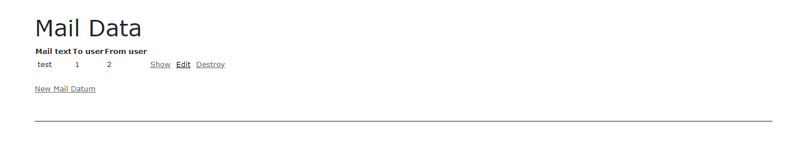

link です。

今回は CRUD を簡単に生成してくれる **Scaffold** を使って、簡単な Web アプリを実装してみましょう。

この記事は [Ruby on Rails 6 入門 Part 8](/ruby-on-rails8/) の続きです。

## 前提条件

- Windows 10
- Ruby 3
- Ruby on Rails 6

## Scaffold とは

Scaffold は工事現場で使う足場、土台の意味で、 Model の CRUD を自動で生成してくれる Rails の機能です。

コンソールで `rails g scaffold モデル名 カラム 1 : 型 カラム 2 : 型...` と入力するだけで CRUD を実装した Controller, View, Model のすべてを自動で生成してくれます。

ただし、自動生成されるのは CRUD だけなので Search(検索) などの別機能は自分で実装する必要があります。

この Scaffold を使って、簡単なメールアプリを実装してみましょう。

## メールアプリのデータ構成

今回のメールアプリを実装するに当たって、以下の表のようなデータ構成を考えます。

| MailDatum | UserOwnMail | User |
| --- | --- | --- |
| id:integer | id:integer | id:integer |
| mail_text:text | mail_datum_id:integer | name:string |
| to_user_id:integer | user_id:integer | |
| from_user_id:integer | | |

`MailDatum` はメール本文、送信元、送信先のデータです。

`User` はユーザのデータです。

`UserOwnMail` はどのメールをどのユーザが持っているかを表す `MailDatum` と `User` の中間 Model です。

## メールアプリの実装

### Model 生成

では早速、 Scaffold を使ってそれぞれの Model を生成しましょう。

ターミナルから以下のコードを入力します。

```
$ rails g scaffold MailDatum mail_text:text to_user_id:integer from_user_id:integer
$ rails g scaffold User name:string`
$ rails g scaffold UserOwnMail mail_datum_id:integer user_id:integer
```

生成が完了したら、以下のページにアクセスして、画像のような画面が表示されるのを確認しましょう。

- `localhost:3000/users/`
- `localhost:3000/mail_data/`
- `localhost:3000/user_own_mails/` 


`New Model 名` のリンクをクリックすると以下の画像のような Create 画面に遷移します。


データを入力して、登録したデータが Index 画面に表示されるのも確認しましょう。



Scaffold で生成したこれらのコードを改造してメールアプリを実装していきます。

### Model の関連付け

Model 間の関連付けを行います。生成した Model を以下のコードに書き換えます。

```rb:app/models/user.rb
class User < ApplicationRecord
    has_many :user_own_mails
    has_many :mail_data, through: :user_own_mails
end
```

```rb:app/models/mail_datum.rb
class MailDatum < ApplicationRecord
    has_many :user_own_mails
    has_many :users, through: :user_own_mails
end
```

```rb:app/models/user_own_mail.rb
class UserOwnMail < ApplicationRecord
    belongs_to :user
    belongs_to :mail_datum
end
```

今回、多対多関係を実現するために `has_many :through` を使っています。

### Controller の改造

### View の改造

### 完成形

## まとめ

今回は Scaffold を使って簡単な Web アプリを実装してみました。

次回は Rails と React を組み合わせる方法を勉強します。

それではまた、別の記事でお会いしましょう。
