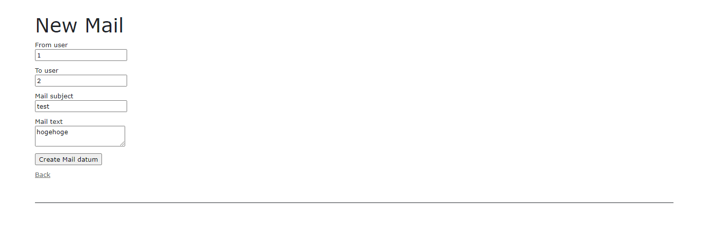

link です。

今回は CRUD を簡単に生成してくれる **Scaffold** を使って、簡単な Web アプリを実装してみましょう。

この記事は [Ruby on Rails 6 入門 Part 8](/ruby-on-rails8/) の続きです。

## 前提条件

- Windows 10
- Ruby 3
- Ruby on Rails 6

## Scaffold とは

Scaffold は工事現場で使う足場、土台の意味で、 Model の CRUD を自動で生成してくれる Rails の機能です。

コンソールで `rails g scaffold モデル名 カラム 1 : 型 カラム 2 : 型...` と入力します。すると、 CRUD を実装した Controller, View, Model のすべてを自動で生成してくれます。

ただし、自動生成されるのは CRUD だけなので Search(検索) などの別機能は自分で実装する必要があります。

この Scaffold を使って、簡単なメールアプリを実装してみましょう。

## メールアプリのデータ構成

今回のメールアプリを実装するにあたって、以下の表のようなデータ構成を考えます。

`MailDatum` はメール本文、送信元、送信先のデータ、 `User` はユーザーのデータです。

### MailDatum

| カラム名 | 型 |
| --- | --- |
| id | integer |
| from_user_id | integer |
| to_user_id | integer |
| mail_subject | string |
| mail_text | text |

### User

| カラム名 | 型 |
| --- | --- |
| id | integer |
| name | string |


## メールアプリの実装

### Model 生成

`User` と ` MailDatum` Model を生成しましょう。

ターミナルから以下のコードを入力します。

```
$ rails g scaffold User name:string`
$ rails g controller MailData show
$ rails g model MailDatum from_user_id:integer to_user_id:integer mail_subject:string mail_text:text 
```

生成が完了したら、 `localhost:3000/users/` にアクセスして、画像のような画面が表示されるのを確認しましょう。


`New User` のリンクをクリックすると以下の画像のような Create 画面に遷移します。


データを入力して、登録したデータが Index 画面に表示されるのも確認しましょう。


この Scaffold で生成した `User` のコードを改造してメールアプリを実装していきます。

### Model の関連付け

Model 間の関連付けを行います。生成した Model を以下のコードに書き換えます。

```rb:title=app/models/user.rb
class User < ApplicationRecord
    has_many :mail_data
end
```

```rb:title=app/models/mail_datum.rb
class MailDatum < ApplicationRecord
    belongs_to :user
end
```

### Controller の改造

Controller を書き換えていきます。

`app/controllers/users_controller.rb` に `new_mail` アクションと `mail_datum_params` メソッドを追加します。

`mail_datum_params` メソッドは `private` より下の位置に追記します。

```rb:title=app/controllers/users_controller.rb
def new_mail
  @mail_datum = MailDatum.new
  @mail_datum.from_user_id = params[:id]
end
private
def mail_datum_params
  params.require(:mail_datum).permit(:user_id, :from_user_id, :mail_subject, :mail_text)
end
```

`app/controllers/mail_data_controller.rb` を以下のように書き換えます。

```rb:title=app/controllers/mail_data_controller.rb
class MailDataController < ApplicationController
  before_action :set_mail_datum, only: %i[ show edit update destroy ]

  def show
  end

  private
  def set_mail_datum
    @mail_datum = MailDatum.find(params[:id])
  end
end
```

`before_action` はアクションの前に呼び出すメソッドを指定するものです。

上述のコードではアクションの前に `set_mail_datum` を呼び出して、 `@mail_datum` の中身を代入しています。

### View の改造

View の中身を書き換えていきます。

`app/views/users/new_mail.html.erb` を以下のように書き換えます。

```html:title=app/views/users/new_mail.html.erb
<h1>New Mail</h1>

<%= form_with(model: @mail_datum, url: :user) do |form| %>
  <div class="field">
    <%= form.label :from_user_id %>
    <%= form.number_field :from_user_id %>
  </div>

  <div class="field">
    <%= form.label 'To user' %>
    <%= form.number_field :user_id %>
  </div>

  <div class="field">
    <%= form.label :mail_subject %>
    <%= form.text_field :mail_subject %>
  </div>

  <div class="field">
    <%= form.label :mail_text %>
    <%= form.text_area :mail_text %>
  </div>

  <div class="actions">
    <%= form.submit %>
  </div>
<% end %>

<%= link_to 'Back', mail_data_path %>
```

`app/views/users/show.html.erb` を以下のように書き換えます。

```html:title=app/views/users/show.html.erb
<p id="notice"><%= notice %></p>

<p>
  <strong>Name:</strong>
  <%= @user.name %>
</p>

<p>
  <% @user.mail_data.each do |mail| %>
    <p><%= mail.id %>: <%= link_to(mail.mail_subject, "#{mail_data_path}/#{mail.id}") %></p>
  <% end %>
</p>

<%= link_to 'Mailing', "/users/#{@user.id}/new_mail" %> |
<%= link_to 'Edit', edit_user_path(@user) %> |
<%= link_to 'Back', users_path %>
```

`app/views/mail_data/show.html.erb` を以下のように書き換えます。

```html:html:title=app/views/mail_data/show.html.erb
<p>
  <strong>To user id:</strong>
  <%= @mail_datum.user_id %>
</p>

<p>
  <strong>From user id:</strong>
  <%= @mail_datum.from_user_id %>
</p>

<p>
  <strong>Mail subject:</strong>
  <%= @mail_datum.mail_subject %>
</p>

<p>
  <strong>Mail text:</strong>
  <%= @mail_datum.mail_text %>
</p>

<%= link_to('Back', "#{users_path}/#{@mail_datum.user_id}") %>
```

これでコードの書き換えは完了です。

最後に、`users#new_mail` と `users#show` のルーティングを設定します。

```rb:title=config/routes.rb
get 'users/:id/new_mail', to: 'users#new_mail'
post 'users/:id', to: 'users#show'
```

 `seeds.rb` にテスト用のレコードを追加して、 `db:migrate` と `db:seed` を実行しましょう。

```rb:title=db/seeds.rb
User.create(name: "Ichiro")
User.create(name: "Jiro")
```

### 完成形

`localhost:3000/users` にアクセスして、以下の画像のような画面が出ることを確認します。


試しに、 `Ichiro` の `Show` リンクを押して、詳細を見てみます。


`Mailing` というリンクがあるを確認したら、クリックしてみましょう。

すると、 `localhost:3000/users/new_mail` に移動します。

`To User` を `Jiro` の `Id` である 2 にして `Create Mail datum` を押します。

ボタンの文字列が気になる場合、 `new_mail.html.erb` の `<%= form.submit %>` を `<%= form.submit("送信") %>` に変えましょう。

`Create Mail datum` が `送信` に置き換わります。

`Ichiro` の `Show` 画面に戻るので、今度は `Jiro` の `Show` 画面に移動します。



`Ichiro` から送られたメールが届いているのがわかります。


リンクをクリックすると、 `MailData` の `Show` 画面に移動します。


## まとめ

今回は Scaffold を使って簡単な Web アプリを実装してみました。

次回は Rails と React を組み合わせる方法を勉強します。

それではまた、別の記事でお会いしましょう。
