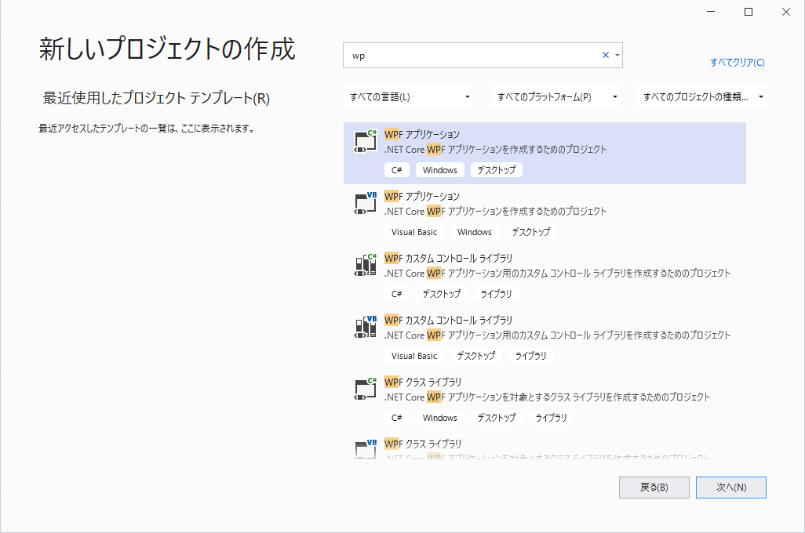
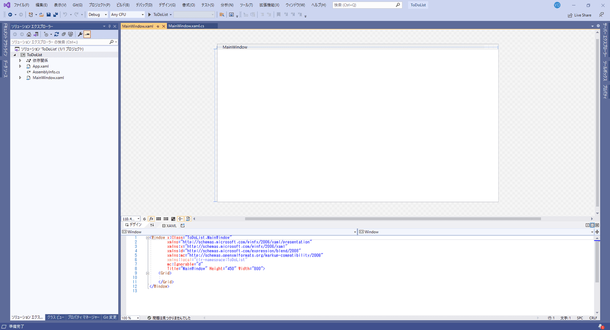
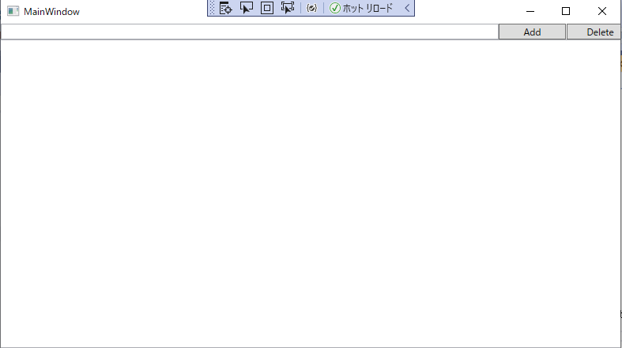
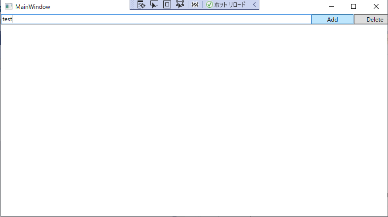
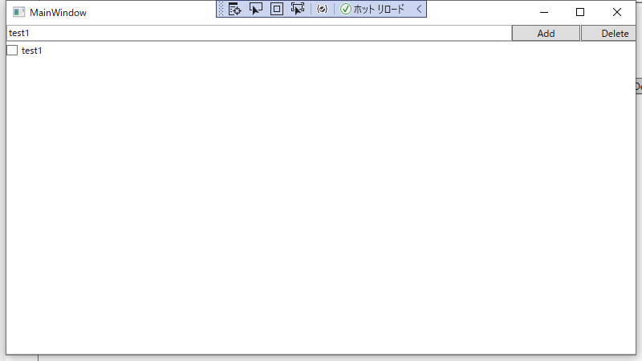
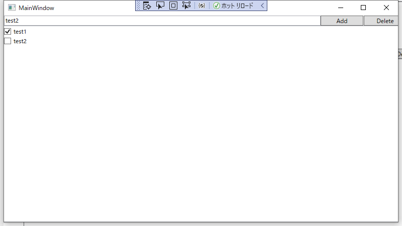
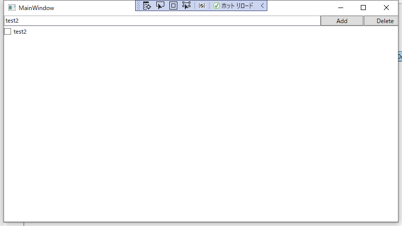

link です。

**WPF(Windows Presentation Foundation)** を使って ToDo リストアプリを作ってみたので、 WPF の解説を交えつつ、アプリの紹介をしてみたいと思います。

## 前提条件

- Windows 10
- Visual Studio 2019

## WPF とは

WPF は、 Microsoft が提供しているデスクトップ クライアント アプリケーションを作成する UI フレームワークです。

>WPF の開発プラットフォームは、アプリケーション モデル、リソース、コントロール、グラフィックス、レイアウト、データ バインディング、ドキュメント、セキュリティなどのさまざまなアプリケーション開発機能の一式をサポートします。フレームワークは .NET の一部であるため、以前 ASP.NET や Windows フォームを使用して .NET でアプリケーションを構築したことがあれば、プログラミングには馴染みがあるでしょう。 WPF は、Extensible Application Markup Language (XAML) を使用して、アプリケーションのプログラミング用に、宣言型モデルを提供します。

>出展：[WPF とは - Visual Studio | Microsoft Docs](https://docs.microsoft.com/ja-jp/visualstudio/designers/getting-started-with-wpf?view=vs-2019)

## データバインディングとは

データバインディングは、二つのオブジェクトやデータを結びつけ、一方の変更をもう一方と同期することを実現する仕組みのことです。

例えば、 WPF の XAML では、 Window 上の CheckBox にチェックを入れたら、それにバインディングされているデータに CheckBox のチェックされているか否かの状態が自動的に反映される、といったものです。

データバインディングには View の変更をデータ側に通知する必要がある**片方向バインディング**と、View とデータの変更が直接連動している**双方向バインディング**があります。

今回は片方向バインディングを使って、追加と削除が可能な ToDo リストアプリを作ってみましょう。

## アプリを作ってみる

Visual Studio を起動して、`新しいプロジェクトの作成 → WPF アプリケーション` を選択します。



これで、 WPF アプリケーションのプロジェクトが作成されます。



まずはデータバインディングに使用するクラスを作成します。 `TodoElement.cs` を作成して中身を
```cs
using System;
using System.Collections.Generic;
using System.Text;

namespace TodoList
{
  class TodoElement
  {
    public TodoElement(string Element, bool DoneFlg)
    {
      this.Element = Element;
      this.DoneFlg = DoneFlg;
    }
    public string Element { get; set; }
    public bool DoneFlg { get; set; }
  }
}
```
とします。

`{ get; set; }` はプロパティの getter と setter です。

こう書くことで `todoElement.Element = "test"` という感じで簡単にプロパティの代入と取得ができます。

次にウィンドウの表示とイベントの処理を行う `MainWindow.xaml` と `MainWindow.xaml.cs` の中身を書き換えます。

**MainWindow.xaml**
```xml
<Window x:Class="TodoList.MainWindow"
        xmlns="http://schemas.microsoft.com/winfx/2006/xaml/presentation"
        xmlns:x="http://schemas.microsoft.com/winfx/2006/xaml"
        xmlns:d="http://schemas.microsoft.com/expression/blend/2008"
        xmlns:mc="http://schemas.openxmlformats.org/markup-compatibility/2006"
        xmlns:local="clr-namespace:TodoList"
        mc:Ignorable="d"
        Title="MainWindow" Height="450" Width="800" Loaded="SetBindingList">
    <Grid>
        <TextBox HorizontalAlignment="Left" Text="" TextWrapping="Wrap" VerticalAlignment="Top" Width="630" Height="20" x:Name="TodoText"/>
        <Button Name="Add" Content="Add" HorizontalAlignment="Left" Height="20" Margin="630,0,0,0" VerticalAlignment="Top" Width="85" Click="AddTodoList"/>
        <Button Name="Delete" Content="Delete" HorizontalAlignment="Left" Height="20" Margin="716,0,0,0" VerticalAlignment="Top" Width="85" Click="DeleteTodoList"/>
        <ListBox HorizontalAlignment="Center" Width="800" Margin="0,20,0,0" x:Name="TodoList">
            <ListBox.ItemTemplate>
                <DataTemplate>
                    <CheckBox IsChecked="{Binding DoneFlg}" Content="{Binding Element}" />
                </DataTemplate>
            </ListBox.ItemTemplate>
        </ListBox>
    </Grid>
</Window>
```

`xaml` はウィンドウの構成を記述する箇所です。ここでウィンドウの表示内容と結びつけるデータやイベントを決定します。

`Loaded` は Window が表示されるときに呼び出されるイベントです。ここでは `MainWindow.xaml.cs` で定義した `SetBindingList` を呼び出しています。

`x:Name` は `MainWindow.xaml.cs` で呼び出す際の変数名を指定しています。

`Click` はボタンがクリックされたときに呼び出す関数名を指定しています。

`ListBox.ItemTemplate` と `DataTemplate` は `ListBox x:Name="オブジェクト"` で指定された List オブジェクトを `DataTemplate` タグで指定した形式で一括表示しています。バインディングするプロパティは `{Binding Path=プロパティ}` で指定しています。

**MainWindow.xaml.cs**
```cs
namespace TodoList
{
  public partial class MainWindow : Window
  {
    private BindingList<TodoElement> todoList = new BindingList<TodoElement>();
    public MainWindow()
    {
      InitializeComponent();
    }
    public void SetBindingList(object sender, RoutedEventArgs e)
    {
      TodoList.ItemsSource = todoList;
    }
    public void AddTodoList(object sender, RoutedEventArgs e)
    {
      todoList.Add(new TodoElement(TodoText.Text, false));
    }
    public void DeleteTodoList(object sender, RoutedEventArgs e)
    {
      BindingList<TodoElement> ListTmp = new BindingList<TodoElement>();
      foreach (TodoElement element in todoList)
      {
        ListTmp.Add(element);
      }
      foreach (TodoElement element in ListTmp)
      {
        if (element.DoneFlg) todoList.Remove(element);
      }
    }
  }
}
```

`xaml.cs` は `xaml` に結びついており、ウィンドウで実行されるイベントを記述します。

`SetBindingList` でデータバインディングするリストを指定しています。

`AddTodoList` はリストにウィンドウの `TextBox` の内容を追加しています。

`DeleteTodoList` では、 `foreach` 文の中で使われている要素を直接削除できないため、一時リストを作って削除しています。

`MainWindow.xaml` でイベントが発生した際に呼び出されるメソッドは `メソッド名(object sender, RoutedEventArgs e)` で定義されます。今回の例では `Click` イベントが発生した時に呼び出されるようになっています。

### アプリ起動

最初の画面は以下の画像の通り。


文字を入力して Add ボタンを押すと、


リストに追加されました。


チェックを押して、 Delete ボタンを押すと、


ちゃんと削除されました。


## まとめ

拙い感じですが、追加と削除ができる ToDo リストアプリができました。

それではまた別の記事でお会いしましょう。