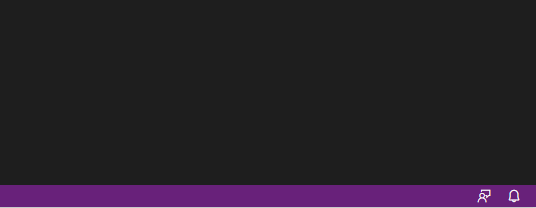
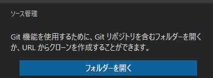
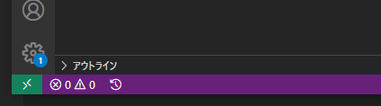
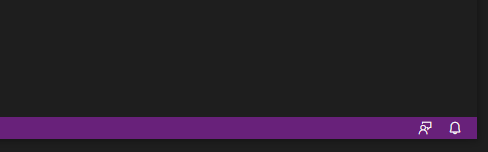

link です。

VS Code の拡張機能を開発する時に、ユーザーが拡張機能の処理状況を確認できるようにしたいと思うことがあります。

そこで、今回は処理状況をプログレスで表示させる手順について書きます。

## 対象

VS Code の拡張機能を開発する際に処理の途中でプログレスを表示させたい人

## 表示方法

`vscode.window.withProgress(options, task)` を呼び出すことでプログレスをエディター上に表示させることができます。

コード例は以下の通りです。
```js
vscode.window.withProgress({location: vscode.ProgressLocation, title: string}, async progress => {
  progress.report({ message: string });
  // 処理
  progress.report({ message: string, increment: number });
  // 処理
});
```

## withProgress(options, task) の解説

エディター上にプログレスを表示するために呼び出すメソッドです。

- `vscode.window.withProgress(options, task)` 
  - 第 1 引数は `vscode.ProgressOptions` オブジェクトを代入
  - 第 2 引数は ラムダ式 ` task` の中に、処理と進行状況を表示するメソッド `progress.report()' を記述

### vscode.ProgressOptions

プログレスの表示に関する設定を保存する interface です。

- `title?: string` : プログレスの処理内容を表すタイトルの設定
- `cancellable?: boolean` : プログレスの処理が中断可能かどうかの設定
  - `vscode.ProgressLocation.Notification` が指定されている場合のみ有効
- `location: vscode.ProgressLocation` : プログレスの表示位置を指定
  - `vscode.ProgressLocation.Notification` : 下から別ウィンドウとして表示
  
  - `vscode.ProgressLocation.SourceControl` : ソース管理のビューレット上に進行状況を表示
  
  - `vscode.ProgressLocation.Window` : エディターのステータスバー（左下の紫の枠の中）に表示
  

### task

プログレスの表示と処理を行うラムダ式です。

- `(progress, token) => Thenable<R>`
  - 第 1 引数は `Progress<{increment: number, message: string}>` オブジェクト
  - 第 2 引数は `CancellationToken` オブジェクト

#### progress.report()

プログレスを表示、更新するメソッドです。

- `progress.report({ message: string, increment?: number })`
  - `message: string` : 表示するメッセージを指定
  - `increment?: number` : ゲージを増加させる数値を指定
- `increment` を指定しない場合

- `increment` を指定している場合、進行状況の最大値を 100 として、指定した数値分ゲージが増加

  - 数値が指定されていれば 0 でも不定ではないゲージに

#### vscode.CancellationToken

プログレスが中断されたかを判定するためのクラスです。

- `isCancellationRequested: boolean` : 処理を中断したかどうかのプロパティ
  - 中断した場合 : `True`
  - そうでない場合 : `False`
- `onCancellationRequested: Event<any>` : 処理を中断した場合に発生するイベント

## 参考サイト

[VS Code API | Visual Studio Code Extension API](https://code.visualstudio.com/api/references/vscode-api#window)

## まとめ

色々な種類のプログレスを表示できました。

時間のかかる処理を行う時に、ユーザーエクスペリエンスの改善に役立ってくれると思います。

それではまた、別の記事でお会いしましょう。