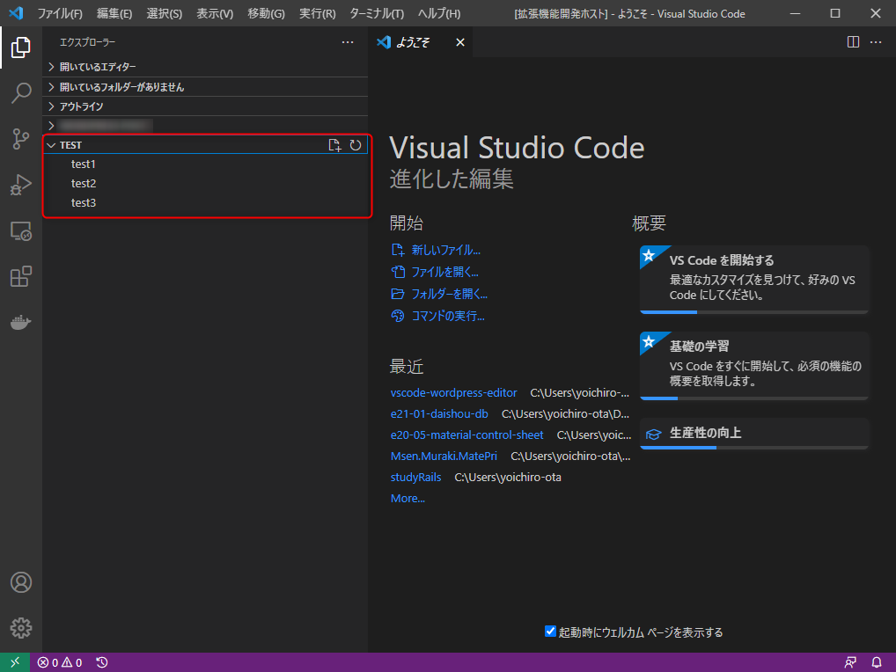

link です。

VS Code API で拡張機能を開発するときに TreeView を表示させるのに手間取ったのでオリジナルの TreeView を表示するための必要最低限の手順と TreeView 関係のクラスと interface の仕様について書いていきます。

## 対象

- VS Code の拡張機能を開発する際に TreeView を使いたい人

## TreeView 表示に必要な手順

1. `package.json` に view を登録
2. `TreeDataProvider` に view で使うデータの処理を実装
3. `TreeDataProvider` のインスタンスを `vscode.window.registerTreeDataProvider` で登録

## package.json に view を登録

`package.json` に以下の内容を追記します。
```js
"contributes": {
  "views": {
    "explorer": [
      {
        "id": "test",
        "name": "Test"
      }
    ]
  }
}
```
`id` は TreeView にデータを登録するときに使用します。

`name` はエクスプローラー上で表示される項目名です。

## TreeDataProvider に view で使うデータの処理を実装

`vscode.TreeDataProvider<T>` は interface なのでクラスとして実装する必要があります。

その際に最低限、以下のメソッドが必要になります。

- `getTreeItem(element: T): vscode.TreeItem | Thenable<vscode.TreeItem>`
- `getChildren(element?: T): ProviderResult<T[]>`

これらはエクスプローラー上で view を表示するときに呼び出されるメソッドです。

`T` は TreeView で扱うクラスを指定する型変数です。

`ProviderResult<T>` は戻り値の型が `T`, `undefined`, `null`, `Thenable<T | undefined | null>` のいずれかであることを表す interface です。

### 実装例
```js
class TreeDataProvider implements vscode.TreeDataProvider<vscode.TreeItem> {
  getTreeItem(element: vscode.TreeItem): vscode.TreeItem {
    return element;
  }

  getChildren(element?: vscode.TreeItem): vscode.TreeItem[] {
    return [new vscode.TreeItem('test1'), new vscode.TreeItem('test2'), new vscode.TreeItem('test3')];
  }
}
```
### getTreeItem(element: T)

`element: T` を `TreeItem` に変換して返すメソッドです。

実装例では `T` を `vscode.TreeItem` に指定しているため、そのまま返しています。

### getChildren(element?: T)

`element` の TreeView としての子要素を返すメソッドです。

**`element` が `null` の場合、ルートを表しますので、戻り値にはルートに表示したい要素のリストを返します。**

例えばフォルダーのようにその下に何かしらの項目が存在する場合、フォルダーの `element` を引数にこのメソッドを再帰呼び出しすることで TreeView の構造を表現します。

## TreeDataProvider のインスタンスの登録

`vscode.window.registerTreeDataProvider(viewId, treeDataProvider)` で view で表示される `TreeItem` を `treeDataProvider` から取得するように指定します。

上述の例なら、 `vscode.window.registerTreeDataProvider('test', new TreeDataProvider())` という風になります。

登録が成功すれば以下の画像のようにエクスプローラー上に `TEST` という項目とその中に `getChildren` で返ってくる `TreeItem[]` が表示されていると思います。


## TreeItem について

TreeView に表示する項目です。

`TreeDataProvider` では `getTreeItem(element: T)` で実際に TreeView の項目として表示される内容を取得しています。

### 主なプロパティ

- `label: string`
  - ここで設定した文字列がそのまま項目名になります。
- `iconPath: string | vscode.Uri | vscode.IconTheme`
  - 項目で表示するアイコンを設定します。**`string` はローカルからアイコン画像を読み込みます。 `Uri` はWeb 上からアイコン画像を読み込みます。 `IconTheme` は VS Code で使用されているアイコンを読み込みます。**

## 参考サイト

- [Tree View API | Visual Studio Code Extension API](https://code.visualstudio.com/api/extension-guides/tree-view)
- [VS Code API | Visual Studio Code Extension API](https://code.visualstudio.com/api/references/vscode-api#TreeItem)

## まとめ

VS Code API の日本語の情報がほとんどなくて苦労しました。今後は VS Code 系の情報も発信していけたらと思います。

それではまた。
