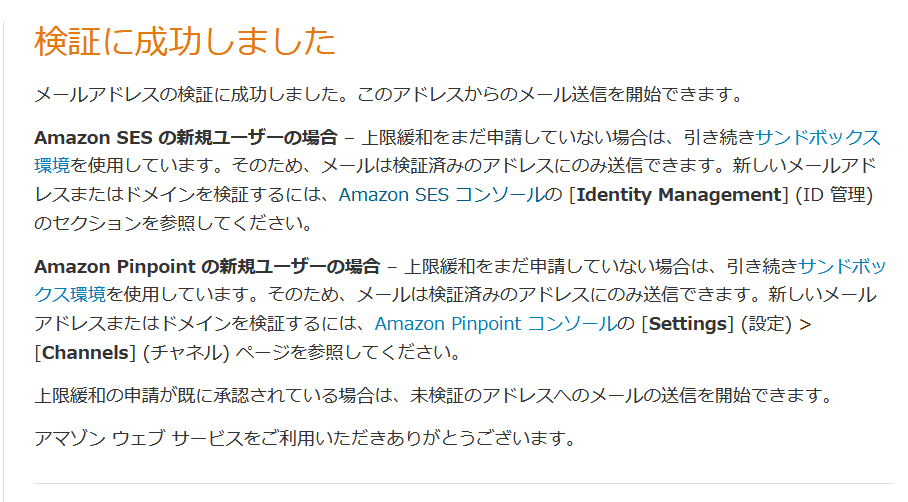

link です。

今回は **Amazon SES** を利用して、登録されたメールアドレスに E メールを送信してみます。

## Amazon SES とは

Amazon SES は特価販売などのマーケティング E メールや、注文確認などの取引 E メール、ニュースレターなどの E メールの自動送信システムを提供するプラットフォームです。

>Amazon SES は、ユーザー自身の E メールアドレスとドメインを使用して E メールを送受信するための、簡単で費用効率の高い方法を提供する E メールプラットフォームです。
>
>例えば、特価販売などのマーケティング E メールや、注文確認などの取引 E メール、ニュースレターなどのその他のタイプの通信文の送信に使用できます。Amazon SES を使用してメールを受信するときは、E メール自動応答システム、E メール登録解除システム、受信 E メールからカスタマーサポートのチケットを生成するアプリケーションなどのソフトウェアソリューションを開発できます。
>
><cite>[Amazon SESとは？ - Amazon Simple Email Service](https://docs.aws.amazon.com/ja_jp/ses/latest/dg/Welcome.html)</cite>

## Amazon SES から E メールを送信してみる

実際に Amazon SES から E メールを送信してみます。

まずは、 ID を登録します。

### ID 登録

`Create Identity` をクリックします。

`Create Identity` 画面で `Identity Type` を `Email address` を選択し、送信先の E メールアドレスを入力します。

入力が完了したら `Create Identity` をクリックします。

すると、メールアドレスの検証を要求されるため、 AWS から届いた検証用のメールに書かれているリンクをクリックして、検証を完了させます。

検証が完了すると、以下の画面が表示されます。

検証完了後に `Verified identities` 画面で登録したメールアドレスのステータスが `Verified` になっていることを確認しましょう。

これで、メールアドレスの登録は完了です。

### テストメールを送信

テストメールを送信してみましょう。

`Verified identities` 画面からテストメールを送信する ID を選択して、 `Send Test Mail` をクリックします。

`Subject` と `Body` に適当なメッセージを書き込んで `Send Test Mail` をクリックします。

メールを確認して、以下の画像のようなメールが来ていることを確認しましょう。

迷惑メールに振り分けられる可能性があるため、受信メールに見当たらなければそちらも確認しましょう。

## まとめ

今回は Amazon SES を利用して、登録されたメールアドレスにメールを送信してみました。

ですが、今回の内容だけだと少し SES を利用するのに物足りないので、次回の記事で Lambda と組み合わせて送信させる方法を紹介したいと思います。

それではまた、別の記事でお会いしましょう。

## 参考サイト

- [Amazon SESとは？ - Amazon Simple Email Service](https://docs.aws.amazon.com/ja_jp/ses/latest/dg/Welcome.html)