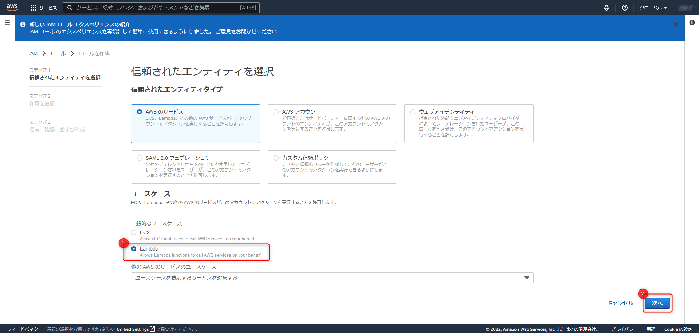
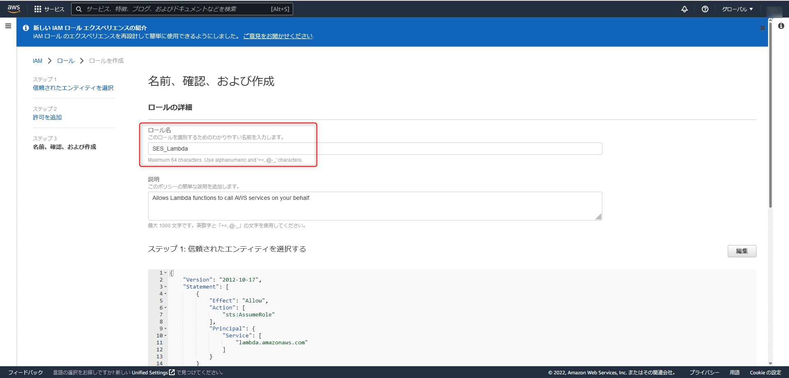
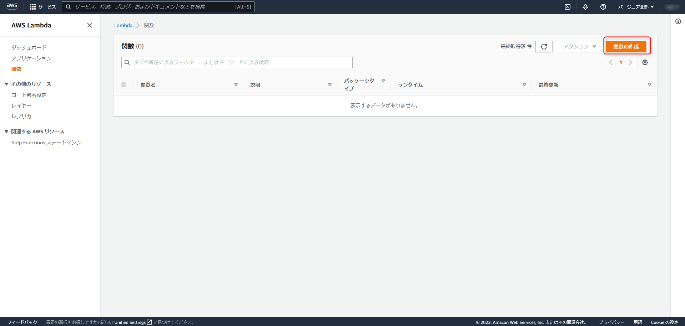

link です。

別の記事で Amazon SES の `Identity` を作成して、テストメールを送信しましたが、今回は Lambda からテストメールを送信する手順を紹介します。

この記事は[Amazon SES で E メールを自動送信する第一歩](https://mseeeen.msen.jp/amazon-ses/)の続きです。

## Lambda から SES にメールを送らせる手順

Lambda から SES にメールを送らせるには以下の手順を踏む必要があります。

1. IAM ロールと IAM ポリシーを作成
2. Amazon SES の `Identity` を作成
3. E メールを送信するための Lambda 関数を作成
4. テストの E メールを送信

これらを紹介していきます。

### IAM ロールと IAM ポリシーを作成

まず、 IAM ロールと IAM ポリシーを作成します。

IAM のポリシー画面に移動して**ポリシーの作成**をクリックします。


JSON を選択して、以下の内容に書き換えたうえで次のステップをクリックします。

```js:title=ポリシーJSON
{
    "Version": "2012-10-17",
    "Statement": [
        {
            "Effect": "Allow",
            "Action": [
                "ses:SendEmail",
                "ses:SendRawEmail"
            ],
            "Resource": "*"
        }
    ]
}
```


タグ画面は何も設定する必要はありませんので、ポリシーの確認画面まで進めます。

ポリシーの確認画面で適当な名前を設定したらポリシーの作成をクリックします。


次は、 IAM ロールを作成します。


Lambda を選択して次へをクリックします。



先ほど作成した IAM ポリシーにチェックを入れて次へをクリックします。


適当なロール名を入力して、ロール作成を完了させます。



### Amazon SES の Identity を作成

Amazon SES の `Identity` の作成は[前回の記事](../amazon-ses/)で紹介しましたので、省略させていただきます。前回登録したメールアドレスとは別のメールアドレスにメールを送信させたい場合は前回の記事を参考に新しく登録してください。

### E メールを送信するための Lambda 関数を作成

E メールを送信するための Lambda 関数を作成します。



まず、適当な関数名を設定します。


関数を作成後、コードソースの `index.js` を以下のコードに書き換えます。

```js:title=メール送信関数
const aws = require("aws-sdk");
const ses = new aws.SES({ region: "us-east-1" });

exports.handler = function (event) {
    const params = {
        Destination: {
            ToAddresses: ["Address", ...],
        },
        Message: {
            Body: {
                Text: { Data: "Test" },
            },
            Subject: { Data: "Test Email" },
        },
        Source: "SourceAddress",
    };

    return ses.sendEmail(params).promise();
};
```

`region: "us-east-1"` となっている箇所は利用しているリージョンを指定しましょう。

`ToAddresses` には送信先のメールアドレスを、 `SourceAddress` には送信元のメールアドレスを指定します。

いずれも、 SES に登録済みである必要があります。


基本設定を編集する画面で既存のロールを作成したロールに変更します。


これで準備は完了です。

### テストの E メールを送信

コードソース画面の Test ボタンをクリックすることでテストメールを送信できると思います。

クリック後に送信先の E メールを確認して、以下の画像のようなメールが届いているかを確認しましょう。


## まとめ

今回は Lambda 関数を使って Amazon SES から E メールを送信してみました。

これでお知らせメールの一斉送信も簡単に構築できると思うので、ぜひ参考にしてみてください。

それではまた、別の記事でお会いしましょう。

## 参考サイト

- [Lambda と Amazon SES を使用して E メールを送信する](https://aws.amazon.com/jp/premiumsupport/knowledge-center/lambda-send-email-ses/)
- [Creating IAM policies (console) - AWS Identity and Access Management](https://docs.aws.amazon.com/IAM/latest/UserGuide/access_policies_create-console.html#access_policies_create-start)