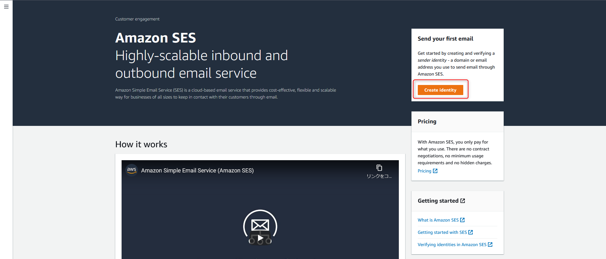
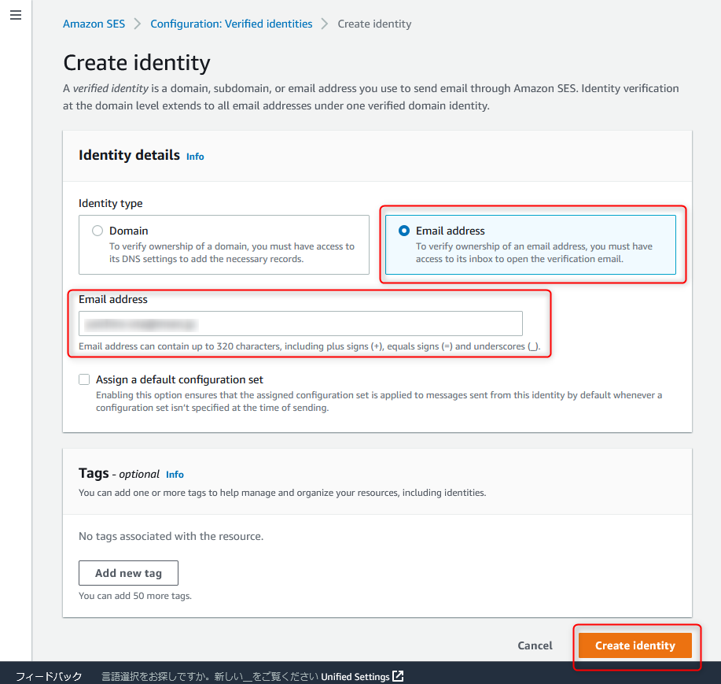
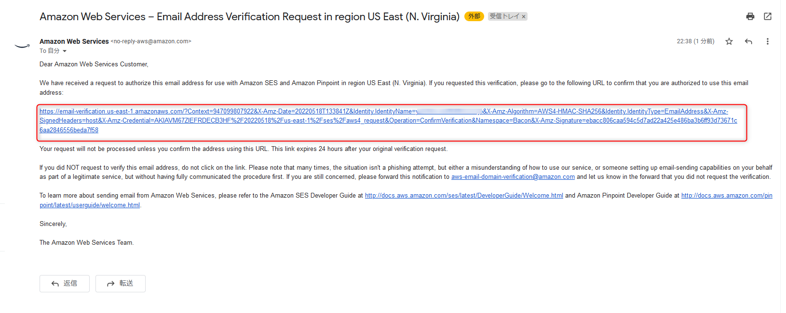
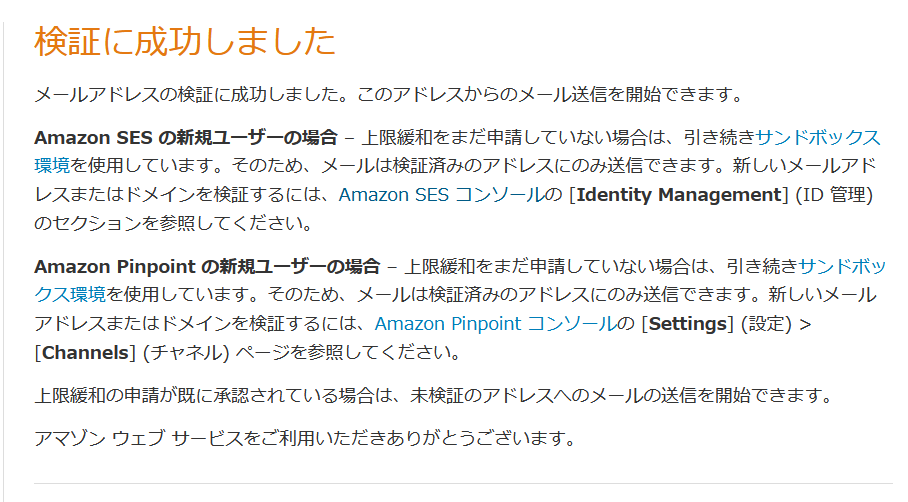
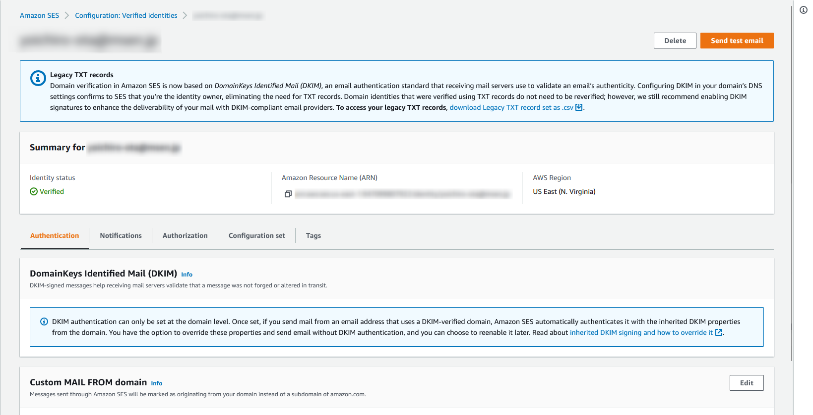
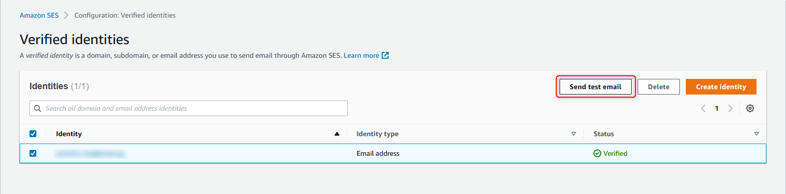
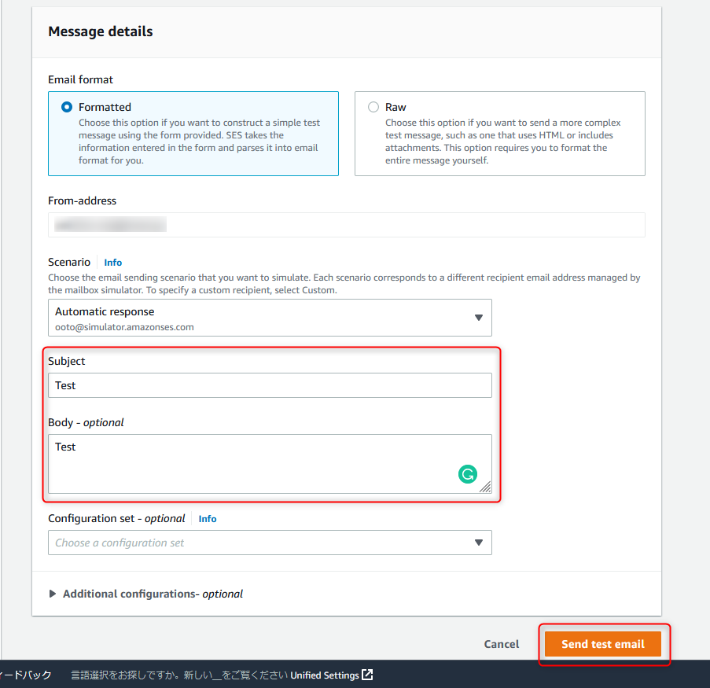
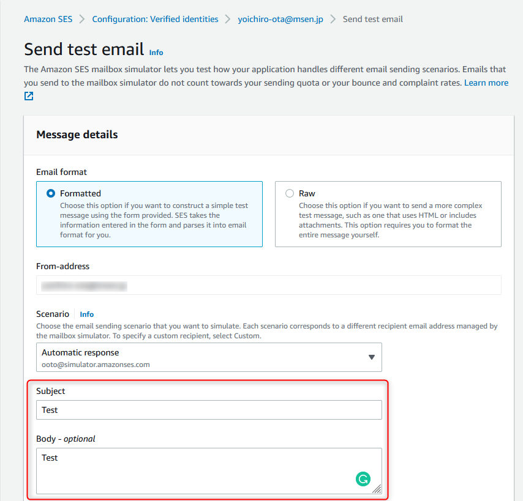
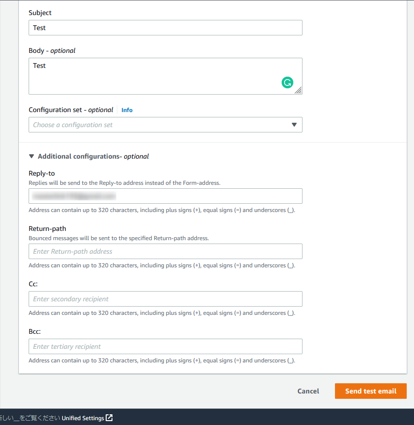
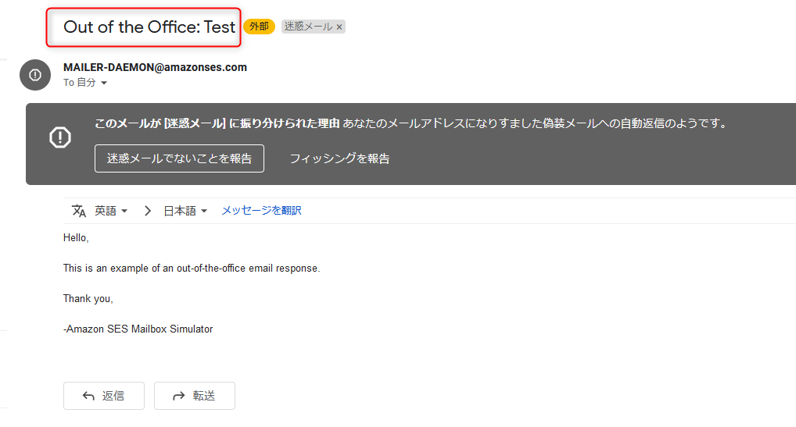

link です。

今回は **Amazon SES** を利用して、登録されたメールアドレスに E メールを送信してみます。

## Amazon SES とは

Amazon SES は特価販売などのマーケティング E メールや、注文確認などの取引 E メール、ニュースレターなどの E メールの自動送信を行うシステムを提供するプラットフォームです。

>Amazon SES は、ユーザー自身の E メールアドレスとドメインを使用して E メールを送受信するための、簡単で費用効率の高い方法を提供する E メールプラットフォームです。
>
>例えば、特価販売などのマーケティング E メールや、注文確認などの取引 E メール、ニュースレターなどのその他のタイプの通信文の送信に使用できます。Amazon SES を使用してメールを受信するときは、E メール自動応答システム、E メール登録解除システム、受信 E メールからカスタマーサポートのチケットを生成するアプリケーションなどのソフトウェアソリューションを開発できます。
>
>出典 : [Amazon SESとは？ - Amazon Simple Email Service](https://docs.aws.amazon.com/ja_jp/ses/latest/dg/Welcome.html)

## Amazon SES から E メールを送信してみる

### ID 登録

### テストメールを送信

## まとめ

## 参考サイト

- [Amazon SESとは？ - Amazon Simple Email Service](https://docs.aws.amazon.com/ja_jp/ses/latest/dg/Welcome.html)