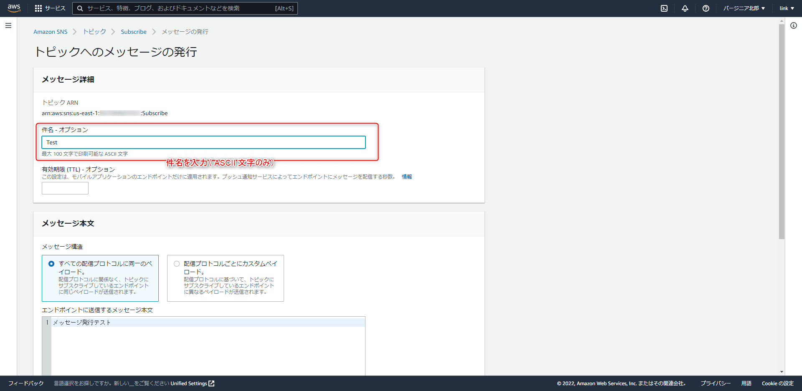

link です。

今回は Amazon SNS でサブスクリプションする方法について勉強します。

## Amazon SNS とは

Amazon SNS とは AWS のサービスの 1 つで、アプリケーションからの通知を可能にするサービスです。ユーザーが何かを行ったタイミングで通知する「イベントドリブン」なメッセージングを手軽に実現できます。

>Amazon Simple Notification Service (Amazon SNS) は、配信者から受信者 (または生産者から消費者) へのメッセージ配信を提供するマネージドサービスです。発行者は、論理アクセスポイントおよび通信チャネルであるトピックにメッセージを送信することで、受信者と非同期的に通信します。クライアントは、Amazon Kinesis Data Firehose、Amazon SQS、AWS Lambda、HTTP、E メール、モバイルプッシュ通知、モバイルテキストメッセージ (SMS) などのサポートされたエンドポイントを使用して SNS トピックにサブスクライブし発行されたメッセージを受信できます。
>
>出典 : [Amazon SNS とは - Amazon Simple Notification Service](https://docs.aws.amazon.com/ja_jp/sns/latest/dg/welcome.html)

## サブスクリプションの準備

サブスクリプションの準備として**トピック**を作成します。

適当なトピック名を入力して「次のステップ」をクリックします。

名前欄にはトピック名が入力されています。

SMS のサブスクリプションを行いたいので表示名にも適当な名前を入力します。

## E メールでサブスクリプション

まず、 E メールでサブスクリプションをしてみます。

「サブスクリプションを作成」をクリックします。

**プロトコルを E メールに指定、エンドポイントに送信先のメールアドレスを入力**して、「サブスクリプションの作成」ボタンを押します。

送信先のメールボックスを確認すると、 AWS から以下の画像のようなメールが届いていると思います。 `Confirm subscription` をクリックします。

クリックして、以下の画像のような画面に移動したらサブスクリプション完了です。

Amazon SNS のトピックの管理画面で E メールのサブスクリプションのステータスが確認済みになっているのを確認しましょう。

## SMS でサブスクリプション

次は SMS でサブスクリプションをやってみます。

トピック管理画面から「サブスクリプションを作成」ボタンを押して、今度は**プロトコルを SMS に指定、エンドポイントに送信先の電話番号を入力**します。

この時、 SMS サンドボックスに電話番号を追加することになると思います。
電話番号を入力して「電話番号を追加」ボタンをクリックします。

入力した電話番号の SMS に検証コードが送られてくるので入力して、「電話番号を検証」ボタンをクリックします。

サブスクリプションを作成して、 SMS のサブスクリプションのステータスが確認済みになっているのを確認しましょう。

## メッセージ送信

サブスクリプション先へメッセージを送信できます。

トピックから「メッセージの発行」ボタンをクリックすると、トピックへのメッセージの発行画面に移動できます。

送信する件名やメッセージ本文を入力できます。

また、送信先のプロトコルに応じてメッセージ本文の内容を変えることもできます。

「メッセージを発行」ボタンをクリックすると、すべてのサブスクリプションにメッセージが送信されます。

届いたメールに記載されている URL はサブスクリプションを解除するためのリンクです。よくメールマガジンなどにある「購読解除はこちら」のリンクがこれになっています。

サブスクリプションが削除されるとサブスクリプション一覧から対応するサブスクリプションが削除された状態になります。

## まとめ

今回は Amazon SNS でサブスクリプションをする方法を勉強しました。

Amazon SNS を利用すれば、簡単にサブスクリプションを行うシステムを構築できますのでぜひ活用してみてください。

それではまた、別の記事でお会いしましょう。

## 参考サイト

- [Amazon SNS とは - Amazon Simple Notification Service](https://docs.aws.amazon.com/ja_jp/sns/latest/dg/welcome.html)