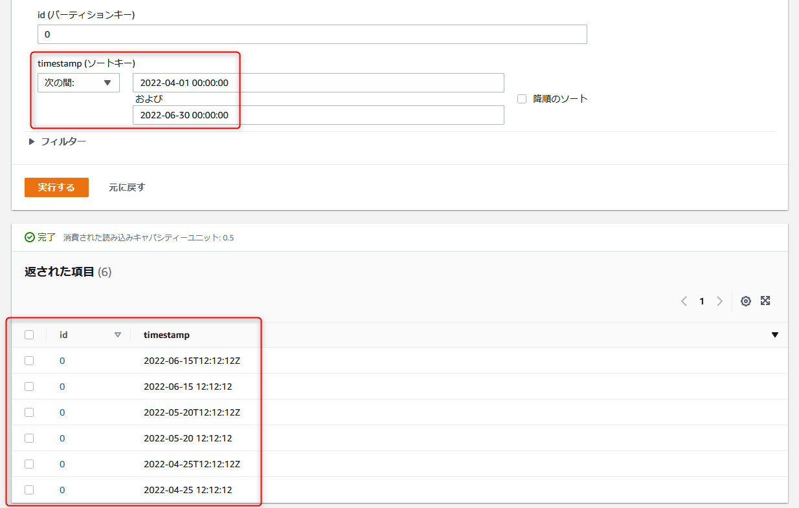

link です。

AWS のサービス開発で DynamoDB を扱うことは多いと思います。

NoSQL な DynamoDB のデータの型は以下のようになっています。

>DynamoDB では、テーブル内の属性に対してさまざまなデータ型がサポートされています。データ型は次のように分類できます。
>
>- **スカラー型** – スカラー型は 1 つの値を表すことができます。スカラー型は、数値、文字列、バイナリ、ブール、および null です。
>- **ドキュメント型** – JSON ドキュメントで見られるように、入れ子の属性を持つ複雑な構造を表すことができます。ドキュメント型は、リストとマップです。
>- **セット型** – セット型は複数のスカラー値を表すことができます。セット型は、文字セット、数値セット、およびバイナリセットです。
>
>出典 : [命名ルールおよびデータ型 - Amazon DynamoDB](https://docs.aws.amazon.com/ja_jp/amazondynamodb/latest/developerguide/HowItWorks.NamingRulesDataTypes.html)

上述の通り、 DynamoDB で扱える型に DateTime 型がありません。

今回は DynamoDB で日時データを扱う方法を紹介します。

## データ形式

先ほど引用したページの文字列の項目にある以下の記述の通り、**ISO 8601 文字列**で保存すると日時データとして扱うことができます。

>文字列データ型を使用して、日付またはタイムスタンプを表すことができます。これを行う 1 つの方法は、これらの例に示すように、ISO 8601 文字列を使用することです。
>
>出典 : [命名ルールおよびデータ型 - Amazon DynamoDB](https://docs.aws.amazon.com/ja_jp/amazondynamodb/latest/developerguide/HowItWorks.NamingRulesDataTypes.html)

ISO 8601 とは、 ISO が定めた日付および時刻に関連するデータの国際規格です。

ISO 8601 で定められたフォーマットの文字列で日時データとして扱うことができるようになります。

フォーマットの表現はいくつか存在し、以下のようになっています。

```:title=2022年4月25日12時12分12秒をISO8601文字列で表現
2022-04-25 12:12:12
2022-04-25T12:12:12Z
20220425T121212Z
```

## 具体例

上記のデータ形式を DynamoDB に登録して、日時の範囲を指定して取得できるかを確認してみましょう。

日時データをいくつか入力したテーブルを用意しました。


こちらのテーブルには ISO 8601 文字列以外に yyyy/mm/dd HH:mm:ss 形式のデータを入力しています。

20220425T121212Z の形式で検索すると以下の画像のような結果になります。


20220425T121212Z の形式のデータしか表示されていないのがわかります。

2022-04-25T12:12:12Z の形式で検索すると以下の画像のような結果になります。


2022-04-25T12:12:12Z の形式と 2022-04-25 12:12:12 の形式のデータが表示されているのがわかります。

2022-04-25 12:12:12 の形式で検索しても以下の画像のように同様の結果になります。



いずれの場合でも yyyy/mm/dd HH:mm:ss 形式のデータは表示されていないのがわかります。

## 参考サイト

- [命名ルールおよびデータ型 - Amazon DynamoDB](https://docs.aws.amazon.com/ja_jp/amazondynamodb/latest/developerguide/HowItWorks.NamingRulesDataTypes.html)
- [ISO 8601 - Wikipedia](https://en.wikipedia.org/wiki/ISO_8601#General_principles)

## まとめ

DynamoDB には DateTime などの日付型が存在しないため、最初は戸惑う方も多いと思います。

NoSQL の DB は処理速度が速いというメリットが存在するので、 DB ごとの特徴を理解してうまく活用していきたいと思います。

それではまた、別の記事でお会いしましょう。
