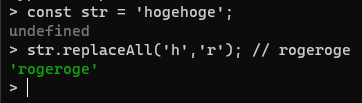
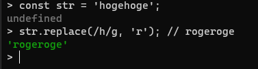

link です。

JavaScript で文字列を処理するときに使う関数の 1 つとして `replace()` と `replaceAll()` が存在します。

どちらも第一引数で指定した文字列に一致する箇所を第二引数の文字列に置き換える関数です。

`replace()` は最初に引っかかった文字列だけを置き換えますが、 `replaceAll()` は一致した文字列すべてを置き換えます。

この内、 `replaceAll()` は ES2021 で追加されたかなり新しい関数となっています。

そのため、 15 以前の Node.js などの ES2021 を搭載していない環境では使用できません。

今回は 15 以前の Node.js で `replaceAll()` と同じことを `replace()` を使って行う方法を紹介します。

## 対象

- Node.js 15 以前などの ES2021 が搭載されていない環境

## replace で全置換する方法

`replace()` で全置換する方法はとてもシンプルです。

置換対象の文字列を g オプション付きの正規表現で書くだけです。

JavaScript で正規表現を利用するときは `''`, `""` などで囲う代わりに `//` で囲います。

g オプションは置き換えたい文字列を指定した時にその文字が複数含まれている場合に、そのすべてを置き換えるオプションです。

以下はソースコード例と実行結果です。

```js:title=replaceAllの場合
const str = 'hogehoge';
str.replaceAll('h','r'); // rogeroge
```



```js:title=replaceの場合
const str = 'hogehoge';
str.replace(/h/g, 'r'); // rogeroge
```



## 参考サイト

- [String.prototype.replaceAll() - JavaScript | MDN](https://developer.mozilla.org/ja/docs/Web/JavaScript/Reference/Global_Objects/String/replaceAll)
- [String.prototype.replace() - JavaScript | MDN](https://developer.mozilla.org/ja/docs/Web/JavaScript/Reference/Global_Objects/String/replace)

それではまた、別の記事でお会いしましょう。