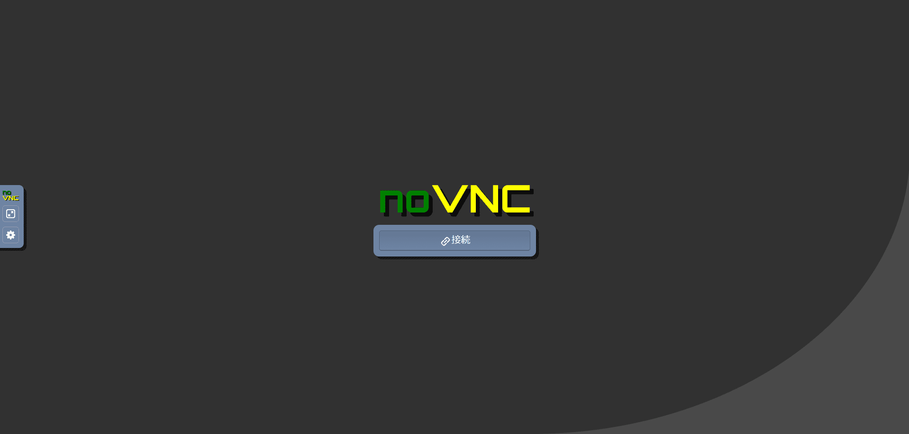

link です。

Web スクレイピングを自動で行う方法として Beautiful Soup や Octoparse などが存在します。

今回は Node-RED 上で Selenium を利用できるノードを導入して Web スクレイピングをする方法を紹介します。

## 想定環境

- Windows 10 以降
- Docker 4

## Selenium とは

>Seleniumはブラウザー自動化を可能にし、それを支えるツール群とライブラリー群プロジェクトです。
>
>出典 : [Seleniumブラウザー自動化プロジェクト | Selenium](https://www.selenium.dev/ja/documentation/)

**Selenium** とは画面のテストを自動化し実行することを可能にするツールです。

### メリット

Selenium はブラウザ操作に特化しているので習得のための難易度が比較的低いことや、様々な言語に対応しているという特徴があります。

主な対応言語として `Java`, `JavaScript`, `Python` などが挙げられます。

### デメリット

ブラウザ操作しかできないため、 Windows アプリケーションをスクレイピングするといったことはできません。

また、 UI に少しでも変更があると、作成した自動操作が正常に働かなくなることがあります。

そのため、メンテナンスに手間がかかります。

## Node-RED と Selenium のコンテナーを作成

今回は簡単に導入可能な Docker イメージを利用して Node-RED と Selenium のコンテナーを作成します。

### Node-Red と Selenium 用のネットワーク作成

まず、 Node-Red と Selenium 用のネットワークを作成します。

以下のコマンドを実行します。

```bash:title=Node-RedとSelenium用のネットワーク作成
docker network create -d bridge node-red-selenium
```

### Node-RED のコンテナー作成

以下のコマンドを実行します。

```bash:title=Node-REDのコンテナー作成
docker run -itd --network=node-red-selenium -it -p 1880:1880 -v node_red_data:/data --name mynodered nodered/node-red
```

`localhost:1880` にアクセスして以下の画像のような画面が表示されれば OK です。


### Selenium のコンテナー作成

以下のコマンドを実行します。

```bash:title=Seleniumのコンテナー作成
docker run -itd --network=node-red-selenium -d -p 4444:4444 -p 7900:7900 --shm-size="2g" --name selenium-hub selenium/standalone-firefox:4.6.0-20221104
```

`localhost:7900` にアクセスして以下の画像のような画面が表示されれば OK です。

こちらは Selenium の動作を確認できる noVNC の画面です。

初期パスワードは `secret` に設定されています。



## Node-RED に webdriver ノードをインストール

Node-RED に webdriver ノードをインストールします。

右上のメニューから**パレットの管理**を選択します。


**ノードを追加**タブを選択して `node-red-contrib-simple-webdriver` を検索して、ノードを追加します。


ノードの追加に成功すると以下のノード一式がパレットに追加されます。


## Web スクレイピングをさせてみる

さっそく Web スクレイピングをさせてみましょう。

今回は Mseeeen のトップページの標語「Beyond our knowledge」を取得してみます。

まず、取得する要素を指定するため、 DOM を確認します。

取得する要素の上で右クリック → 調査を選択します。


取得する要素を特定できるもの、ここでは `class` 名を確認します。


続いて、ノードを以下の画像のように設置します。


その後、各ノードの設定を以下のようにします。

- `open browser`
  - ブラウザを開きます、サーバーは `http://selenium-hub:4444/wd/hub` を入力します

- `navigate`
  - 指定したページに遷移します
  - ここでは `https://mseeeen.msen.jp/` を指定します

- `get text`
  - 指定した要素の文字列を取得します
  - `By` を `className` に、 `Target` に確認した `class` 名を入力します


`inject` ノードをクリックして動作させます。

しばらくすると以下の画像のようにメッセージが表示され、取得したテキストが `payload` に保存されていることがわかります。


取得したテキストは Node-RED 上の `change` ノードや `function` ノードなどにそのまま流せるので、そこで加工したり、ファイルに出力したりすることもできます。

ちなみに取得中は以下の画像のように noVNC でブラウザが動いていることがわかります。


## 参考サイト

- [Seleniumブラウザー自動化プロジェクト | Selenium](https://www.selenium.dev/ja/documentation/)
- [Dockerで実行する : Node-RED日本ユーザ会](https://nodered.jp/docs/getting-started/docker)
- [SeleniumHQ/docker-selenium: Docker images for Selenium Grid](https://github.com/SeleniumHQ/docker-selenium)
- [docker network create — Docker-docs-ja 20.10 ドキュメント](https://docs.docker.jp/engine/reference/commandline/network_create.html)

## まとめ

今回はNode-RED で Web スクレイピングをする方法を紹介しました。

Node-RED 上であれば Web スクレイピングの手順が容易に可視化できるため、ぜひ活用してみてください。

それではまた、別の記事でお会いしましょう。