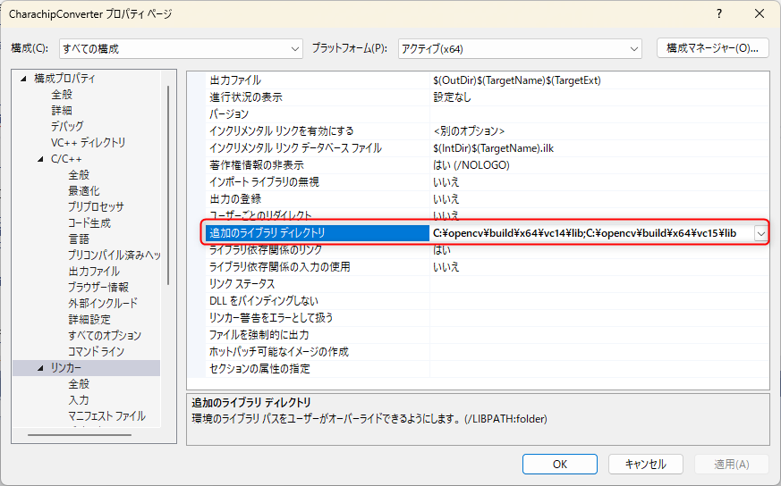
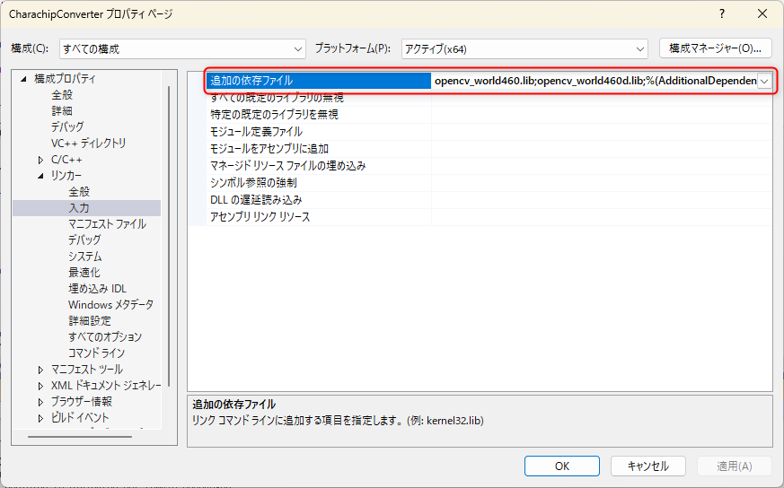

link です。

OpenCV を使って画像処理をする機会があったので Visual Studio で OpenCV を使う手順を紹介します。

## 想定環境

- Windows 10 以降
- Visual Studio 2022

## OpenCV のインストール

OpenCV の[公式サイト](https://opencv.org/releases/)から Windows の圧縮ファイルをダウンロードして解凍します。

解凍したファイルはわかりやすい場所に設置しましょう。

解凍したフォルダの `build\x64\vc15\bin` にある `opencv_world460.dll` と `opencv_world460d.dll` を `C:\Windows\System32` にコピーしてインストール完了です。

Visual Studio の NuGet でプロジェクトに直接インストールする方法もあります。

しかし、**そちらは現在、正常にビルドができない**ため、今回は公式サイトから直接ダウンロードする方法を取ります。

## Visual Studio で OpenCV を使えるようにする

次は Visual Studio で OpenCV を使えるように設定します。

まずはプロジェクトの設定を開きます。

構成を「すべての構成」に変更し、「C/C++」の「追加のインクルードディレクトリ」に `OpenCV のフォルダ \build\include` を設定します。

続いて、「リンカー」の「追加のライブラリディレクトリ」に `OpenCV のフォルダ \build\x64\vc14\lib` を設定します。

最後に「リンカー → 入力」の「追加の依存ファイル」に `opencv_world460.lib;opencv_world460d.lib;` を設定して準備完了です。

## OpenCV で画像を表示させてみる

## 参考サイト

- [Home - OpenCV](https://opencv.org/)

## まとめ

今回は Visual Studio で OpenCV を使う手順について紹介しました。

それではまた、別の記事でお会いしましょう。