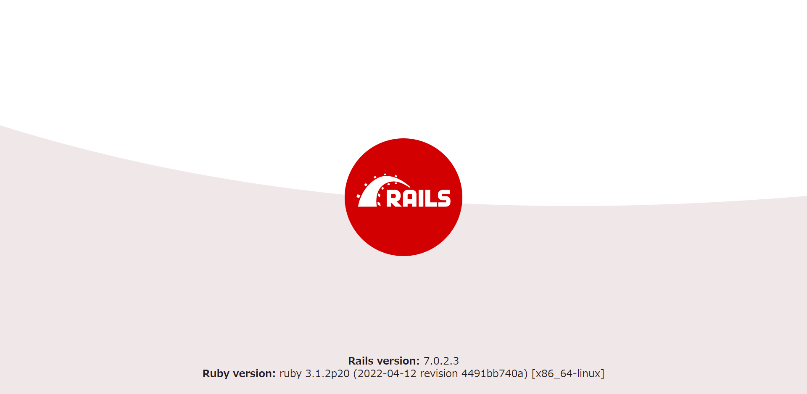

link です。 Rails のバージョンが 7 に上がりましたが、 Webpacker がデフォルトでは搭載されなくなった影響で Rails に関するいろいろな情報が古くなっています。

今回は Rails 7 に対応する一環として Docker 上で Ruby on Rails 7 の開発環境を構築する手順を紹介します。

## 前提条件

- Ruby 3
- Ruby on Rails 7
- Docker 4

## 対象者

- Docker をあまり触ったことがない人

## Docker ファイル作成

まず、 Rails のプロジェクトフォルダを作りましょう。

```:title=フォルダ作成コマンド
mkdir docker-rails
cd docker-rails
```

この直下に以下の空ファイルを作成します。

- Dockerfile
- docker-compose.yml
- Gemfile
- Gemfile.lock
- entrypoint.sh

次に作成したファイルの中身を以下のように変更します。
Gemfile.lock は書き換えなくて大丈夫です。

```Dockerfile:title=Dockerfile
FROM ruby:3.1

RUN apt update -qq && apt install -y postgresql-client
RUN mkdir /myapp
WORKDIR /myapp
COPY Gemfile /myapp/Gemfile
COPY Gemfile.lock /myapp/Gemfile.lock
RUN bundle install
COPY . /myapp

COPY entrypoint.sh /usr/bin/
RUN chmod +x /usr/bin/entrypoint.sh
ENTRYPOINT ["entrypoint.sh"]
EXPOSE 3000

CMD ["rails", "server", "-b", "0.0.0.0"]
```

Dockerfile は Docker イメージを作成するために必要なパッケージやアプリ、各種設定を指定するファイルです。

Rails 7 では Webpacker が標準では組み込まれなくなった影響で yarn や Node.js のインストールが不要になりました。

そのため、 Ruby 以外は PostgreSQL のみをインストールするようにしています。

```yml:title=docker-compose.yml
version: "3.9"
services:
  db:
    image: postgres
    volumes:
      - ./tmp/db:/var/lib/postgresql/data
    environment:
      POSTGRES_PASSWORD: password
  web:
    build: .
    command: bash -c "rm -f tmp/pids/server.pid && bundle exec rails s -p 3000 -b '0.0.0.0'"
    volumes:
      - .:/myapp
    ports:
      - "3000:3000"
    depends_on:
      - db
```

docker-compose.yml は複数の Docker コンテナーを定義するためのファイルです。

今回はデータベース用の `db` と Rails アプリ用の `web` を定義しています。

```Gemfile:title=Gemfile
source 'https://rubygems.org'
gem 'rails', '~> 7.0.2'
```

Gemfile は Ruby と各種パッケージのバージョン管理するためのファイルです。

Ruby は最新版、 Rails は 7.0.2 以上を指定しています。

```sh:title=entrypoint.sh
#!/bin/bash
set -e

rm -f /myapp/tmp/pids/server.pid

exec "$@"
```

entrypoint.sh は特定のファイルがすでに存在する場合にサーバーを再起動できない Rails 固有の問題を修正するためのスクリプトです。

## コンテナーイメージのビルド

次は、先ほど作成した Docker 関連ファイルを使ってコンテナーイメージをビルドします。

以下のコマンドを入力します。

```:title=ビルドコマンド
docker-compose build
```

そこそこ時間がかかりますのでしばらく待ちます。

## 起動

次は `docker-compose` コマンドを使って `rails new` を実行し、 Rails プロジェクトを作成しましょう。

`docker-compose run` に続けてサービス名を指定し、さらにコンテナー内で実行したいコマンドを続けていきます。

Rails が動くサービスには `web` という名前を docker-compose.yml で付けたのでコマンドでのコンテナー名としては `web` を当てはめます。

以下のコマンドを実行してください。

```:title=Railsプロジェクト生成コマンド
docker-compose run web rails new . --force --no-deps --database=postgresql
```

これで通常の `rails new` と同じように、ディレクトリ内に関連ファイルが生成されます。

## データベース作成

コンテナー上で利用するデータベースを作成します。

`config/database.yml` に以下の内容を貼り付けします。

```yml:title=config/database.yml
default: &default
  adapter: postgresql
  encoding: unicode
  host: db
  username: postgres
  password: password
  pool: 5

development:
  <<: *default
  database: myapp_development

test:
  <<: *default
  database: myapp_test
```

書き換えが終わったら、以下のコマンドを実行して、データベースを作成しましょう。

```:title=データベース作成コマンド
docker-compose run web rails db:create
```

## コンテナーを起動

最後にコンテナーを起動するため、次のコマンドを実行します。

```:title=コンテナー起動コマンド
docker-compose up -d
```

`docker-compose up` は docker-compose.yml に基づいて起動するコマンドです。

コンテナー起動時にコンテナー内で実行させたいコマンドは Dockerfile で設定しているので、コンテナーを起動させると Rails サーバーが立ち上がります。

また、オプションの -d を付けるとバックグラウンドで起動させることができます。

## 動作確認

これで無事に Rails の開発用サーバーが起動したことになります。

ブラウザのアドレスバーに http://localhost:3000/ と入力し、起動を確認してみましょう。

以下の画像のような画面が出れば成功です。



## まとめ

今回は Docker 上 に Rails 7 の開発環境を構築する手順を紹介しました。

今後も Rails 7 に対応した情報を発信していきたいと思います。

それではまた、別の記事でお会いしましょう。

## 参考サイト

- [Quickstart: Compose and Rails | Docker Documentation](https://docs.docker.com/samples/rails/)