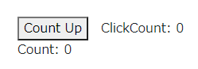
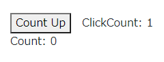
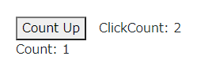

link です。

JavaScript のプログラミングだけで作れる軽量なフレームワークの React について、 useState で値を更新しても反映されない場合があります。

今回は発生原因と解決法について書いていきます。

## ソースコード例

以下のコンポーネントを実行してみます。

```js
import { useState } from "react";

const Count = (props) => {
  const [count, setCount] = useState(0);

  const ButtonClick = () => {
    setCount(count + 1);
    props.setCount(count);
  }
  
  return (
    <div>
      <button onClick={ButtonClick}>Count Up</button>
      <span style={{paddingLeft: '1em'}}>ClickCount: {count}</span>
    </div>
  );
}

const Index = () => {
  const [count, setCount] = useState(0);

  return (
    <div>
      <Count setCount={(count) => setCount(count)}/>
      <span>Count: {count}</span>
    </div>
  );
}

export default Index;
```

上記のコードは、ボタンを押すと `<Count>` 側の `count` が 1 増えて、それと連動して `<Index>` 側の `count` も 1 増えるというものです。



ボタンを押すと ClickCount と Count が連動して 1 増えるはずですが増えません。



複数回ボタンを押すと値が遅れて反映されていることがわかります。



なぜこのような挙動になるのでしょうか。この挙動は React の再レンダリングの仕様に起因しています。

## 再レンダリングの挙動

React では以下のタイミングで再レンダリングが起こるようになっています。

1. stateが更新された時
2. propsが更新された時
3. 親コンポーネントが再レンダリングされた時

上記の例は 1 に該当しますが、**最新の state は次のレンダリングのときにしか反映されないようになっています。**

そのため、子コンポーネント側で親コンポーネントの値を更新する場合は子コンポーネントの state と一緒に親コンポーネントの useState を呼び出して更新する必要があります。

## 解決法

以下のコードのように更新後の値を state の更新に用いることで更新後の値を利用できます。

```js
const ButtonClick = () => {
  setCount(count + 1);
  props.setCount(count + 1);
}
```

## まとめ

useState 、というより React の state の挙動は React を正しく扱う上で避けられない問題だと思います。

フレームワークごとの独特の挙動を把握して、意図したとおりの動きをするアプリケーションを組んでいきたいと思います。

それではまた、別の記事でお会いしましょう。