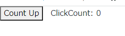

link です。

JavaScript のプログラミングだけで作れる軽量なフレームワークの React について、 useState で値を更新しても反映されない場合があります。

今回は発生原因と解決法について書いていきます。

## ソースコード例

以下のコンポーネントを実行してみます。

```js
import { useState } from "react";

const Index = (props) => {
  const [count, setCount] = useState(0);

  const ButtonClick = () => {
    setCount(count + 1);
    console.log('button clicked', count);
  }

  console.log('rendered', count);

  return (
    <div>
      <button onClick={ButtonClick}>Count Up</button>
      <span style={{paddingLeft: '1em'}}>ClickCount: {count}</span>
    </div>
  );
}

export default Index;
```

上記のコードは、ボタンを押すと `ClickCount` が 1 増えるというものです。

画面上では `count` が即座に更新されているように見えます。



しかし、 `console.log` で `count` の値を表示させると、ボタンをクリックした直後は `count` の値が増えていないことがわかります。


なぜこのような挙動になるのでしょうか。この挙動は React の再レンダリングの仕様に起因しています。

## 再レンダリングの挙動

React では以下のタイミングで再レンダリングが起こるようになっています。

1. stateが更新された時
2. propsが更新された時
3. 親コンポーネントが再レンダリングされた時

上記の例は 1 に該当しますが、 **state は通常の変数とは異なり、即座には更新されません。**

**最新の state は次のレンダリングのときにしか反映されないようになっています。**

そのため、 `useState` で値を代入した直後の値は更新前の値のままになっています。

## 解決法

更新する値を利用するようにしましょう。

state が更新されるたびに再レンダリングが行われるため、 state の更新に影響される変数は state と同時に更新するのがベターです。

```js
const ButtonClick = () => {
  setCount(count + 1);
  console.log('button clicked', count + 1);
}
```

## まとめ

useState 、というより React の state の挙動は React を正しく扱う上で避けられない問題だと思います。

フレームワークごとの独特の挙動を把握して、意図したとおりの動きをするアプリケーションを組んでいきたいと思います。

それではまた、別の記事でお会いしましょう。