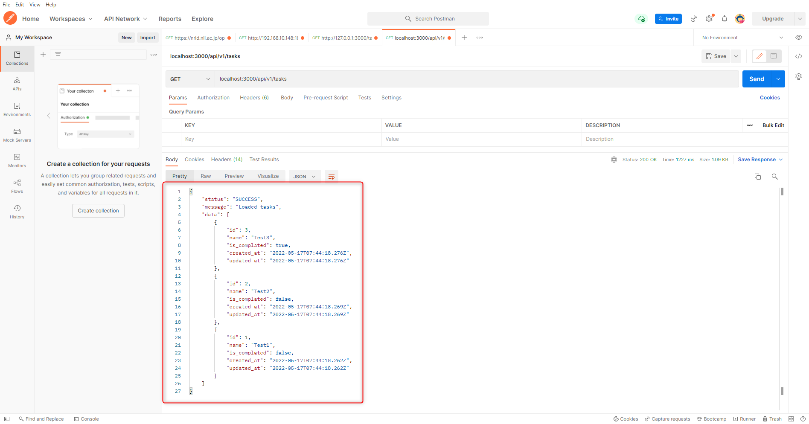

link です。

今回は **React** と Rails を組み合わせる方法について勉強していきます。

なお、 Rails 7 が新たにリリースされていますが、今回、紹介する方法は Rails 7 でも利用できます。

## 前提条件

- Windows 10 以降
- Ruby on Rails 6 以降
- Ruby 3 以降

## React とは

React とは、ユーザーインターフェースを作成することに特化した JavaScript ライブラリです。

React の特徴として JavaScript 内に HTML の様な独自の記法（JSX）を記述する点が挙げられます。

>React はユーザインターフェイスを構築するための、宣言型で効率的で柔軟な JavaScript ライブラリです。複雑な UI を、「コンポーネント」と呼ばれる小さく独立した部品から組み立てることができます。
>
>出典 : [チュートリアル：React の導入 – React](https://ja.reactjs.org/tutorial/tutorial.html)

## Rails + React で ToDo アプリを作ってみる

Rails には View の機能を排して Web API として運用する API モードという機能があります。

この Rails の API モードと React を組み合わせて ToDo Web アプリを作ってみたいと思います。

### API モードで Rails プロジェクトを作成

まず、 API モードで Rails プロジェクトを作成します。

```:title=APIモードで作成
$ rails new ReactRails --api
$ cd ReactRails
$ rails g controller tasks index show create destroy update
$ rails g model task id:integer name:string is_completed:boolean
```

まずは、ルーティングを設定します。

バージョン管理を容易にするために `namespace` を使って定義しています。

```rb:title=config/routes.rb
Rails.application.routes.draw do
  namespace 'api' do
    namespace 'v1' do
      resources :tasks
    end
  end
end
```

次に先ほど生成した `controllers/tasks_controller.rb` を `controllers/api/v1/` に移動します。

`tasks_controller.rb` の中身を以下のように書き換えます。

```rb:title:controllers/api/v1/tasks_controller.rb
module Api
  module V1
    class TasksController < ApplicationController
      before_action :set_task, only: [:show, :update, :destroy]

      def index
        tasks = Task.order(created_at: :desc)
        render json: { status: 'SUCCESS', message: 'Loaded tasks', data: tasks }
      end

      def show
        render json: { status: 'SUCCESS', message: 'Loaded the task', data: @task }
      end

      def create
        task = Task.new(task_params)
        if task.save
          render json: { status: 'SUCCESS', data: task }
        else
          render json: { status: 'ERROR', data: task.errors }
        end
      end

      def destroy
        @task.destroy
        render json: { status: 'SUCCESS', message: 'Deleted the task', data: @task }
      end

      def update
        if @task.update(task_params)
          render json: { status: 'SUCCESS', message: 'Updated the task', data: @task }
        else
          render json: { status: 'SUCCESS', message: 'Not updated', data: @task.errors }
        end
      end

      private

      def set_task
        @task = Task.find(params[:id])
      end

      def task_params
        params.require(:task).permit(:title)
      end
    end
  end
end
```

```rb:title=config/application.rb
require_relative "boot"

require "rails/all"

# Require the gems listed in Gemfile, including any gems
# you've limited to :test, :development, or :production.
Bundler.require(*Rails.groups)

module ReactRails
  class Application < Rails::Application
    # Initialize configuration defaults for originally generated Rails version.
    config.load_defaults 7.0

    config.middleware.insert_before 0, Rack::Cors do
      allow do
        origins "*"
        resource "*",
          headers: :any,
          methods: [:get, :post, :options, :head]
      end
    end
    
    config.api_only = true
  end
end
```

```rb:title=Gemfile
gem 'rack-cors'
```

データベースの初期値を設定するため、 `db/seeds.rb` の中身を以下のように書き換えます。

```rb:title=db/seeds.rb
Task.create(id: 1, name: "Test1", is_completed: false)
Task.create(id: 2, name: "Test2", is_completed: false)
Task.create(id: 3, name: "Test3", is_completed: true)
```

最後にデータベースを作成するコマンドを一通り打ち込んで完了です。

```:title=データベース作成
$ rails db:create
$ rails db:migrate
$ rails db:seed
```

`rails s` で起動した後、 Postman などで `localhost:3000/api/v1/tasks` にアクセスして、以下の画像のような JSON が返ってくることを確認しましょう。



### React プロジェクトを作成

```:title=Reactプロジェクトを作成
$ npx create-react-app react-frontend
```

```js:title=src/App.js
import { useEffect } from 'react';
import './App.css';
import Task from './Task.js';

const App = () => {
  useEffect(() => {
    fetch('http://localhost:3000/api/v1/tasks')
    .then(result => result.json())
    .then((output) => {
        console.log('Output: ', output);
      }).catch(err => console.error(err));
  }, []);

  return (
    <div className="App">
      <Task title="test" is_completed={true}/>
    </div>
  );
}

export default App;
```

```js:title=src/Task.js
import { Form } from 'react-bootstrap';

const Task = (props) => {
  return (
    <div>
        <Form>
            <Form.Group>
                <Form.Check type="checkbox" label="完了" checked={props.is_completed}/>
            </Form.Group>
        </Form>
        <p>{props.title}</p>
    </div>
  );
}

export default Task;
```

## まとめ

今回は Rails + React で ToDo アプリを作ってみました。

## 参考サイト

- [チュートリアル：React の導入 – React](https://ja.reactjs.org/tutorial/tutorial.html)
- [Rails による API 専用アプリケーション - Railsガイド](https://railsguides.jp/api_app.html)