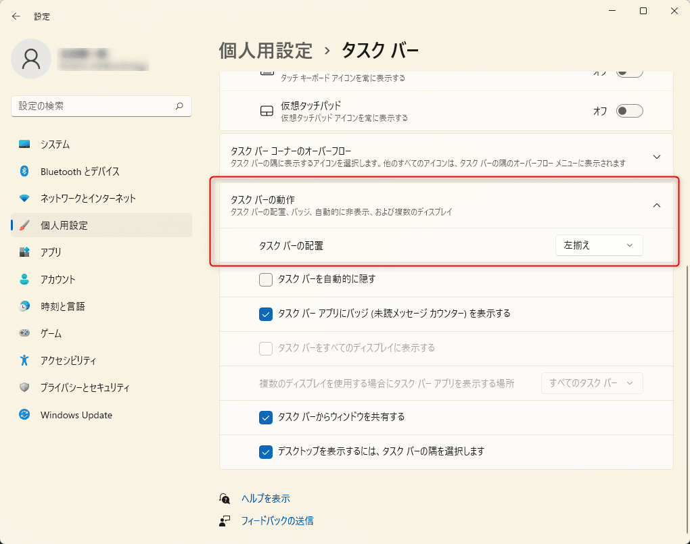

link です。

最近、新しい PC を買いまして、初期から入っている OS が Windows 11 になっていました。

この Windows 11 、今までの Windows と異なり、タスクやスタートボタンがデフォルトでは `中央揃え` になっています。

今までの UI から変わりすぎていて、このままでは使いづらい方も多いと思うので、今回はこのタスク バーを `左揃え` にする方法を紹介します。

## タスクバーを左揃えにする方法

まず、設定を開き、個人用設定から**タスク バー**を選択します。

タスク バーの**タスク バーの動作**の**タスク バーの配置**を `中央揃え` から `左揃え` に変更します。

変更後にタスク バーが以下の画像のようになると思います。

## まとめ

今回は Windows 11 のタスク バーを 10 以前の形式に変更する方法を紹介しました。

少し短いですが、また。別の記事でお会いしましょう。