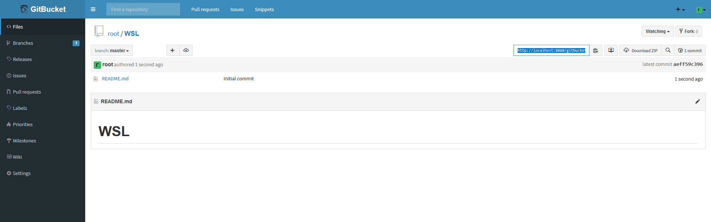

link です。

Git で公開したいけど GitHub 上ではなくローカルのネットワーク上にだけリポジトリを置いておきたいという方がおられると思います。

そこで、今回は WSL2 上で GitBucket を構築する手順を紹介します。

本記事は [WSL2 上で Tomcat 9 を構築してみる](/wsl-tomcat/) の続きとなっています。

## GitBucket とは

GitBucket とは、ローカル環境に構築可能な Git のプラットフォームです。

>GitBucket とは、オープンソースにて開発されている Git をインターネット上で管理するプラットフォームである。 ソースコードは Apache License Version 2.0 のもと公開・開発されている。 GitHub と異なり、個人が所有する環境にインストール可能であることが特徴。 
>
><site>[GitBucket - Wikipedia](https://ja.wikipedia.org/wiki/GitBucket)</site>

## 想定環境

- Windows 10 以降
- WSL2 Ubuntu 20.04
- Tomcat 9
- GitBucket 4.37.0

## GitBucket のインストール

GitBucket のインストールには **Tomcat** がインストールされている必要があります。 Tomcat のインストールは [WSL2 上で Tomcat 9 を構築してみる](/wsl-tomcat/) の記事を参照してください。

まず、 Tomcat を停止します。

```:title=Tomcatの停止
$ sudo systemctl stop tomcat9
```

そして、最新の GitBucket をダウンロードします。（記事執筆時の最新版は `4.37.2` ）

```:title=GitBucketのダウンロード
$ cd /var/lib/tomcat9/webapps
$ sudo wget https://github.com/gitbucket/gitbucket/releases/download/4.37.2/gitbucket.war
```

GitBucket の リポジトリの保存先となる Tomcat のユーザーフォルダを作成し、必要な権限を与えます。

```:title=Tomcatのユーザーフォルダ
$ sudo mkdir /home/tomcat9
$ sudo chown tomcat:tomcat /home/tomcat9
$ sudo usermod -d /home/tomcat9 tomcat
```

最後に Tomcat を再起動します。

```:title=Tomcatの再起動
$ sudo systemctl start tomcat9
```

`localhost:8080/manager/html` にアクセスして以下の画像のような画面になっていれば完了です。


`localhost:8080/gitbucket` にアクセスすると以下の画像のように GitBucket のページへ移動できると思います。


## GitBucket を利用してみる

さっそくサインインしてみます。

デフォルトの管理者アカウントは以下のようになっていますのでこの管理者アカウントでサインインします。

- Username:root
- Password:root

### アカウント作成

アカウントを作成してみます。

まず、右上のアカウントマークの `System Administration` からユーザー管理画面に移動します。


ユーザー管理画面に移動できたら、 `New User` ボタンをクリックし、ユーザー作成画面に移動します。


入力必須項目を一通り入力して `Create User` ボタンをクリックすると新規のユーザーが作成されます。


### リポジトリの作成

新規のリポジトリを作成する場合は右上の `+` ボタンから `New Repository` を選択します。


以下の画像のような画面でリポジトリ名や Public, Private の指定をして `Create Repository` ボタンをクリックすると、新規のリポジトリが作成できます。


### リポジトリのクローン

GitHub と同様、リポジトリのクローンも可能です。

適当に WSL というリポジトリを作成してみます。



作成したリポジトリを SourceTree でクローンしてみました。

問題なくクローンできていますね。


## まとめ

今回は GitBucket を WSL2 にインストールしてみました。

手軽にローカル環境で Git システムを構築できるのでぜひ活用してみてください。

それではまた、別の記事でお会いしましょう。

## 参考サイト

- [GitBucket - Wikipedia](https://ja.wikipedia.org/wiki/GitBucket)