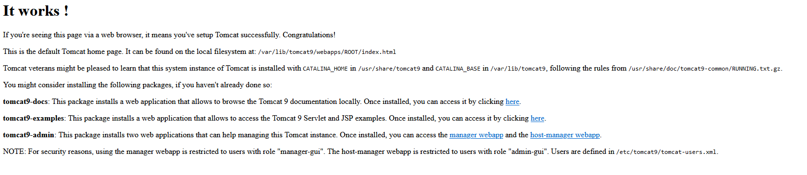
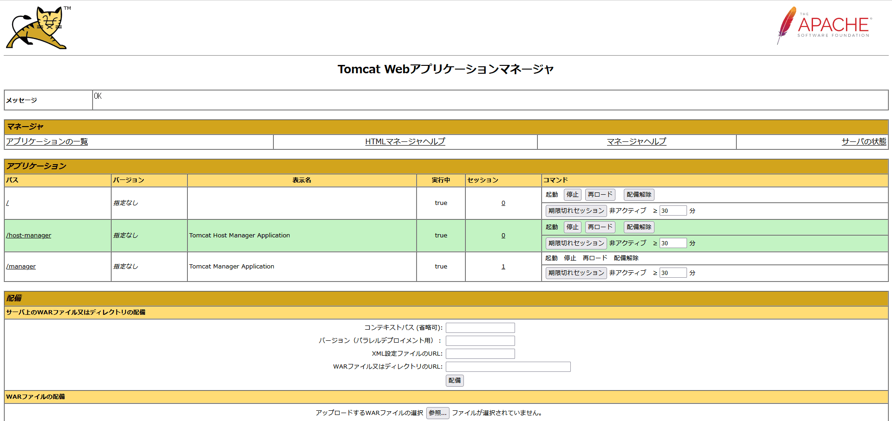

link です。

Linux 環境を Windows 上に手軽に用意できる WSL2 ですが、 Linux 上での Jenkins などの動作確認のために **Tomcat** をインストールしたいと考える方がいると思います。

そこで今回は Tomcat を WSL2 Ubuntu 上にインストールしてみたいと思います。

## 想定環境

- Windows 10 もしくは Windows 11
- WSL2 Ubuntu 20.04 以降

## WSL 上で systemd を動かす

WSL2 に Ubuntu をインストールし `systemctl` コマンドを実行すると以下のようなエラーが発生し実行できません。

```:title=systemctlのエラーメッセージ
$ systemctl
System has not been booted with systemd as init system (PID 1). Can't operate.
Failed to connect to bus: Host is down
```

これは `systemd` が PID1 で動作していないためです。

Tomcat を Ubuntu 上で動作させるには `systemd` が必要不可欠ですので、まずは `systemd` を PID1 で稼働できるようにします。

### genie のインストール

WSL2 上で `systemd` を PID1 で稼働できるようにするためのライブラリーとして **genie** が存在します。

genie をインストールするため、まず、依存モジュールを一通りインストールします。

Ubuntu のバージョンが 20.04 の場合は以下のコマンドを実行すれば OK です。

```:title=dotnet-runtime-5.0のインストール
$ sudo wget https://packages.microsoft.com/config/ubuntu/20.04/packages-microsoft-prod.deb -O packages-microsoft-prod.deb
$ sudo dpkg -i packages-microsoft-prod.deb
$ sudo rm packages-microsoft-prod.deb
$ sudo apt-get update
$ sudo apt-get install -y apt-transport-https
$ sudo apt-get update
$ sudo apt-get install -y aspnetcore-runtime-5.0
```

```:title=それ以外のインストール
$ sudo apt install -y daemonize dbus gawk libc6 libstdc++6 policykit-1 systemd systemd-container
```

`genie` は Ubuntu のデフォルトのリポジトリからは入手できないので、 `genie` の pull 元である `wsl-transdebian` のリポジトリを設定します。

```:title=wsl-transdebianのリポジトリの設定
$ sudo apt install apt-transport-https
$ sudo wget -O /etc/apt/trusted.gpg.d/wsl-transdebian.gpg https://arkane-systems.github.io/wsl-transdebian/apt/wsl-transdebian.gpg
$ sudo chmod a+r /etc/apt/trusted.gpg.d/wsl-transdebian.gpg
$ sudo cat << EOF > /etc/apt/sources.list.d/wsl-transdebian.list
> sudo deb https://arkane-systems.github.io/wsl-transdebian/apt/ $(lsb_release -cs) main
> sudo deb-src https://arkane-systems.github.io/wsl-transdebian/apt/ $(lsb_release -cs) main
> EOF
$ sudo apt update
```

最後に genie をインストールして有効化します。

```:title=genieのインストール
$ sudo apt install -y systemd-genie
$ genie -s
```

これで `systemctl` が利用できるようになりました。

## Tomcat 9 インストール

Tomcat の動作には Java が必要なのでインストールします。

```:title=javaのインストール
$ sudo apt install -y default-jre
```

続いて、 Tomcat 9 と Tomcat Manager をインストールします。

```:title=Tomcatのインストール
$ sudo apt install -y tomcat9 tomcat9-admin
```

### ユーザー情報設定

Tomcat Manager にログインするユーザー情報を設定します。

`tomcat-users` タグ内に以下の記述を追加します。ユーザー名とパスワードは適当に設定します。

```
$ sudo nano /etc/tomcat9/tomcat-users.xml
```

```xml:title=TomcatManagerにログインするユーザーの設定
<tomcat-users ... >
...
<user username="admin" password="pass" roles="manager-gui,admin-gui"/>
...
</tomcat-users>
```

### Tomcat をサービスに登録

Tomcat を systemd のサービスに登録するための定義ファイル `/etc/systemd/system/tomcat.service` を作成します。

```:title=/etc/systemd/system/tomcat.service
[Unit]
Description=Apache Tomcat 9
After=network.target

[Service]
User=tomcat
Group=tomcat
Type=oneshot
PIDFile=/opt/apache-tomcat-9.0.0.M21/tomcat.pid
RemainAfterExit=yes

ExecStart=/opt/apache-tomcat-9.0.0.M21/bin/startup.sh
ExecStop=/opt/apache-tomcat-9.0.0.M21/bin/shutdown.sh
ExecReStart=/opt/apache-tomcat-9.0.0.M21/bin/shutdown.sh;/opt/apache-tomcat-9.0.0.M21/bin/startup.sh

[Install]
WantedBy=multi-user.target
```

作成した定義ファイルの権限を 755 に変更します。

```:title=定義ファイルの権限を 755 に変更
$ sudo chmod 755 /etc/systemd/system/tomcat.service
```

### Tomcat 起動

最後に Tomcat のサービスを有効化して起動します。

```:title=Tomcatを起動
$ sudo systemctl enable tomcat
$ sudo systemctl start tomcat
```

## 動作確認

WSL2 の `localhost` へアクセスできるようにします。

WSL2 の `localhost` を Windows の `localhost` にフォワーディングします。

`<ユーザー名>/.wslconfig` を作成して、中身を以下のように書き換えます。

```:title=<ユーザー名>/.wslconfig
localhostForwarding=True
```

WSL2 を再起動して準備完了です。

```:title=WSL2の再起動
$ wsl --shutdown
```

### Tomcat

`localhost:8080` にアクセスして以下の画面が表示されれば OK です。



### Tomcat Manager

`http://localhost:8080/manager/html` にアクセスして以下の画面が表示されれば OK です。



## まとめ

今回は WSL2 Ubuntu に Tomcat をインストールしました。

今回インストールした Tomcat を利用して、 GitBucket をインストールする手順を次回紹介したいと思います。

それではまた、別の記事でお会いしましょう。

## 参考サイト

- [Install .NET on Ubuntu - .NET | Microsoft Docs](https://docs.microsoft.com/en-us/dotnet/core/install/linux-ubuntu#2004-)
- [wsl-transdebian | A repository for WSL-only apt packages.](https://arkane-systems.github.io/wsl-transdebian/)