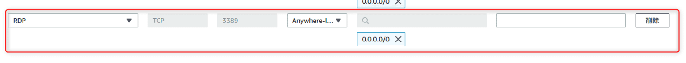

link です。

今回は EC2 インスタンスの Amazon Linux 2 上にデスクトップ環境を構築してリモートデスクトップ接続する手順を紹介します。

## 前提条件

- Windows 11
- Amazon Linux 2

## EC2 インスタンスの設定

リモートデスクトップ接続ができるように EC2 インスタンスに設定しているセキュリティグループのインバウンドルールを編集します。

インスタンスの詳細からセキュリティタブを選択し、セキュリティグループをクリックします。


「インバウンドのルールを編集する」をクリックします。

ルールを追加してタイプを `RDP` 、ソースを `0.0.0.0/0` に設定します。



## Amazon Linux 2 の環境構築

Amazon Linux 2 にデスクトップ環境と Windows 側から Linux にリモート接続できるようにする **TigerVNC** と **xrdp** を導入します。

TigerVNC はグラフィカルデスクトップ共有用のシステムであり、他のコンピューターのリモート制御を可能にします。

xrdp は Windows のリモートデスクトップ接続に用いられる RDP(Remote Desktop Protocol) のサーバ機能を Linux 向けに提供するサーバソフトウェアです。

デスクトップ環境は **MATE** を導入します。

EC2 インスタンスに ssh 接続して以下のコマンドを実行します。

```bash:title=MATEとTigerVNCとxrdpをインストール
$ sudo amazon-linux-extras install mate-desktop1.x
$ sudo bash -c 'echo PREFERRED=/usr/bin/mate-session > /etc/sysconfig/desktop'
$ sudo yum install tigervnc-server
$ sudo amazon-linux-extras install epel
$ sudo yum install xrdp
```

xrdp の起動と起動設定を行います。

```bash:title=xrdpの設定
$ sudo systemctl start xrdp
$ sudo systemctl enable xrdp
```

xrdp からログインするためのパスワードを設定します。

```bash:title=パスワード設定
$ sudo passwd ec2-user
```

## 日本語化

MATE の日本語化を行います。

フォントなどをインストールします。

```bash:title=日本語化用のパッケージインストール
$ sudo yum install ibus-kkc
$ sudo yum install google-noto-sans-japanese-fonts
```

`~/.bashrc` の末尾に以下の内容を追加します。

```:title=~/.bashrc
export GTK_IM_MODULE=ibus
export XMODIFIERS=@im=ibus
export QT_IM_MODULE=ibus
ibus-daemon -drx

````

言語などを指定するロケールを設定します。

```bash:title=ロケール設定
$ sudo localectl set-locale LANG=ja_JP.UTF-8
$ sudo localectl set-keymap jp106
$ sudo localectl set-keymap jp-OADG109A
````

最後に `sudo reboot` で再起動して完了です。

## リモートデスクトップ接続する

EC2 インスタンスにリモートデスクトップ接続してみます。

接続先に Amazon Linux 2 のパブリック IPv4 アドレスを指定して接続します。

接続に成功すれば、以下のような画面が表示されると思います。


`username` に `ec2-user` 、 `password` に EC2 インスタンスの環境構築で設定したパスワードを入力して「OK」をクリックします。

以下のような画面が表示されればログイン成功です。


## 参考サイト

- [Amazon Linux 2 を実行している Amazon EC2 インスタンスに GUI をインストールする | AWS re:Post](https://repost.aws/ja/knowledge-center/ec2-linux-2-install-gui)
- [\[AWS\] 「Amazon Linux 2」で MATE（GUI） を日本語化する。 – .zapping](https://zapping.beccou.com/2021/06/17/aws-japaneseize-mate-on-amazon-linux-2/)

## まとめ

今回は EC2 インスタンスの Amazon Linux 2 上にデスクトップ環境を構築してリモートデスクトップ接続する手順を紹介しました。

それではまた、別の記事でお会いしましょう。
