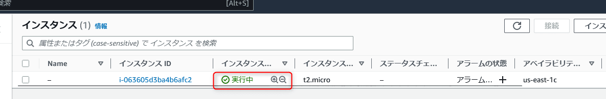
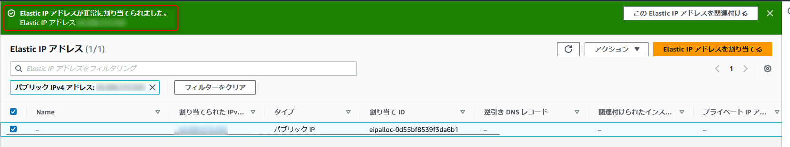
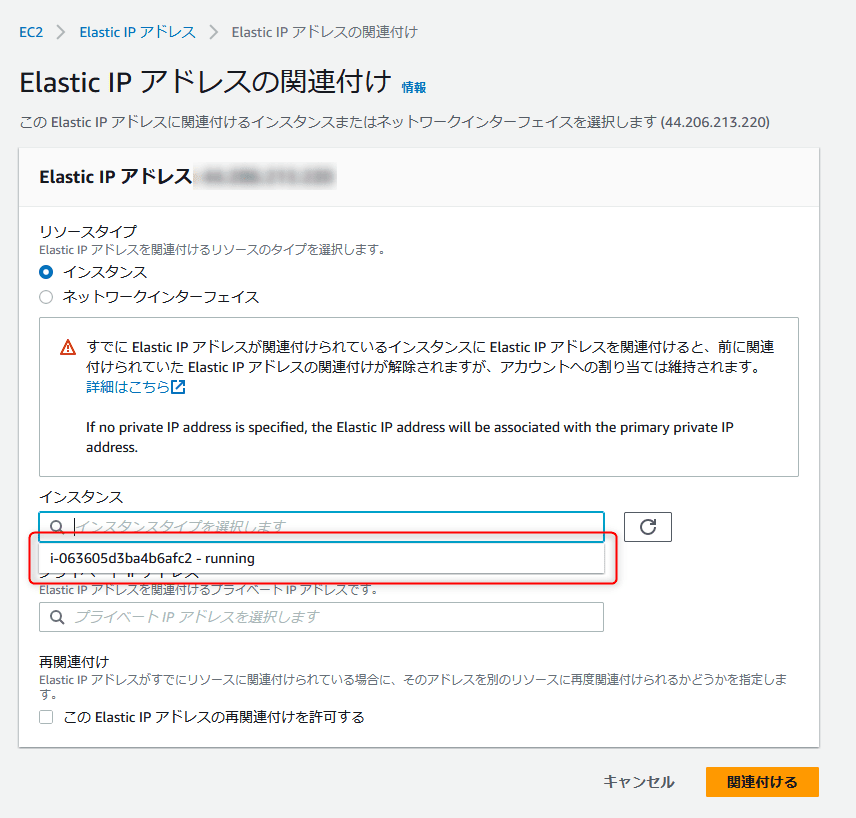
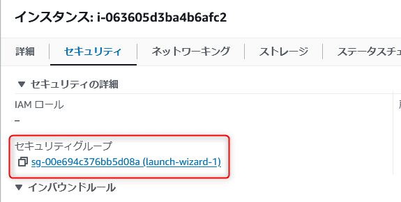

link です。

AWS では Web アプリケーションをデプロイ、公開するサービスとして **Amplify** がありますが、 Ruby on Rails など対応していないフレームワークが存在しています。

その場合、 EC2 で用意した仮想マシン上に Web アプリケーションを展開して公開する必要があります。

今回は EC2 を利用して Rails のアプリをデプロイ、公開する方法の EC2 インスタンスに接続するまでを紹介します。

## 前提条件

- Windows 11
- WSL2(Ubuntu 22.04)
- Amazon Linux 2023

## EC2 インスタンス作成

まず、 EC2 インスタンスを作成します。

EC2 のトップ画面から**インスタンス(実行中)**をクリックして、**インスタンスを起動**をクリックします。


マシンイメージを **Amazon Linux 2023 AMI** に設定します。


**新しいキーペアの作成**をクリックします。


適当なキーペア名を指定して、**キーペアのタイプ**を **RSA** 、**プライベートキーファイル形式**を **.ppm** に指定します。ここで作成したキーペアは後で利用しますので保存しておいてください。


設定完了後、**インスタンスを起動**をクリックします。


EC2 のインスタンスの状態が「実行中」になったら起動完了です。



## Elastic IP の割り当て

次に IP アドレスの固定化とインスタンスの外部公開するために Elastic IP を割り当てます。

まず、 EC2 の **Elastic IP アドレス**に移動し、**Elastic IP を割り当てる**をクリックします。


インスタンスを作成したリージョンのネットワークボーダーグループになっていることを確認して、**割り当て**をクリックします。


Elastic IP アドレスが正常に割り当てられたことを確認します。



続いて、割り当てた IP アドレスを EC2 インスタンスと関連付けします。

IP アドレスを選択して**Elastic IP アドレスの関連付け**をクリックします。


インスタンスを選択して、**関連付ける**をクリックします。



これで Elastic IP アドレスの関連付けが完了です。


## インバウンドルールの設定

続いて、インバウンドルールを設定して、外部からインスタンスへアクセスできるようにします。

EC2 インスタンスのセキュリティタブから**セキュリティグループ**をクリックします。



**インバウンドのルールを編集**をクリックします。


**ルールを追加**をクリックし、タイプを **HTTP** 、 IP アドレスを `::/0` を設定して**ルールを変更**をクリックします。


これで IP 周りの設定は完了です。

## EC2 インスタンスに SSH で接続する

起動した EC2 インスタンスに SSH で接続してみます。

SSH 接続には作成したキーペアの ppm ファイルが必要になりますが、この ppm ファイルを使うには `chmod` コマンドで権限を設定しておく必要があります。

そこで `chmod` コマンドを使うために WSL2 上の Ubuntu を利用しますが、デフォルトのままだと Windows 上のファイルに `chmod` コマンドを適用できません。

まず、 Windows 上のファイルに `chmod` コマンドを適用できるようにします。

Ubuntu を起動し、 `/etc/wsl.conf` を以下のように設定します。

```conf:title=/etc/wsl.conf
# Enable extra metadata options by default
[automount]
enabled=true
root=/mnt/
options="metadata,umask=22,fmask=11"
mountFsTab=false
# Enable DNS – even though these are turned on by default, we'll specify here just to be explicit.
[network]
generateHosts=true
generateResolvConf=true
```

設定後、 `wsl --shutdown` で WSL を再起動します。
これで Windows 上のファイルに `chmod` コマンドを適用できるようになりました。

あとは `chmod` で pem ファイルに権限を設定し、 `ssh` で接続するだけです。

IP アドレスを EC2 インスタンスの Elastic IP に指定すれば接続できます。

```bash:title=インスタンスに接続
$ chmod 600 Rails.pem
$ ssh -i Rails.pem ec2-user@IPアドレス
   ,     #_
   ~\_  ####_        Amazon Linux 2023
  ~~  \_#####\
  ~~     \###|
  ~~       \#/ ___   https://aws.amazon.com/linux/amazon-linux-2023
   ~~       V~' '->
    ~~~         /
      ~~._.   _/
         _/ _/
       _/m/'
[ec2-user@ip-IPアドレス ~]$
```

## 参考サイト

- [Amazon EC2 を使用するようにセットアップする - Amazon Elastic Compute Cloud](https://docs.aws.amazon.com/ja_jp/AWSEC2/latest/UserGuide/get-set-up-for-amazon-ec2.html)

## まとめ

今回は EC2 インスタンスに接続するまでを紹介しました。

次回は接続できるようになった EC2 インスタンスの内部に Rails の動作に必要なものをインストールして、起動させた Web アプリケーションに接続するまでをやります。

それではまた、次の記事でお会いしましょう。