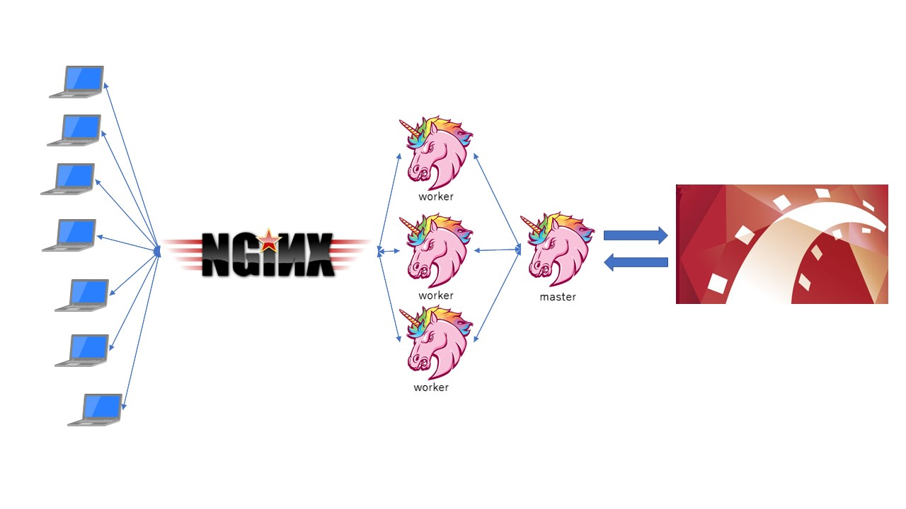

link です。

この記事は前回 [AWS に Rails のアプリをデプロイする方法 ～ Rails アプリを起動するまで](linkohta/ec2-setup-rails) の続きになります。

前回は Rails アプリを起動してアクセスするまでをやりました。

今回は実際に外部公開する Rails アプリの本番環境を EC2 インスタンス上で構築する手順を紹介します。

## 想定環境

- Windows 11
- Amazon Linux 2023
- Ruby 3.2
- Ruby on Rails 7

## 本番環境構築について

今回、本番環境を構築するにあたって **Unicorn+nginx** で Rails アプリを立ち上げます。

Rails アプリの起動は `rails s` で行えます。

しかし `rails s` で立ち上がる Rack アプリサーバーは負荷を分散させるための機能がありません。

そのため、実運用していく上で、大勢の人がサイトを見たときなどにとても重くなってしまいます。

そこで Unicorn+nginx を使ってアクセス時の負荷を分散できるようにします。

## Unicorn と nginx について

**Unicorn** はプロセス上で動作するアプリケーションサーバーです。

`master` と `worker` の 2 プロセスに分かれており、 `master` プロセスがアプリのソースを保持し、 `worker` プロセス群が実際のリクエストを処理するようになっています。

**nginx** はクライアントからのリクエストを受け、何らかの処理を行う Web サーバーです。

処理できるリクエストの数が Unicorn は `worker` プロセスが数個程度であるのに対し、 nginx は数千のコネクションが存在しているため、大量のリクエストを処理できることが特徴です。

リクエスト処理の流れは以下のようになっています。

1. nginx からリクエストが Unicorn に渡される
2. Unicorn は Rack をとおして Rails アプリケーションのルーターに処理を渡す
3. Rails アプリケーションの結果を Unicorn が受け取る
4. Unicorn はこれを Web サーバーに渡し、最終的にクライアントへと渡る



## Unicorn のインストールと設定

ローカルの Rails のプロジェクトフォルダ内の `Gemfile` に Unicorn を追加します。

```rb:title=Gemfile
group :production do
  gem 'unicorn'
end
```

`config/unicorn.rb` を作成して以下の内容を記述します。

```rb:title=config/unicorn.rb
# Rails のルートパスを求める
app_path = File.expand_path('../../', __FILE__)

# Unicorn は複数のワーカーで起動するのでワーカー数を定義
worker_processes 1

# Unicorn の起動コマンドを実行するディレクトリを指定します
working_directory app_path

# プロセスの停止などに必要なPIDファイルの保存先を指定
pid "#{app_path}/tmp/pids/unicorn.pid"

# ポートを設定
listen "#{app_path}/tmp/sockets/unicorn.sock"

# Unicorn のエラーログと通常ログの位置を指定
stderr_path "#{app_path}/log/unicorn.stderr.log"
stdout_path "#{app_path}/log/unicorn.stdout.log"

# 接続タイムアウト時間
timeout 60

# Unicorn の再起動時にダウンタイムなしで再起動を行う
preload_app true

check_client_connection false

run_once = true

# USR2 シグナルを受けると古いプロセスを止める
before_fork do |server, worker|
  defined?(ActiveRecord::Base) &&
    ActiveRecord::Base.connection.disconnect!

  if run_once
    run_once = false
  end

  old_pid = "#{server.config[:pid]}.oldbin"
  if File.exist?(old_pid) && server.pid != old_pid
    begin
      sig = (worker.nr + 1) >= server.worker_processes ? :QUIT : :TTOU
      Process.kill(sig, File.read(old_pid).to_i)
    rescue Errno::ENOENT, Errno::ESRCH => e
      logger.error e
    end
  end
end

after_fork do |_server, _worker|
  defined?(ActiveRecord::Base) && ActiveRecord::Base.establish_connection
end
```

続いて、 Unicorn の起動・停止スクリプトを作成します。

```bash:title=スクリプト生成
$ rails g task unicorn
```

これで `lib/tasks/unicorn.rake` が生成されるので中身を以下のように書き換えます。

```rb:title=lib/tasks/unicorn.rake
namespace :unicorn do

  # Tasks
  desc "Start unicorn"
  task(:start) {
    config = Rails.root.join('config', 'unicorn.rb')
    sh "unicorn -c #{config} -E production -D"
  }

  desc "Stop unicorn"
  task(:stop) {
    unicorn_signal :QUIT
  }

  desc "Restart unicorn with USR2"
  task(:restart) {
    unicorn_signal :USR2
  }

  desc "Increment number of worker processes"
  task(:increment) {
    unicorn_signal :TTIN
  }

  desc "Decrement number of worker processes"
  task(:decrement) {
    unicorn_signal :TTOU
  }

  desc "Unicorn pstree (depends on pstree command)"
  task(:pstree) do
    sh "pstree '#{unicorn_pid}'"
  end

  # Helpers
  def unicorn_signal signal
    Process.kill signal, unicorn_pid
  end

  def unicorn_pid
    begin
      File.read("/home/vagrant/myapp/tmp/unicorn.pid").to_i
    rescue Errno::ENOENT
      raise "Unicorn does not seem to be running"
    end
  end

end
```

EC2 インスタンスにログインして環境変数 `SECRET_KEY_BASE` を設定します。

`~/.bash_profile` に以下の内容を追記します。

```bash:title=bash_profile
$ export SECRET_KEY_BASE=`bundle exec rake secret`
```

これで Unicorn を使う準備は完了です。

最後に、変更を commit してリモートリポジトリに push したあと、 EC2 インスタンス内のプロジェクトフォルダで `git pull` して変更を反映します。

## nginx のインストールと設定

EC2 インスタンスに nginx をインストールします。

```bash:title=nginxインストール
$ sudo yum -y install nginx
```

`/etc/nginx/conf.d/rails.conf` を作成して以下の内容を記述します。

```conf:title=/etc/nginx/conf.d/rails.conf
# Unicorn と連携させるための設定
upstream app_server {
  server unix:/var/www/AwsRails/tmp/sockets/unicorn.sock;
}

server {
  # このプログラムが接続を受け付けるポート番号
  listen 80;
  # 接続を受け付けるリクエスト URL
  server_name EC2 インスタンスの IP アドレス;
  # クライアントからアップロードされてくるファイルの容量の上限
  client_max_body_size 2g;
  # 接続が来た際の root ディレクトリ
  root /var/www/AwsRails/public;
  # assets ファイル (CSS や JavaScript のファイルなど)にアクセスが来た際に適用される設定
  location ^~ /assets/ {
    gzip_static on;
    expires max;
    add_header Cache-Control public;
  }

  try_files $uri/index.html $uri @unicorn;
  # Unicorn のリバースプロキシ
  location @unicorn {
    proxy_set_header X-Forwarded-For $proxy_add_x_forwarded_for;
    proxy_set_header Host $http_host;
    proxy_redirect off;
    proxy_pass http://app_server;
  }

  error_page 500 502 503 504 /500.html;
}
```

今のままで POST メソッドを実行すると nginx が Rails アプリがあるディレクトリへのアクセス権限を持っていないため 403 が発生してしまいます。

そこで `/var/lib/nginx` の権限を変更して POST メソッドを実行できるようにします。

```bash:title=権限変更
$ cd /var/lib
$ sudo chmod -R 775 nginx
```

nginx のインストールと設定はこれで完了です。

## 本番環境でのアプリ起動

Rails アプリを起動させます。

Unicorn インストール時に作成したスクリプトで Unicorn を使って Rails アプリを起動します。

```bash:title=アプリ起動
$ rake unicorn:start
```

`unicorn -c /home/{ユーザ名}/AwsRails/config/unicorn.rb -E production -D` の 1 行だけ表示されれば起動成功です。

アプリを停止させるときは `rake unicorn:stop` を実行します。

`http://EC2 インスタンスの IP アドレス` にアクセスして、 Web アプリが利用できることを確認しましょう。

## 参考サイト

- [Unicorn と Nginx の概要と違い - Qiita](https://qiita.com/sunoko/items/3989865bf915887f8d2b)
- [【CentOS 7】nginx + Unicorn で Rails アプリケーションを本番環境で立ち上げる方法](https://zenn.dev/noraworld/articles/deploy-rails-application-with-nginx-and-unicorn)
- [独学向け Rails アプリを AWS にデプロイする方法まとめ【入門】 - Qiita](https://qiita.com/gyu_outputs/items/b123ef229842d857ff39)
- [なぜ rails の本番環境では Unicorn,nginx を使うのか? 　~ Rack,Unicorn,nginx の連携について ~【Ruby On Rails で web サービス運営】 - Qiita](https://qiita.com/fritz22/items/fcb81753eaf381b4b33c)

## まとめ

今回は実際に外部公開する Rails アプリの本番環境を EC2 インスタンス上で構築する手順を紹介しました。

AWS に Rails のアプリをデプロイする方法の紹介は以上になります。

それではまた、別の記事でお会いしましょう。
