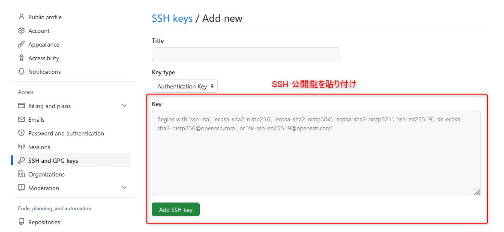
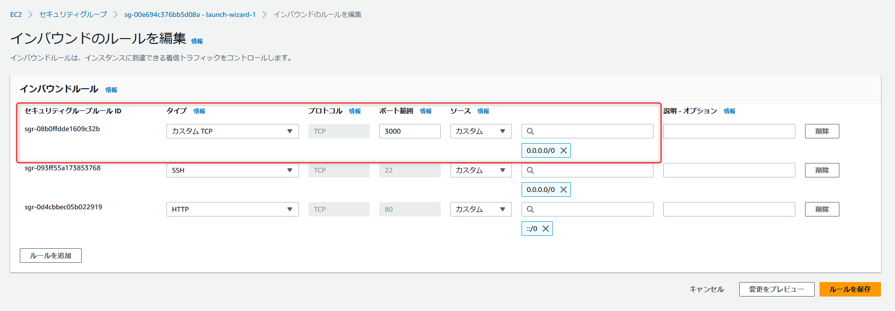
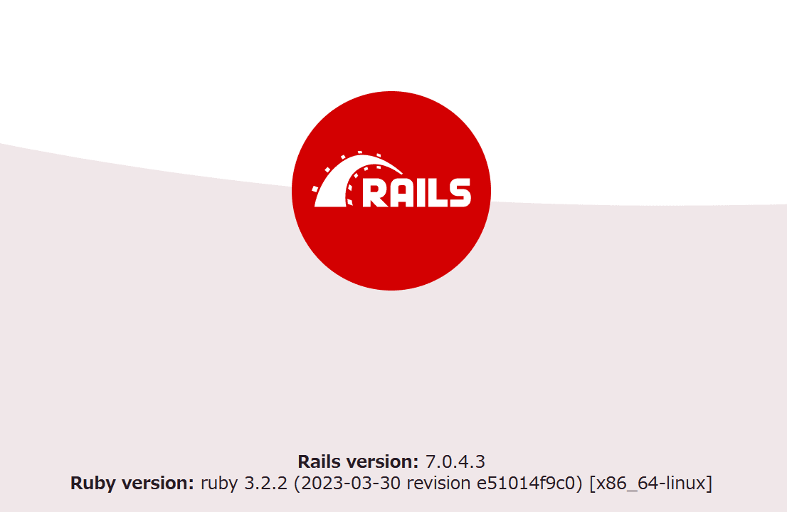

link です。

この記事は前回の続きになっています。

前回は EC2 インスタンスに接続するまでをやりました。

今回は EC2 インスタンス上に Rails アプリの起動に必要なライブラリをインストールしてブラウザ上で Rails アプリに接続するまでの手順を紹介します。

## 前提条件

- Windows 11
- WSL2(Ubuntu 22.04)
- Amazon Linux 2023
- Ruby 3.2.2

## Git, Ruby などをインストール

この先で必要になる Git, Ruby などを一式インストールします。

以下のコマンドを実行します。

```bash:title=インストール
$ sudo yum -y install git make gcc-c++ patch libyaml-devel libffi-devel libicu-devel zlib-devel readline-devel libxml2-devel libxslt-devel ImageMagick ImageMagick-devel openssl-devel ruby ruby-devel
```

## Node.js をインストール

nvm を使って Node.js をインストールします。

以下のコマンドを実行します。

```bash:title=Node.jsインストール
$ curl -o- https://raw.githubusercontent.com/nvm-sh/nvm/v0.39.3/install.sh | bash
$ . ~/.nvm/nvm.sh
$ nvm install 16
```

## Rails アプリを EC2 インスタンスにクローン

Rails アプリを Git からクローンします。

ただし、デフォルトのままだと permission denied エラーが発生するので、先に EC2インスタンスの SSH 公開鍵を Github に登録する必要があります。

### SSH 公開鍵を Github に登録

EC2 にログインして、 `ssh-keygen -t rsa -b 4096` を実行します。

すると以下のようにコンソール上に表示されると思います。

```bash:title=公開鍵作成
$ ssh-keygen -t rsa -b 4096
Generating public/private rsa key pair.
Enter file in which to save the key (/home/ec2-user/.ssh/id_rsa):
Enter passphrase (empty for no passphrase):
Enter same passphrase again:
Your identification has been saved in /home/ec2-user/.ssh/id_rsa
Your public key has been saved in /home/ec2-user/.ssh/id_rsa.pub
The key fingerprint is:
??? ec2-user@ip-172-31-81-143.ec2.internal
The key's randomart image is:
+---[RSA 4096]----+
|=o o             |
| o*..        .   |
|oo.o. .     o    |
|.o o.  = . o .   |
|= +.  = S = .    |
| = o...o.= o     |
|  . o=.oo .      |
|   ooo+*o.       |
| .o.oo=Eoo       |
+----[SHA256]-----+
```

`cat ~/.ssh/id_rsa.pub` で SSH 公開鍵を表示できますので、表示された文字列をすべてコピーします。

その後、 https://github.com/settings/keys にアクセスして、「NEW SSH KEY」をクリックして、 Key 欄にコピーした公開鍵を貼り付けます。



最後に「Add SSH KEY」をクリックして完了です。

EC2 上で `ssh -T git@github.com` を実行して、以下の様に表示されることを確認しましょう。

途中で一回 yes を入力する必要があります。

```bash:title=Github確認
$ ssh -T git@github.com
The authenticity of host 'github.com (140.82.112.3)' can't be established.
ED25519 key fingerprint is SHA256:+DiY3wvvV6TuJJhbpZisF/zLDA0zPMSvHdkr4UvCOqU.
This key is not known by any other names
Are you sure you want to continue connecting (yes/no/[fingerprint])? yes
Warning: Permanently added 'github.com' (ED25519) to the list of known hosts.
Hi ユーザー名! You've successfully authenticated, but GitHub does not provide shell access.
```

### Rails アプリのクローン

Rails アプリをクローンします。

まず、 Rails アプリを保存するディレクトリを作成します。

```bash:title=保存先ディレクトリ作成
$ sudo mkdir /var/www/
$ sudo chown ec2-user /var/www/
$ cd /var/www/
```

あとは `$ git clone リポジトリURL` でクローンすれば完了です。

## gem のインストール

EC2 インスタンスに gem をインストールします。

EC2 ではなく、ローカル環境の Rails アプリを開き、以下のコマンドを実行します。

```bash:title=bundle確認
$ bundler -v
```

これで表示された bundle と同じバージョンを EC2 に入れます。

```bash:title=bundleインストール
$ gem install bundler -v 2.4.8
```

Rails アプリのディレクトリ内で `bundle install` を実行して gem のインストールは完了です。

## ポート開放

EC2 上の Rails アプリにアクセスできるようにポートを開放します。

セキュリティグループのインバウンドルールにタイプを「カスタム TCP」、ポートを「3000」、アドレスを `0.0.0.0/0` に設定したものを追加して保存します。



これで Rails アプリに接続する準備は完了です。

## アプリ起動と接続

Rails アプリのディレクトリ内で `bundle exec rails server -p 3000 -b 0.0.0.0` を実行します。

`http://Elastic IP:3000/` にアクセスして Rails アプリが表示されることを確認しましょう。以下の画像はアプリ作成直後の画面です。



## 参考サイト

- [独学向けRailsアプリをAWSにデプロイする方法まとめ【入門】 - Qiita](https://qiita.com/gyu_outputs/items/b123ef229842d857ff39)
- [EC2でRailsアプリを起動したけどブラウザからアクセスできないとき - Qiita](https://qiita.com/sakaimo/items/dd138b39c7480fb2ebff)

## まとめ

今回は EC2 インスタンスに Ruby 等をインストールして、 Rails アプリにアクセスできることを確認するところまでやりました。

ただ、今回起動させたのは評価環境としてのものになっています。

実際に本番環境として外部公開するにはクライアントからのリクエストを捌く Web サーバーを導入する必要があります。

次回は本番環境として起動させる方法を紹介したいと思います。

それではまた、次の記事でお会いしましょう。