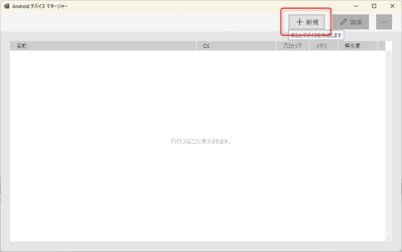
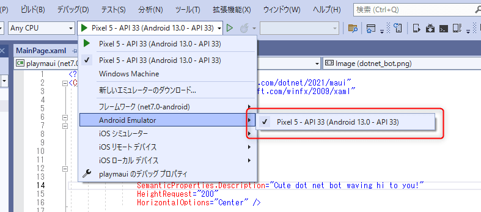

link です。

今回は **.NET MAUI** を使って MVVM な Android アプリを作る第一歩を紹介します。

## 想定環境

- Windows 10 以降
- Visual Studio 2022 version 17.4 以降
- Android 5 以降

## .NET MAUI とは

>.NET Multi-Platform App UI (.NET MAUI) は、C# と XAML を使用して、ネイティブのモバイル アプリやデスクトップ アプリを作成するためのクロスプラットフォーム フレームワークです。
>
>.NET MAUI を使用すると、1 つの共有コード ベースから Android、iOS、macOS、Windows で実行できるアプリを開発できます。
>出典 : [.NET MAUI とは - .NET MAUI | Microsoft Learn](https://learn.microsoft.com/ja-jp/dotnet/maui/what-is-maui?view=net-maui-7.0)

.NET MAUI は .NET 6 で公開された、 Xamarin.Forms の後継フレームワークです。

C# と XAML を使用して Android, iOS, macOS, Windows で実行できるアプリを開発できます。

## テスト環境を用意する

Android アプリの開発にはデバッグ用の環境を用意する必要があります。

実機、エミュレーターそれぞれの手順を紹介します。

### 実機の場合

実機を使う場合は**開発者オプション**から **USB デバッグ**を ON にする必要があります。

ただ、開発者オプションは**初期状態では非表示になっているため、表示させる必要があります。**

この表示させるための手順が機種や Android のバージョンによって異なるため、それぞれで手順を調べて表示させてください。

### エミュレーターの場合

エミュレーターを使う場合は新規プロジェクトを作成後、**Android デバイスマネージャー**を起動して、エミュレーターを作成します。


起動したデバイスマネージャーでエミュレーターを新規作成します。



デバッグに作成したエミュレーターを指定すればデバッグ時に自動でビルドとデプロイをやってくれます。



## Hello World! を表示させる

さっそく、 Hello World! を表示させてみましょう。

まず、 **.NET MAUI アプリ**でプロジェクトを新規作成します。

作成直後のプロジェクトはデフォルトで Hello World! を表示するようになっています。

デバッグ実行させると以下の画像のような画面が Android 上に表示されると思います。


## データバインディングを使った形に書き換える

デフォルトで作成される新規プロジェクトのプログラムはイベントハンドラーを使う形になっています。

これをデータバインディングを使った形に書き換えてみます。

`MainPage.xaml` の書き換えと `CountViewModel.cs` を新規作成します。

```xml:title=MainPage.xaml
<?xml version="1.0" encoding="utf-8" ?>
<ContentPage xmlns="http://schemas.microsoft.com/dotnet/2021/maui"
             xmlns:x="http://schemas.microsoft.com/winfx/2009/xaml"
             x:Class="HelloWorld.MainPage"
             xmlns:local="clr-namespace:HelloWorld">
    <ContentPage.BindingContext>
        <local:CountViewModel />
    </ContentPage.BindingContext>

    <ScrollView>
        <VerticalStackLayout
            Spacing="25"
            Padding="30,0"
            VerticalOptions="Center">

            <Image
                Source="dotnet_bot.png"
                SemanticProperties.Description="Cute dot net bot waving hi to you!"
                HeightRequest="200"
                HorizontalOptions="Center" />

            <Label
                Text="Hello, World!"
                SemanticProperties.HeadingLevel="Level1"
                FontSize="32"
                HorizontalOptions="Center" />

            <Label
                Text="Welcome to .NET Multi-platform App UI"
                SemanticProperties.HeadingLevel="Level2"
                SemanticProperties.Description="Welcome to dot net Multi platform App U I"
                FontSize="18"
                HorizontalOptions="Center" />

            <Button
                x:Name="CounterBtn"
                Text="{Binding ButtonText}"
                SemanticProperties.Hint="Counts the number of times you click"
                Command="{Binding CountUpCommand}"
                HorizontalOptions="Center" />

        </VerticalStackLayout>
    </ScrollView>

</ContentPage>
```

```cs:title=CountViewModel.cs
using System.ComponentModel;
using System.Windows.Input;

namespace HelloWorld
{
    public class CountViewModel : INotifyPropertyChanged
    {
        private int count;

        public CountViewModel()
        {
            count = 0;
            CountUpCommand = new Command(CountUp);
        }

        public string ButtonText {
            get {
                if (count == 0)
                {
                    return $"Click";
                }
                else if (count == 1)
                {
                    return $"Clicked {count} time";
                }
                else
                {
                    return $"Clicked {count} times";
                }
            }
        }

        public event PropertyChangedEventHandler PropertyChanged;
        protected void OnPropertyChanged(string info)
        {
            PropertyChanged?.Invoke(this, new PropertyChangedEventArgs(info));
        }

        public ICommand CountUpCommand { get; set; }

        private void CountUp()
        {
            count++;
            OnPropertyChanged("ButtonText");
        }
    }
}
```

初期と同じ挙動ですが、これで MVVM に書き換えられました。

WPF などと同じ .NET 系のフレームワークなだけあって、ほぼ同じ感覚でアプリ開発ができそうですね。

## まとめ

今回は .NET MAUI を使って MVVM な Android アプリを作る第一歩を紹介しました。

WPF とほぼ同じ感覚で Android アプリを開発できるので活用していければと思います。

それではまた、別の記事でお会いしましょう。