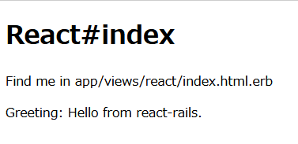

link です。

今回は Ruby on Rails と React を組み合わせて使う方法を紹介します。

## 想定環境

- Ruby 2.7.0 以降

## インストール

Ruby on Rails と React を組み合わせて使うにあたって **react-rails** を利用します。

まず、`--skip-javascript` オプションを指定した Rails プロジェクトを新規作成します。

```:title=プロジェクト作成
$ rails new ReactRails --skip-javascript
$ cd ReactRails
```

作成したプロジェクトに `shakapacker` をインストールします。

```:title=shakapackerインストール
$ bundle add shakapacker --strict
$ rails webpacker:install
```

続いて React と関連パッケージをインストールします。

```:title=Reactインストール
$ yarn add react react-dom @babel/preset-react prop-types css-loader style-loader mini-css-extract-plugin css-minimizer-webpack-plugin
```

`package.json` の Babel の設定を以下のように変更します。

```js:title=package.json
"babel": {
  "presets": [
    "./node_modules/shakapacker/package/babel/preset.js",
    "@babel/preset-react"
  ]
},
```

`config/webpacker.yml` の `source_entry_path` を `packs` に変更します。

```rb:title=config/webpacker.ymlのsource_entry_path
source_entry_path: packs
```

最後に `react-rails` をインストールします。

```:title=react-railsインストール
$ bundle add 'react-rails' --strict
$ rails g react:install
```

これでインストールは完了です。

## React コンポーネントを表示させる

Rails の View に React コンポーネントを表示させます。

まず、 HelloWorld コンポーネントとコンポーネントを表示する View を作成します。

HelloWorld コンポーネントで表示するのは greeting に指定した文字列を表示するだけのシンプルなものです。

```
$ rails g react:component HelloWorld greeting:string
$ rails g controller react index
```

`app/views/react/index.html.erb` に以下のコードを追加します。

`react_component()` に呼び出すコンポーネント名とプロパティを指定しています。

```
<%= react_component("HelloWorld", { greeting: "Hello from react-rails." }) %>
```

`rails s` で Rails アプリを起動して `localhost:3000/react/index` にアクセスし、以下の画像のような画面が表示されることを確認しましょう。



## 参考サイト

- [reactjs/react-rails: Integrate React.js with Rails views and controllers, the asset pipeline, or webpacker.](https://github.com/reactjs/react-rails)

## まとめ

今回は react-rails を使って Ruby on Rails と React を組み合わせる方法を紹介しました。

Rails 上で React を使えば View の表現がより広がりますので活用してみてください。

それではまた、別の記事でお会いしましょう。