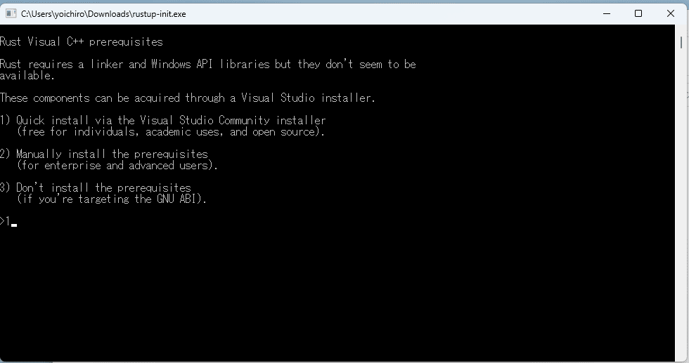
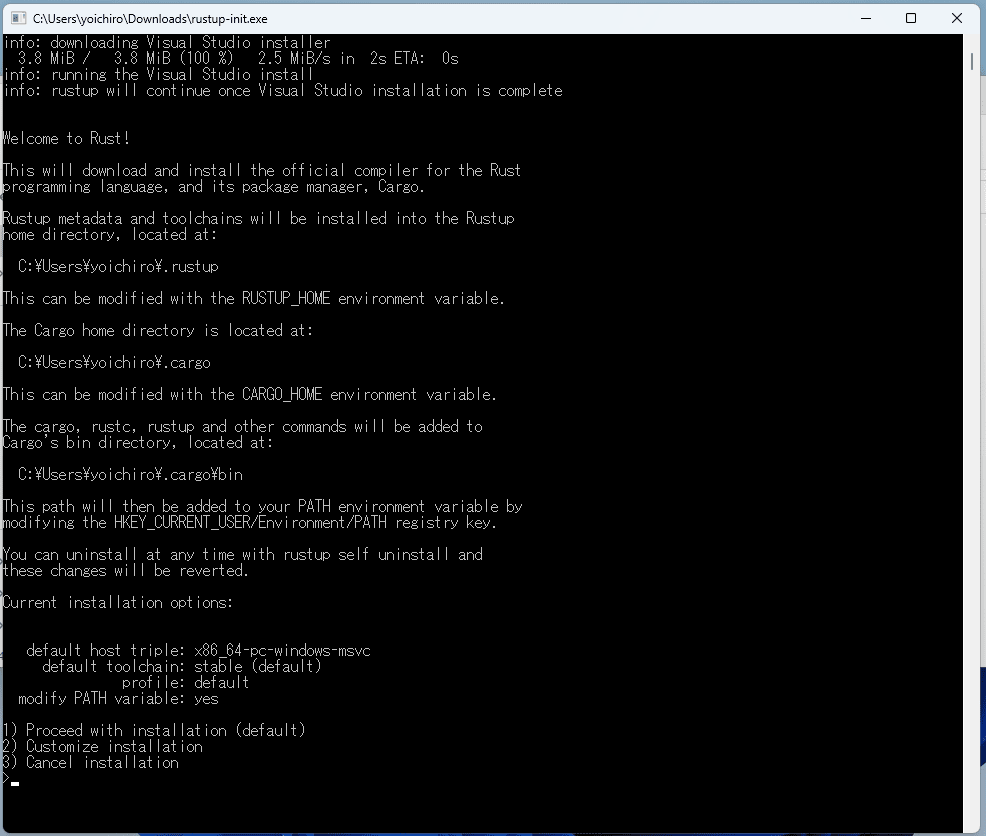

link です。

高速でセキュリティ的にも安全な言語として **Rust** が注目を集めています。

今回はそんな Rust の勉強をしていきます。

## 想定環境

- Windows 11
- Rust 1.72

## Rust とは

Rust（ラスト）は、性能、メモリー安全性、安全な並行性を目指して設計されたマルチパラダイムのプログラミング言語です。

C 言語、 C++ に代わるシステムプログラミング言語を目指しており、構文的には C++ に似ています。

プログラミング言語としての Rust の特徴は、**ボローチェッカー**という参照の有効性を検証するしくみにあります。

参照の有効性を検証することによってメモリー安全性を保証し、不正なデータアクセスをコンパイル時に防止できるというものです。

## インストール

まず Rust をインストールします。 Rustは、 **rustup** というコマンドラインツールを使用してダウンロードします。

rustup は [Rust の公式サイト](https://www.rust-lang.org/ja/tools/install/)からダウンロードできます。

もし、 Visual Studio がインストールされていない場合は rustup を実行すると、以下の画像のように Visual Studio のインストールを求められます。
その場合は `1) Quick install via the Visual Studio Community installer` を選択して Visual Studio Community をインストールしましょう。



Visual Studio Community のインストールが完了、もしくはインストール済みの場合は以下の画像のように Rust のインストール方法が求められます。
ここは `1) Process with installation (default)` で問題ありません。



インストールが完了したら `rustup -v` を実行してバージョンが表示できることを確認しましょう。

## Hello world! する

さっそく、 Hello world! します。

`main.rs` を作成して以下のコードを書き込みます。

```rust:title=Helloworldのコード
fn main() {
    println!("Hello world!");
}
```

このコードを `rustc` でコンパイルして実行すると `Hello world!` が表示されます。

```bash:title=Helloworld!する
$ rustc main.rs
$ .\main.exe
Hello world!
```

Rust では `fn main()` がメイン関数になっています。

この中で `println!()` で `Hello world!` を表示させています。

`rustc` は Rust のコンパイラです。

## Cargo とは

Hello world! で紹介した方法はシンプルにコンパイラを使うだけですが、実際の開発には **Cargo** を使って Rust プロジェクトを管理します。

Cargo は Rust のビルドシステム兼パッケージマネージャーです。

Cargo はコードのビルド、コードが依存するライブラリーのダウンロード、それらのライブラリーのビルドなどを一手に担ってくれます。

この Cargo を使って Hello world! してみます。

まず、 Cargo プロジェクトを作成します。

```bash:title=Cargoプロジェクトを作成
$ cargo new hello_cargo
$ cd hello_cargo
```

Cargo プロジェクトの構造は以下の通りです。

- `src`
    - `main.rs (デフォルト)`
- `target`
    - ビルド後にアプリや必要なライブラリ一式が保存されます
- `Cargo.toml`
    - 依存関係を記述します

この作成した Cargo プロジェクトにデフォルトで入っている `src/main.rs` に Hello world! のコードが記述されています。

Cargo プロジェクトを `cargo build` でビルドします。

```bash:title=Cargoプロジェクトをビルド
$ cargo build
   Compiling hello_cargo v0.1.0 (file:///projects/hello_cargo)
    Finished dev [unoptimized + debuginfo] target(s) in 2.85 secs
```

ビルド完了後、 `cargo run` で Cargo プロジェクトを実行して Hello world! が表示されることを確認しましょう。

```bash:title=Cargoプロジェクトを実行
$ cargo run
   Compiling hello_cargo v0.1.0 (file:///projects/hello_cargo)
    Finished dev [unoptimized + debuginfo] target(s) in 0.33 secs
     Running `target/debug/hello_cargo`
Hello, world!
```

なお、`cargo build` はデフォルトではデバッグモードでコンパイルされます。

リリースモードでコンパイルする場合は `cargo build --release` としましょう。

## Rust の変数

Rust の変数について解説していきます。

### データ型

Rust の変数は型推論が可能であり `let x = 5` としても `i32` 型、つまり他の言語でいうところの `int` 型として認識してくれます。

データ型を指定する場合は `let x: i32 = 5` という風に変数名の後ろにセミコロンとデータ型をつけて指定します。

### 可変性

Rust の変数はデフォルトでは**不変変数**として扱われます。

これは**一度宣言した変数の値は変更できない**というものです。

以下の不変変数に値を代入するコードをコンパイルすると、コンパイルエラーが発生します。

```rust:title=不変変数
fn main() {
    let x = 5;
    println!("The value of x is: {}", x);
    x = 6;
    println!("The value of x is: {}", x);
}
```

```rust:title=不変変数のコンパイルエラー
error[E0384]: cannot assign twice to immutable variable `x`
 --> main.rs:4:3
  |
2 |   let x = 5;
  |       -
  |       |
  |       first assignment to `x`
  |       help: consider making this binding mutable: `mut x`
3 |   println!("The value of x is: {}", x);
4 |   x = 6;
  |   ^^^^^ cannot assign twice to immutable variable

error: aborting due to previous error
```

他の言語のように変数に代入を行える**可変変数**を利用したい場合は `let` の後ろに `mut` をつけます。

```rust:title=可変変数
fn main() {
    let mut x = 5;
    println!("The value of x is: {}", x);
    x = 6;
    println!("The value of x is: {}", x);
}
```

```:title=可変変数のコードの実行結果
The value of x is: 5
The value of x is: 6
```

### シャドーイング

先ほどの不変変数ですが、定数どどう違うか疑問に思った方がおられると思います。

Rust では定数は `let` の代わりに、 `const` で宣言し、型を必ず指定しなければなりません。

例: `const MAX_POINTS: i32 = 100000;`

また定数は、プログラムが走る期間、定義されたスコープ内でずっと有効です。

それに対して**不変変数は前に定義した変数と同じスコープ内で同じ名前の変数を新しく宣言して、新しい変数で覆い隠すこと（消えるわけではない）ができます。**

これを**シャドーイング**といいます。

以下のコードを実行してみましょう。

```rust:title=シャドーイング
fn main() {
    let x = 5;

    let x = x + 1;

    {
        let x = x * 2;
        println!("The value of x in the inner scope is: {}", x);
    }

    println!("The value of x is: {}", x);
}
```

実行結果は以下のようになります。

```:title=コードの実行結果
The value of x in the inner scope is: 12
The value of x is: 6
```

まず、 `x` は 5 として宣言されます。

次に `x = x + 1` が宣言し `x = 5` を `x + 1` の値でシャドーイングします。

この時、`x = 5` の値が消えたわけではないため、 `x` は実質的に 6 になります。

次にスコープを挟んで `x = x * 2` が宣言されます。

これによって、このスコープ内では `x * 2` が `x` の値をさらにシャドーイングします。

よって、直後の `println!()` で表示される値は 12 になります。

このシャドーイングはスコープを抜けると消えるため、その直後にある`println!()` で表示される値は 6 のままです。

なお、このシャドーイングが行えるのは不変変数のみであり、可変変数で行おうとするとコンパイルエラーが発生します。

また、**シャドーイングで再宣言する変数は別の型でも問題ありません。**

**これによって値の型を変えつつ、同じ変数名を使いまわすことが可能です。**

## 参考サイト

- [Rust をインストール - Rustプログラミング言語](https://www.rust-lang.org/ja/tools/install/)
- [The Rust Programming Language 日本語版 - The Rust Programming Language 日本語版](https://doc.rust-jp.rs/book-ja/title-page.html)

## まとめ

今回は Hello world! して、 Rust の変数について学びました。

次回は Rust の関数と制御フローの動きについて学んでいきたいと思います。

それではまた、別の記事でお会いしましょう。