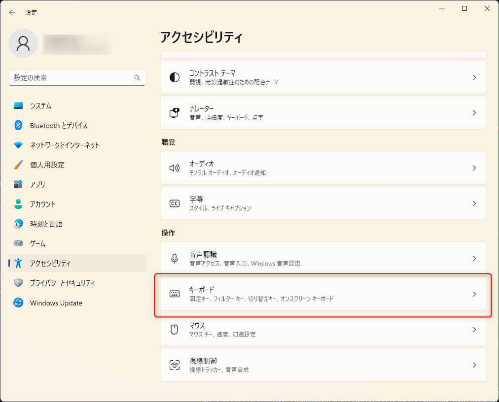
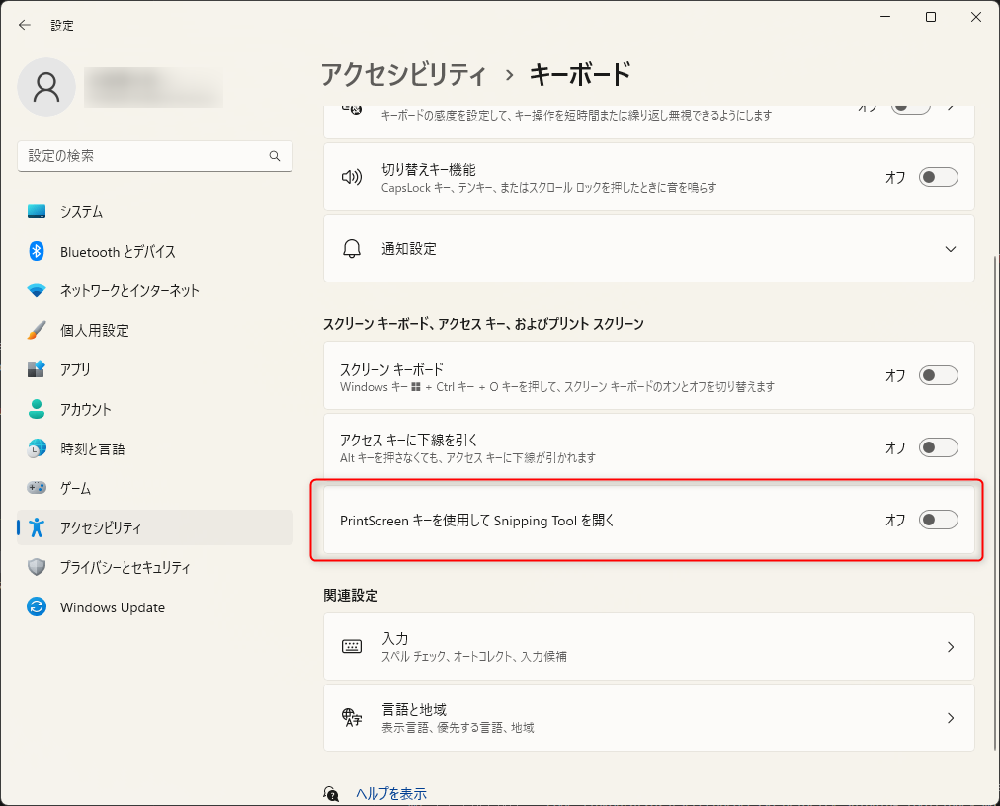

link です。

私はデスクトップ画面キャプチャのソフトとして **Screenpresso** を利用しています。

Screenpresso で画面をキャプチャするときは PrtSc キーで自動起動するようになっています。

ところが、 2023/6/27 リリースの Windows 11 のアップデートで、デフォルトでは Snipping Tool が PrtSc キーで自動起動するように設定されました。

その影響で Windows アップデート後に PrtSc キーで Screenpresso が自動起動しなくなる場合があります。

今回は PrtSc キーで Screenpresso が自動起動しなくなった場合の対処法を紹介します。

## 想定環境

- Windows 11 KB5027303 適用済み

## 対処法

対処法はいたって単純です。

PrtSc キーで Snipping Tool が自動起動しないようにします。

「設定」→「アクセシビリティ」→「キーボード」を選択します。

「Print Screen キーを使用して Snipping Tool を開く」を無効化します。

無効化後、 PrtSc キーで Screenpresso が自動起動するようになっています。

もし、これでも Screenpresso が自動起動しない場合、 Windows を再起動して再度 PrtSc キーの動作を確認します。

## 参考サイト

- [2023 年 6 月 27 日 — KB5027303 (OS ビルド 22621.1928) プレビュー - Microsoft サポート](https://support.microsoft.com/ja-jp/topic/2023-%E5%B9%B4-6-%E6%9C%88-27-%E6%97%A5-kb5027303-os-%E3%83%93%E3%83%AB%E3%83%89-22621-1928-%E3%83%97%E3%83%AC%E3%83%93%E3%83%A5%E3%83%BC-1ada2c0a-fa85-43f8-91c4-6ee13fdf278b)

## まとめ

今回は PrtSc キーで Screenpresso が自動起動しなくなった場合の対処法を紹介しました。

それではまた、別の記事でお会いしましょう。