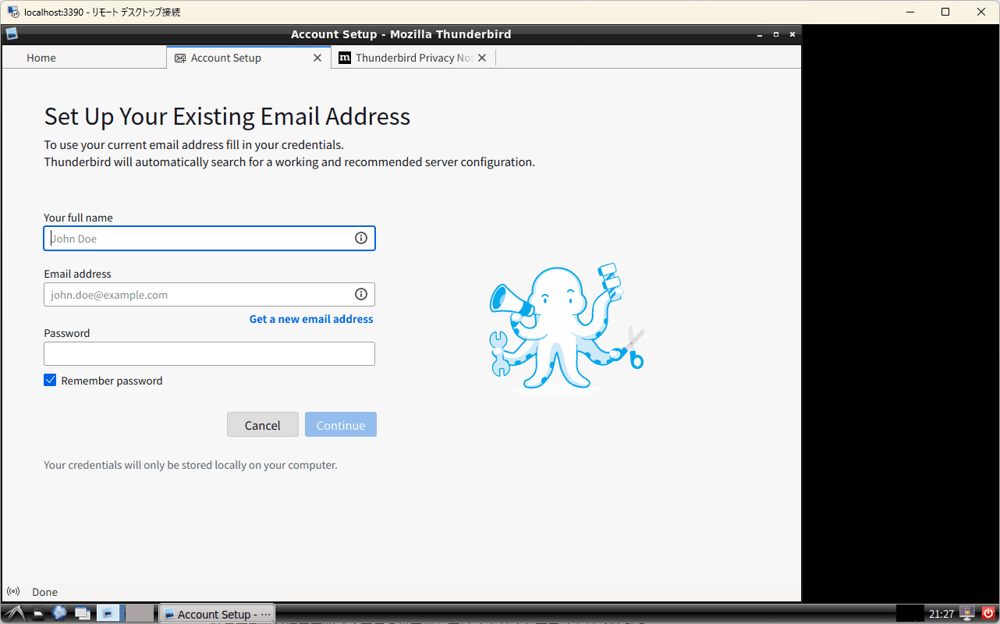
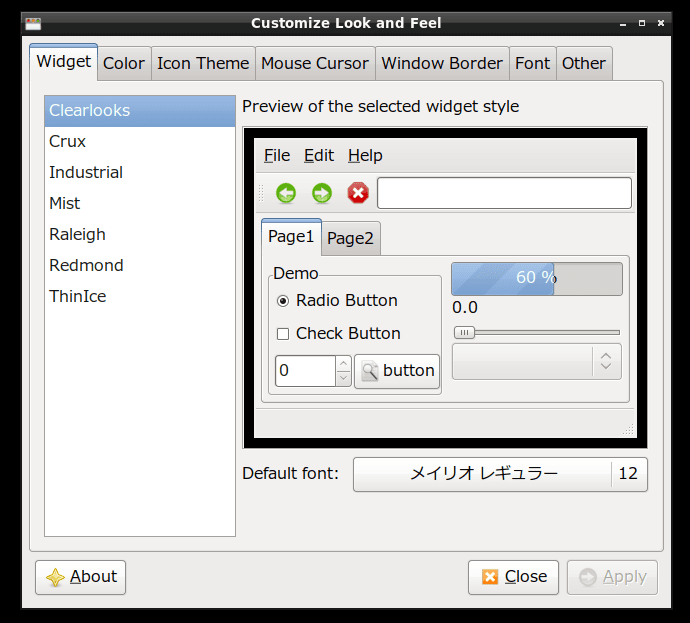

link です。

Windows 上で Linux を利用する時、 WSL か仮想 PC を作成してインストールすることがほとんどだと思います。

WSL だと GUI アプリケーションが利用できないため、GUI アプリケーションを利用する場合は仮想 PC を作成する必要があります。
しかし、仮想 PC は Windows の領域を圧迫する問題があります。

そこで WSL 上の Ubuntu にリモートデスクトップ接続して、 GUI アプリケーションを利用する方法を紹介します。

## 想定環境

- Windows 11
- WSL2
- Ubuntu 20.04 以降

## Ubuntu 上での準備

Windows 上から Ubuntu へリモートデスクトップ接続するために Windows から Linux へリモート接続できるようにする機能である **xrdp** をインストールします。
また、デスクトップを表示する機能が WSL にはデフォルトでは入っていないため、 **LXDE** をインストールします。

```bash:title=インストールコマンド
$ sudo apt install xrdp
$ sudo apt install lxde
```

xrdp インストール中に以下の画面が表示されると思います。

**gdm3** を選択しましょう。


xrdp のデフォルトのポートは 3389 になっているのでこれをリモート接続の既定ポートである 3390 に置き換えます。

```bash:title=ポート置換
$ sudo sed -i -e 's/^port=3389/port=3390/g' /etc/xrdp/xrdp.ini
```

リモートデスクトップの接続時に LXDE が起動するように、ホームディレクトリに.`xsessionrc` というファイルを作成します。

```bash:title=xsessionrc作成
$ echo "export LANG=ja_JP.UTF-8" > ~/.xsessionrc
$ echo "startlxde" >> ~/.xsessionrc
```

後々フォントを変更できるようにするために Windows 11 からフォントを参照できるようにしておきます。

```bash:title=フォント設定
$ sudo ln -s /mnt/c/Windows/Fonts/ /usr/share/fonts/windows
$ sudo fc-cache -fv
```

最後に xrdp を再起動して Ubuntu 側の作業は完了です。

```bash:title=xrdp再起動
$ sudo service xrdp restart
```

## Windows からリモートデスクトップ接続

Windows からリモートデスクトップ接続します。

`localhost:3390` を指定して接続しましょう。


以下の画面が表示されたら接続成功です。

`username` と `password` に WSL2 で起動したときと同じユーザー名とパスワードを入力して「OK」をクリックします。


以下の画像のようなデスクトップが表示されれば成功です。


Thunderbird のようなアプリも使えます。



## フォントが気になる場合

デフォルトだとフォントが汚い等で変更したいと思うことがあります。

その場合、以下のように「設定」→「ルックアンドフィールを設定します」からデフォルトのフォントを選択して、変更できます。




## 参考サイト

- [WSL2+ubuntu20.04: GUI化して使う方法 - Qiita](https://qiita.com/atomyah/items/887a5185ec9a8206c7c4)

## まとめ

今回は WSL 上の Ubuntu にリモートデスクトップ接続して、 GUI アプリケーションを利用する方法を紹介しました。

それではまた、別の記事でお会いしましょう。