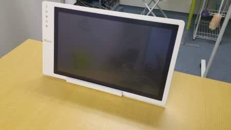
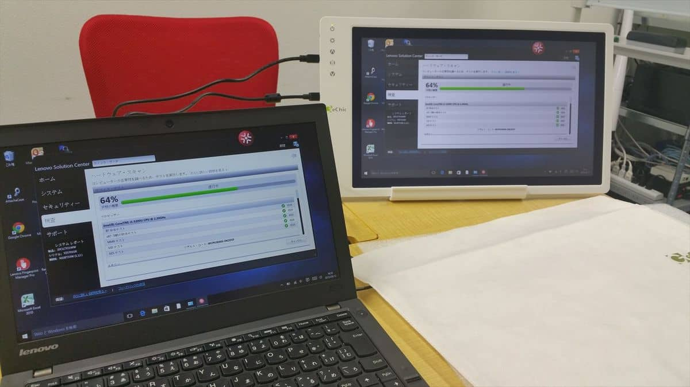
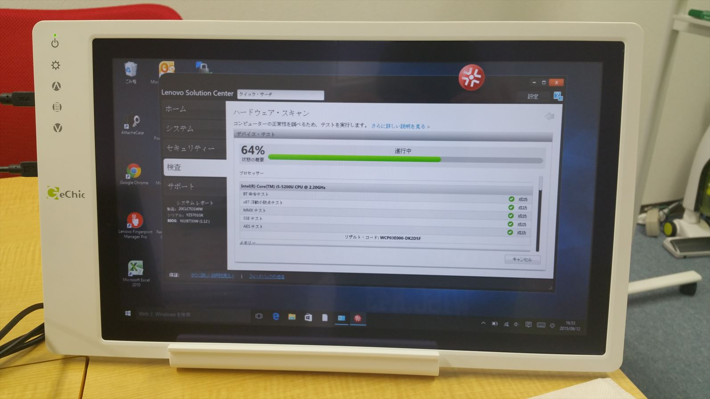
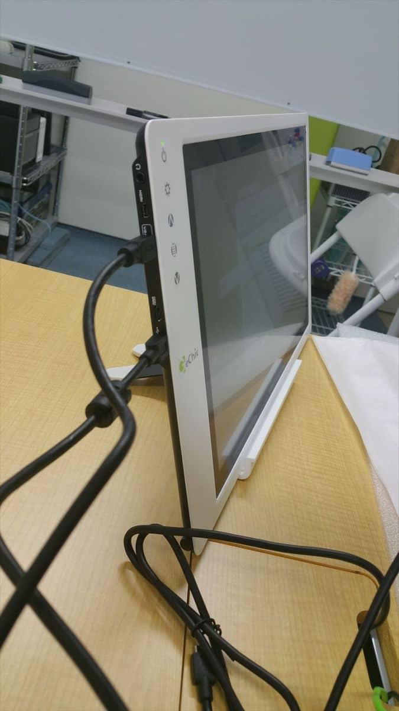

MSENの桝田です。
 
今回は、なかなか便利なモバイルモニタの紹介です。

これは、GeChic (ゲシック）のOn-Lap 1502I/Jというモニタなのですが、プレゼンにも使えて、レビューの時のプロジェクター代わりにも使えて非常に便利です。

[販売店サイト](http://www.tekwind.co.jp/products/GEC/entry_12277.php)

Youtubeの紹介などをくまなくチェックして決めたのですが、
なかなか優秀で、モニタ自体はマイクロUSBで電源が動作します。（Androidと同じです）
 
そして、HDMIとVGAの出力を備えていて、タッチパネル対応です。
 
PCがタッチパネルに対応していなくても、モバイルモニタとPCをUSBで接続したら、モニタ側のタッチ操作が可能になります。

こんな感じで、モバイルモニタ側の操作（写真右側）が可能になります。

そして、この薄さ！

サーバーの一時的な作業用モニタとしてもばっちりで対応でき早速、今週の作業で利用しました！
 
以上、桝田がお届けしました。

（本記事は過去ブログからの移行記事です。）
