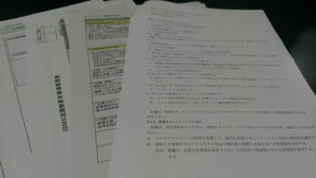

MSENの桝田です。
 
シルバーウィークが実質昨日からはじまりましたね。
先ほどイオンに寄りましたが、人が少なかったです(笑)
 
さて、弊社はISO27001（ISMS)の取得に向け活動を開始しました。
認定審査は、来年１月、２月に行う予定でスケジュールを消化していきます。
 
ISMS（情報セキュリティマネジメントシステム）は、組織（企業、部、課など）における情報セキュリティを管理するための仕組みのことで、ISO国際規格です。
Infomation Secrurity Management System
ひさしぶりに・・・座学で約３時間講義を受けると睡魔は襲ってきますね(笑)
決して寝てはないですｗ

仕組み作り、資料整備など大変な要素が出てきていますが、メンバー５名でしっかり取り組んで行きたいと思います。
 
以上、桝田がお届けしました。

（本記事は過去ブログからの移行記事です。）

