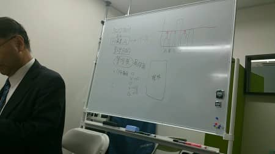
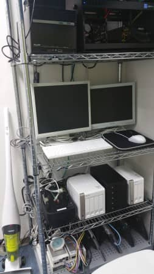

MSENの桝田です。
 
朝夕は涼しく、日中が暑い・・・。そんな休日でした。
土曜日は、息子の運動会で撮影班だったのですが季節外れに体半分焼けてしまって、今もまだひりひりです・・・ｗ
 
同じ、土曜にISMS取得にむけての第２回講習がありました。

少しずつ具体化してきて、いよいよ宿題も出だしました。
 
そのうちの１つ、ネットワーク環境を整備・整理するという重たい作業を先ほどまでかかってやりきりました。

さて、まだまだ・・・。
 
以上、桝田がお届けしました！

（本記事は過去ブログからの移行記事です。）
