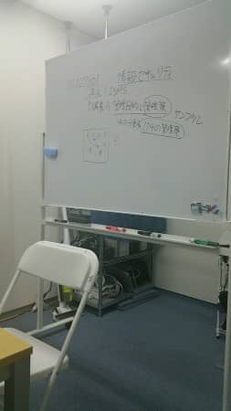

MSENの桝田です。
 
朝晩がすっかり冷えるようになって、でも日中は快晴続きですね。
長男は季節の変わり目でばっちり風邪を引きました(笑)
 
さて、先週の土曜ですがISMS取得講義の第３回が開催されました。

毎回同じような写真ですが・・・。
 
作成資料の宿題も出てきており、難度が高いというよりは整理するのと、今後の管理を意識したやりかたをしていかないと行けない点が苦労しています。
 
今後のスケジュールとしては講義が全９回あり、年明け２月に第１次審査を受けます。
その後、３月には最終２次審査を受け、無事通れば取得となります。
 
 
まだ３回目ですが、不思議と意識が変わってきたように感じています。
引き続き、メンバー一同取り組んで参ります。
 
以上、桝田がお届けしました。

（本記事は過去ブログからの移行記事です。）