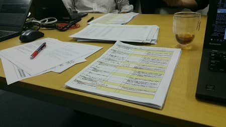

MSENの桝田です。
 
11月に入りましたが、まだそれほど寒くなりませんね。
クールビズが世間的に終了ということでネクタイを付け、冬用のスーツに衣替えをしました。
 
さて、先週土曜(11/7)のことですが、ISMS講習の4回目を行いました。

第４回の中心は、ベースライン分析、というものでした。
簡単に言うと、ISMSで定められたセキュリティ基準をクリア出来ているか？
ということなのですが、１つ１つ確認を受けながら現時点の状況を
分析するのですが、観点が　なるほどな　と発見させられることも多くあり、
面白い分析だな、と思っています。
 
第１回審査も近づいてきましたが、色々と作成・整備しなければいけないものが・・・。
 
引き続き、メンバー力を合わせて頑張って行きます。
以上、桝田がお届けしました。

（本記事は過去ブログからの移行記事です。）