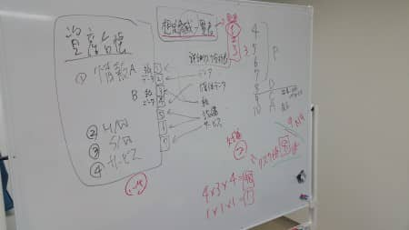

MSENの桝田です。
 
久しぶりの投稿となりました。
前回投稿したときより、ずいぶん寒くなってしまいました笑
 
さて、取得に向けて一同奮闘しているISMSですが、
11月28日に5回目、12月5日に6回目の講義がありました。
 
年末にも第7回目を実施する予定で、全９回の講義もいよいよ終盤に近付いています。
 
2月には第1回認定審査があり、3月前半に第2回審査となり、
無事通過となれば、ISMSの認定取得となります。
 
第6回ともなってくるといろいろな資料を作成することも去ることながら、
社内整備など、基準に沿った体制づくりも進めていかなければならず、
なかなか悩まされることも多いです。
 
ただ、コンサルティングに入って頂いている方が癒し系で、
「一緒にやっていきましょう」と励まして頂けているのが救いです（笑）

以上、桝田がお届けしました。

（本記事は過去ブログからの移行記事です。）